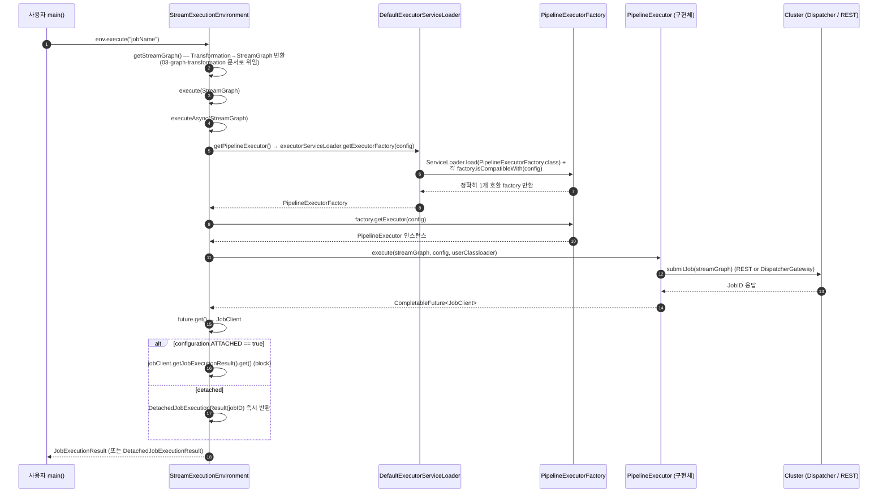

# `env.execute()` — Job 제출의 진입점

> **요약**: 사용자가 작성한 Flink 코드의 `env.execute()` 한 줄이 어떻게 SPI(`ServiceLoader`)로 적절한 `PipelineExecutor`를 골라 클러스터에 Job을 제출하고 `JobClient`를 돌려주는지 코드 레벨로 따라간다.
> **모듈**: `flink-runtime` (StreamExecutionEnvironment), `flink-core` (PipelineExecutor 추상), `flink-clients` (실행기 구현체), `flink-kubernetes` (클러스터 측 entrypoint)
> **기준 버전**: Flink `release-2.0` (commit 시점: 2026-04-26)
> **운영 권장 여부**: ★Production (모든 Flink 프로그램의 표준 진입점)

---

## 1. TL;DR (3문장)

`env.execute()`는 사용자 빌드한 `StreamGraph`(=`Pipeline`)를 `PipelineExecutor.execute(...)`로 위임하고, 그 결과 `CompletableFuture<JobClient>`를 받아 동기 또는 detached 모드로 처리한다. 어떤 `PipelineExecutor` 구현체가 쓰일지는 `Configuration.execution.target` 값과 Java 표준 `ServiceLoader`로 등록된 모든 `PipelineExecutorFactory`의 `isCompatibleWith(config)` 결과로 정확히 1개 선택된다. K8s + Flink Operator 환경에선 사용자 main 프로세스(=client)가 보통 `RemoteExecutor`를 거쳐 Operator가 띄워둔 `KubernetesSessionClusterEntrypoint`(또는 ApplicationMode면 `KubernetesApplicationClusterEntrypoint`)에 REST로 Job을 제출한다.

---

## 2. 사전 지식

이 문서는 Java 표준 라이브러리의 다음 세 개념을 자주 마주친다. 깊이 다루는 별도 문서는 추후 `01-java-prerequisites/`에 작성될 예정이며, 우선 본 문서에서 필요한 만큼만 인라인으로 정리한다.

### 2.1 `java.util.concurrent.CompletableFuture<T>`

비동기 작업 결과를 나타내는 컨테이너. `f.get()`은 결과가 나올 때까지 **block**하고, `f.thenApply(...)`/`.whenComplete(...)`는 결과가 나오면 **콜백**으로 이어붙인다. Flink는 거의 모든 분산 호출(Job 제출, RPC, 체크포인트 트리거)을 `CompletableFuture`로 표현한다. `executor.execute(...)`가 `CompletableFuture<JobClient>`를 돌려주는 이유도 Job 제출 자체가 RPC를 거치는 비동기 작업이기 때문.

### 2.2 `java.util.ServiceLoader<T>` (SPI 패턴)

JDK 표준의 **Service Provider Interface** 로딩 메커니즘. JAR 안의 `META-INF/services/<인터페이스 FQN>` 파일에 구현체 클래스명을 적어두면, `ServiceLoader.load(MyInterface.class)`가 클래스패스의 모든 구현체를 발견·인스턴스화한다. **사용자 코드 변경 없이 JAR만 추가/제거하면 동작 구현체가 바뀌는** 플러그인 메커니즘. Flink의 `PipelineExecutorFactory`, `FileSystemFactory`, `StateBackendFactory` 등 거의 모든 확장점이 이 패턴을 쓴다.

### 2.3 `java.lang.ClassLoader` (특히 사용자 코드 클래스로더)

`PipelineExecutor.execute(pipeline, config, **classLoader**)`의 세 번째 인자. Flink는 시스템 클래스로더 위에 **사용자 JAR 전용 클래스로더**(보통 `child-first`)를 별도로 두고, 직렬화된 사용자 함수를 역직렬화할 때 이 로더를 쓴다. 이렇게 분리해야 사용자 JAR이 의존하는 라이브러리 버전이 Flink의 그것과 충돌하지 않는다.

---

## 3. 핵심 클래스 / 진입점

| 역할 | 클래스/인터페이스 | 위치 |
|------|------------------|------|
| 사용자 facing 진입점 | `StreamExecutionEnvironment` (Class) | `flink-runtime/src/main/java/org/apache/flink/streaming/api/environment/StreamExecutionEnvironment.java` |
| 실행기 추상 | `PipelineExecutor` (Interface) | `flink-core/src/main/java/org/apache/flink/core/execution/PipelineExecutor.java` |
| 실행기 팩토리 추상 | `PipelineExecutorFactory` (Interface) | `flink-core/src/main/java/org/apache/flink/core/execution/PipelineExecutorFactory.java` |
| 팩토리 로더 추상 | `PipelineExecutorServiceLoader` (Interface) | `flink-core/src/main/java/org/apache/flink/core/execution/PipelineExecutorServiceLoader.java` |
| 팩토리 로더 기본 구현 | `DefaultExecutorServiceLoader` (Class) | `flink-core/src/main/java/org/apache/flink/core/execution/DefaultExecutorServiceLoader.java` |
| Job 핸들 | `JobClient` (Interface) | `flink-core/src/main/java/org/apache/flink/core/execution/JobClient.java` |
| Local 실행기 (MiniCluster) | `LocalExecutor` (Class) | `flink-clients/src/main/java/org/apache/flink/client/deployment/executors/LocalExecutor.java` |
| Remote 실행기 (Standalone REST) | `RemoteExecutor` (Class) | `flink-clients/src/main/java/org/apache/flink/client/deployment/executors/RemoteExecutor.java` |
| Session executor 베이스 | `AbstractSessionClusterExecutor` (Class) | `flink-clients/src/main/java/org/apache/flink/client/deployment/executors/AbstractSessionClusterExecutor.java` |
| Application Mode 실행기 | `EmbeddedExecutor` (Class) | `flink-clients/src/main/java/org/apache/flink/client/deployment/application/executors/EmbeddedExecutor.java` |
| K8s Session 클러스터 entrypoint | `KubernetesSessionClusterEntrypoint` (Class) | `flink-kubernetes/src/main/java/org/apache/flink/kubernetes/entrypoint/KubernetesSessionClusterEntrypoint.java` |
| K8s Application 클러스터 entrypoint | `KubernetesApplicationClusterEntrypoint` (Class) | `flink-kubernetes/src/main/java/org/apache/flink/kubernetes/entrypoint/KubernetesApplicationClusterEntrypoint.java` |

> **참고 — release-2.0의 모듈 재배치**: 과거 버전(1.x)에서 `StreamExecutionEnvironment`는 `flink-streaming-java`에 있었으나, release-2.0에서 **`flink-runtime`** 모듈로 옮겨졌다. 본 문서의 모든 `flink-runtime/.../StreamExecutionEnvironment.java` 인용은 이 변경을 반영한다.

---

## 4. 데이터 / 제어 흐름



---

## 5. 코드 워크스루

### 5.1 사용자 코드 — 모든 것이 시작되는 한 줄

`flink-examples/flink-examples-streaming/.../wordcount/WordCount.java:179`:

```java
// Apache Flink applications are composed lazily. Calling execute
// triggers actual computation.
env.execute("WordCount");
```

이 한 줄 위에는 사용자가 빌드한 DataStream 변환 트리(`Transformation` 리스트)가 `env` 안에 누적된 상태다. `execute()`가 호출되기 전까지 어떤 데이터도 흐르지 않는다 (lazy evaluation).

### 5.2 `execute()` → `execute(String)` → `execute(StreamGraph)`

`StreamExecutionEnvironment.java:1823-1825` (no-arg 진입점):

```java
public JobExecutionResult execute() throws Exception {
    return execute((String) null);
}
```

`StreamExecutionEnvironment.java:1838-1843` (String 오버로드 — `StreamGraph`를 만들고 jobName 부착):

```java
public JobExecutionResult execute(String jobName) throws Exception {
    final List<Transformation<?>> originalTransformations = new ArrayList<>(transformations);
    StreamGraph streamGraph = getStreamGraph();
    if (jobName != null) {
        streamGraph.setJobName(jobName);
    }
    // ... (try/catch + retry 로직, 본 문서 범위 밖)
```

> **`getStreamGraph()` 내부**는 `Transformation` 리스트를 `StreamGraphGenerator`로 돌려 `StreamGraph` DAG를 만든다. **이 변환의 상세는 [`03-graph-transformation/01-stream-graph.md`](../03-graph-transformation/01-stream-graph.md)에서 다룬다.** 여기서는 "DataStream 빌드 결과 → `StreamGraph` 객체가 만들어진다"까지만 이해하면 된다.

`StreamExecutionEnvironment.java:1870-1902` (실제 동작):

```java
@Internal
public JobExecutionResult execute(StreamGraph streamGraph) throws Exception {
    final JobClient jobClient = executeAsync(streamGraph);

    try {
        final JobExecutionResult jobExecutionResult;

        if (configuration.get(DeploymentOptions.ATTACHED)) {
            jobExecutionResult = jobClient.getJobExecutionResult().get();
        } else {
            jobExecutionResult = new DetachedJobExecutionResult(jobClient.getJobID());
        }

        jobListeners.forEach(
                jobListener -> jobListener.onJobExecuted(jobExecutionResult, null));

        return jobExecutionResult;
    } catch (Throwable t) {
        // get() on the JobExecutionResult Future will throw an ExecutionException. This
        // behaviour was largely not there in Flink versions before the PipelineExecutor
        // refactoring so we should strip that exception.
        Throwable strippedException = ExceptionUtils.stripExecutionException(t);
        // ... onJobExecuted(null, strippedException) 호출 후 rethrow
    }
}
```

핵심 포인트:
- **`executeAsync(streamGraph)`** 호출이 실제 제출. 이게 끝나면 Job은 이미 클러스터에 도달했고 `JobClient`로 제어 가능.
- **`DeploymentOptions.ATTACHED`** (`execution.attached`) 설정으로 동기/비동기 결정:
  - `true` (기본값) → `jobClient.getJobExecutionResult().get()`로 Job 종료까지 block
  - `false` → 즉시 `DetachedJobExecutionResult(jobID)` 반환, 사용자는 `JobClient`로 별도 모니터링
- `jobListeners.onJobExecuted(...)` — 사용자가 `env.registerJobListener(...)`로 등록한 리스너 통지 지점

### 5.3 `executeAsync(StreamGraph)` — 진짜 위임이 일어나는 곳

`StreamExecutionEnvironment.java:1987-2011`:

```java
@Internal
public JobClient executeAsync(StreamGraph streamGraph) throws Exception {
    checkNotNull(streamGraph, "StreamGraph cannot be null.");
    final PipelineExecutor executor = getPipelineExecutor();

    CompletableFuture<JobClient> jobClientFuture =
            executor.execute(streamGraph, configuration, userClassloader);

    try {
        JobClient jobClient = jobClientFuture.get();
        jobListeners.forEach(jobListener -> jobListener.onJobSubmitted(jobClient, null));
        collectIterators.forEach(iterator -> iterator.setJobClient(jobClient));
        collectIterators.clear();
        return jobClient;
    } catch (ExecutionException executionException) {
        final Throwable strippedException =
                ExceptionUtils.stripExecutionException(executionException);
        jobListeners.forEach(
                jobListener -> jobListener.onJobSubmitted(null, strippedException));

        throw new FlinkException(
                String.format("Failed to execute job '%s'.", streamGraph.getJobName()),
                strippedException);
    }
}
```

이 메서드의 골격은 **세 줄**로 압축할 수 있다:
1. `getPipelineExecutor()` — SPI로 적절한 Executor 선택
2. `executor.execute(streamGraph, configuration, userClassloader)` — Job 제출 (비동기)
3. `jobClientFuture.get()` — 제출 결과 동기 대기

이 세 줄에 모든 본질이 있다. 나머지는 listener 통지와 예외 가공.

### 5.4 `getPipelineExecutor()` — SPI 진입점

`StreamExecutionEnvironment.java:2508-2522`:

```java
private PipelineExecutor getPipelineExecutor() throws Exception {
    checkNotNull(
            configuration.get(DeploymentOptions.TARGET),
            "No execution.target specified in your configuration file.");

    final PipelineExecutorFactory executorFactory =
            executorServiceLoader.getExecutorFactory(configuration);

    checkNotNull(
            executorFactory,
            "Cannot find compatible factory for specified execution.target (=%s)",
            configuration.get(DeploymentOptions.TARGET));

    return executorFactory.getExecutor(configuration);
}
```

핵심은 `executorServiceLoader.getExecutorFactory(configuration)`. 이 `executorServiceLoader`는 `StreamExecutionEnvironment`의 필드로, 기본 구현은 `DefaultExecutorServiceLoader`이며 사용자가 커스텀 로더를 주입할 수도 있다(테스트 시 유용).

### 5.5 `DefaultExecutorServiceLoader` — Java SPI를 그대로 사용

`flink-core/src/main/java/org/apache/flink/core/execution/DefaultExecutorServiceLoader.java:54-91` (요지만):

```java
@Override
public PipelineExecutorFactory getExecutorFactory(final Configuration configuration) {
    checkNotNull(configuration);

    final ServiceLoader<PipelineExecutorFactory> loader =
            ServiceLoader.load(PipelineExecutorFactory.class);

    final List<PipelineExecutorFactory> compatibleFactories = new ArrayList<>();
    final Iterator<PipelineExecutorFactory> factories = loader.iterator();
    while (factories.hasNext()) {
        try {
            final PipelineExecutorFactory factory = factories.next();
            if (factory != null && factory.isCompatibleWith(configuration)) {
                compatibleFactories.add(factory);
            }
        } catch (Throwable e) {
            if (e.getCause() instanceof NoClassDefFoundError) {
                LOG.info("Could not load factory due to missing dependencies.");
            } else {
                throw e;
            }
        }
    }

    if (compatibleFactories.size() > 1) {
        // ... config dump + IllegalStateException("Multiple compatible client factories found")
    }

    if (compatibleFactories.isEmpty()) {
        throw new IllegalStateException("No ExecutorFactory found to execute the application.");
    }

    return compatibleFactories.get(0);
}
```

알고리즘은 **놀랍도록 단순**하다:
1. `ServiceLoader.load(PipelineExecutorFactory.class)`로 클래스패스의 모든 factory 검색
2. 각 factory에 `isCompatibleWith(configuration)` 호출 — `true`면 후보 리스트에 추가
3. 후보가 정확히 1개여야 함. 0개 또는 2개 이상이면 `IllegalStateException`
4. `NoClassDefFoundError`(로더 클래스 자체의 의존성 누락)는 silently 무시 — Flink 배포에 모든 executor JAR이 들어 있지 않을 수 있기 때문

### 5.6 `PipelineExecutor` 인터페이스 — 단 1개의 메서드

`flink-core/src/main/java/org/apache/flink/core/execution/PipelineExecutor.java:28-50`:

```java
@Internal
public interface PipelineExecutor {
    /**
     * Executes a {@link Pipeline} based on the provided configuration and returns a {@link
     * JobClient} which allows to interact with the job being executed, e.g. cancel it or take a
     * savepoint.
     *
     * <p><b>ATTENTION:</b> The caller is responsible for managing the lifecycle of the returned
     * {@link JobClient}. ...
     */
    CompletableFuture<JobClient> execute(
            final Pipeline pipeline,
            final Configuration configuration,
            final ClassLoader userCodeClassloader)
            throws Exception;
}
```

`Pipeline`은 `flink-core-api` 쪽 인터페이스로, **`StreamGraph`는 그 구현체**다 (`StreamGraph implements Pipeline`). 즉 SEE가 만든 streamGraph를 그대로 실행기에 넘긴다.

### 5.7 `PipelineExecutor` 4구현체 — 언제 무엇이 쓰이나

| 구현체 | `NAME` | `Configuration.execution.target` | 용도 / 동작 |
|--------|--------|----------------------------------|-----------|
| `LocalExecutor` | `"local"` | `local` | 같은 JVM 안에서 `MiniCluster`를 새로 띄워 Job 실행. 테스트/IDE 디버깅 표준 |
| `RemoteExecutor` (`extends AbstractSessionClusterExecutor`) | `"remote"` | `remote` | 이미 떠 있는 Standalone 클러스터의 REST endpoint로 Job 제출 |
| `EmbeddedExecutor` | `"embedded"` | `embedded` | **ApplicationMode 전용** — 같은 JVM 내 `Dispatcher`에 직접 `submitJob` (REST 우회). client 프로세스 = JobManager 프로세스 |
| `WebSubmissionExecutor` | (web) | `web-submission` | Flink Web UI의 "Submit New Job"용 |

**선택의 실제**: 보통은 **사용자가 `execution.target`을 명시적으로 설정하지 않고**, Flink 배포 모드에 따라 시작 스크립트(`flink run`, K8s entrypoint 등)가 미리 알맞은 값을 주입한다. 사용자 main이 실행되는 JVM이 어떤 컨텍스트(client vs cluster)에 있느냐가 결정한다.

### 5.8 `LocalExecutor` 본체 — MiniCluster 한 그릇 띄워서 실행

`flink-clients/src/main/java/org/apache/flink/client/deployment/executors/LocalExecutor.java:82-113` (`execute` 메서드):

```java
@Override
public CompletableFuture<JobClient> execute(
        Pipeline pipeline, Configuration configuration, ClassLoader userCodeClassloader)
        throws Exception {
    checkNotNull(pipeline);
    checkNotNull(configuration);

    Configuration effectiveConfig = new Configuration();
    effectiveConfig.addAll(this.configuration);
    effectiveConfig.addAll(configuration);

    // we only support attached execution with the local executor.
    checkState(configuration.get(DeploymentOptions.ATTACHED));

    final StreamGraph streamGraph =
            PipelineExecutorUtils.getStreamGraph(pipeline, configuration);

    streamGraph.serializeUserDefinedInstances();
    return PerJobMiniClusterFactory.createWithFactory(effectiveConfig, miniClusterFactory)
            .submitJob(streamGraph, userCodeClassloader)
            .whenComplete( /* ... listener notify ... */ );
}
```

핵심: `PerJobMiniClusterFactory`가 매 Job마다 `MiniCluster`를 새로 띄우고 `submitJob` → 그 결과 future가 그대로 `CompletableFuture<JobClient>`. **단, ATTACHED 모드만 지원** (detached LocalExecutor는 의미 없음 — JVM 종료 시 미니클러스터도 사라짐).

### 5.9 `AbstractSessionClusterExecutor` — `RemoteExecutor`의 부모 (실제 클러스터 제출)

`flink-clients/src/main/java/org/apache/flink/client/deployment/executors/AbstractSessionClusterExecutor.java:88+`:

```java
@Override
public CompletableFuture<JobClient> execute(
        @Nonnull final Pipeline pipeline,
        @Nonnull final Configuration configuration,
        @Nonnull final ClassLoader userCodeClassloader)
        throws Exception {
    StreamGraph streamGraph = PipelineExecutorUtils.getStreamGraph(pipeline, configuration);

    try (final ClusterDescriptor<ClusterID> clusterDescriptor =
            clusterClientFactory.createClusterDescriptor(configuration)) {
        final ClusterID clusterID = clusterClientFactory.getClusterId(configuration);
        checkState(clusterID != null);

        final ClusterClientProvider<ClusterID> clusterClientProvider =
                clusterDescriptor.retrieve(clusterID);
        ClusterClient<ClusterID> clusterClient = clusterClientProvider.getClusterClient();

        streamGraph.serializeUserDefinedInstances();
        return clusterClient
                .submitJob(streamGraph)
                .thenApplyAsync( /* ... waitUntilJobInitializationFinished ... */ );
    }
}
```

`RemoteExecutor` 자체는 거의 빈 클래스이며 (`flink-clients/.../RemoteExecutor.java:28-37`), 부모인 이 추상 클래스가 **모든 RPC 기반 클러스터 제출 로직**을 담는다. `clusterClientFactory`가 무엇인지에 따라 Standalone, YARN(이전 버전), 또는 K8s로 분기된다.

### 5.10 `EmbeddedExecutor` — Application Mode의 핵심

`flink-clients/src/main/java/org/apache/flink/client/deployment/application/executors/EmbeddedExecutor.java:103-122` (`execute` 메서드 본체):

```java
@Override
public CompletableFuture<JobClient> execute(
        final Pipeline pipeline,
        final Configuration configuration,
        ClassLoader userCodeClassloader)
        throws Exception {
    checkNotNull(pipeline);
    checkNotNull(configuration);

    final Optional<JobID> optJobId =
            configuration
                    .getOptional(PipelineOptionsInternal.PIPELINE_FIXED_JOB_ID)
                    .map(JobID::fromHexString);

    if (optJobId.isPresent() && submittedJobIds.contains(optJobId.get())) {
        return getJobClientFuture(optJobId.get(), userCodeClassloader);
    }

    return submitAndGetJobClientFuture(pipeline, configuration, userCodeClassloader);
}
```

`submitAndGetJobClientFuture`(같은 파일:131-)는 `dispatcherGateway.submitJob(...)`를 직접 호출 — REST를 거치지 않고 **같은 JVM 내 Dispatcher와 통신**한다. 이게 ApplicationMode의 정의: 사용자 main()이 JobManager 컨테이너 안에서 실행되어, 외부 client 프로세스 없이 그대로 Dispatcher에 `submitJob`을 부른다.

---

## 6. K8s + Flink Operator 환경에서의 실제 흐름 (사용자 환경)

본인이 운영하는 환경 ([`../00-overview/my-environment-map.md`](../00-overview/my-environment-map.md))에 비춰 이 호출 체인이 실제로 어떻게 펼쳐지는지:

### 6.1 SessionMode (다중 Job, Operator가 long-running cluster 관리)

```
[client 프로세스]                 [JobManager Pod]                       [TaskManager Pod들]
사용자 main()                     KubernetesSessionClusterEntrypoint     TaskExecutor
  ↓                                ↓ (이미 떠 있음)
env.execute("Job1")               Dispatcher
  ↓                                ResourceManager
RemoteExecutor                     ↓
(execution.target=remote)         (REST 수신 → JobMaster 생성)
  ↓ HTTP REST
ClusterClient.submitJob() ───────→ Dispatcher.submitJob(streamGraph) ─→ Slot 할당 → Task 배치
  ↓
JobClient (REST 핸들) 반환
```

- **client 프로세스**는 별도 Pod이거나, `flink run`을 부른 사용자 머신
- **`KubernetesSessionClusterEntrypoint`** 가 클러스터 측 진입점 (`flink-kubernetes/.../KubernetesSessionClusterEntrypoint.java`):

```java
public static void main(String[] args) {
    EnvironmentInformation.logEnvironmentInfo(LOG, ..., args);
    SignalHandler.register(LOG);
    JvmShutdownSafeguard.installAsShutdownHook(LOG);

    final Configuration dynamicParameters =
            ClusterEntrypointUtils.parseParametersOrExit(
                    args,
                    new DynamicParametersConfigurationParserFactory(),
                    KubernetesSessionClusterEntrypoint.class);
    final ClusterEntrypoint entrypoint =
            new KubernetesSessionClusterEntrypoint(
                    KubernetesEntrypointUtils.loadConfiguration(dynamicParameters));
    ClusterEntrypoint.runClusterEntrypoint(entrypoint);
}
```

`SessionClusterEntrypoint`를 상속하므로 `Dispatcher` + `ResourceManager` 컴포넌트가 함께 뜬다. Operator의 `FlinkDeployment` CR에서 `mode: native` (ApplicationMode 아닌 경우) 시 이 entrypoint가 사용됨.

### 6.2 ApplicationMode (1 Job = 1 cluster, Operator 권장 패턴)

```
[JobManager Pod (사용자 JAR 포함)]
KubernetesApplicationClusterEntrypoint
  ↓
사용자 main() 실행 (in-process)
  ↓
env.execute("Job1")
  ↓
EmbeddedExecutor (execution.target=embedded)
  ↓ direct call (REST 우회)
DispatcherGateway.submitJob(streamGraph)
  ↓
JobMaster 생성 → Slot 할당 → Task 배치
```

- 사용자 JAR과 Flink JM이 **같은 프로세스**에 있다 → 별도 client 없음, 네트워크 hop 1개 절약
- `EmbeddedExecutor`가 `DispatcherGateway`를 직접 호출 (REST 직렬화/역직렬화 없음)
- Operator가 사용자의 `FlinkDeployment` CR을 보고 이 entrypoint를 띄움

### 6.3 Operator와 Flink의 경계

**Operator(외부 레포 `apache/flink-kubernetes-operator`)의 책임**:
- `FlinkDeployment` CR을 watch
- JM/TM Pod, ConfigMap, Service, RBAC 생성
- 위 두 entrypoint 중 하나를 컨테이너 command로 지정
- autoscaler가 동작하면 TM 개수 변경 + Flink REST API로 parallelism 변경 명령

**Flink 본 레포 (`flink-kubernetes` 모듈) 책임**:
- 위 두 entrypoint의 main()
- `KubernetesResourceManagerDriver` (TaskManager Pod 요청은 Operator가 주입한 RBAC로 K8s API 호출)
- K8s ConfigMap 기반 leader election (`flink-kubernetes/.../highavailability/`)

→ Operator의 자세한 동작은 [`../09-kubernetes-integration/operator-flink-boundary.md`](../09-kubernetes-integration/05-operator-flink-boundary.md).

---

## 7. 관련 FLIP / JIRA

| 문서 | 무엇 |
|------|------|
| [FLIP-73: Introducing Executors for job submission](https://cwiki.apache.org/confluence/display/FLINK/FLIP-73%3A+Introducing+Executors+for+job+submission) | `PipelineExecutor` 추상 도입 (Flink 1.10) — 본 문서의 모든 내용의 설계 출발점 |
| [FLIP-85: Flink Application Mode](https://cwiki.apache.org/confluence/display/FLINK/FLIP-85+Flink+Application+Mode) | `EmbeddedExecutor` + `KubernetesApplicationClusterEntrypoint` 도입 (Flink 1.11) |
| [FLIP-160: Adaptive Scheduler](https://cwiki.apache.org/confluence/display/FLINK/FLIP-160:+Adaptive+Scheduler) | (참고) 본 문서가 다루는 client 측 흐름 이후 cluster 측에서 어떻게 스케줄링되는지 — [`10-scheduling-failover/`](../10-scheduling-failover/) |
| FLINK-13954 (umbrella) | FLIP-73 구현 추적 JIRA |

---

## 8. 디버깅 & 실험

### 8.1 IDE에서 한 단계씩 따라가기 (가장 빠른 학습법)

1. `flink-examples/flink-examples-streaming/.../wordcount/WordCount.java`를 IDE에서 연다
2. 다음 줄들에 브레이크포인트:
   - `WordCount.java:179` — `env.execute("WordCount")`
   - `StreamExecutionEnvironment.java:1838` — `execute(String jobName)`
   - `StreamExecutionEnvironment.java:1991` — `executor.execute(streamGraph, ...)`
   - `StreamExecutionEnvironment.java:2515` — `executorServiceLoader.getExecutorFactory(configuration)`
   - `DefaultExecutorServiceLoader.java:54` — `getExecutorFactory`
   - `LocalExecutor.java:82` — `execute(...)` (IDE 실행은 자동으로 LocalExecutor 선택됨)
3. WordCount의 `main` 실행 → 위 순서로 멈춤
4. Variables 탭에서 `loader.iterator()`가 어떤 factory들을 반환하는지 관찰 → 보통 1개(`LocalExecutorFactory`)만 등록되어 있음을 확인

### 8.2 `MiniCluster`로 환경 격리 검증

`flink-runtime/src/test/.../minicluster/MiniClusterTest.java`처럼 직접 띄울 수도 있고, IDE 실행은 자동으로 `LocalExecutor`가 `PerJobMiniClusterFactory`로 띄운다. **본인 환경(K8s)에서는 만나지 않는 코드 경로지만**, 메커니즘 학습엔 가장 빠름.

### 8.3 실제 K8s 환경에서 어떤 executor가 쓰이는지 확인

JM Pod에 들어가서 환경변수 / `flink-conf.yaml`에서 `execution.target` 값을 확인:

```bash
kubectl exec -it <jm-pod> -- cat /opt/flink/conf/flink-conf.yaml | grep -E "^execution\."
```

`embedded`면 ApplicationMode, `remote`면 SessionMode + 별도 client.

### 8.4 그래프로 호출 관계 빠르게 보기 (codebase-memory-mcp)

```
mcp__codebase-memory-mcp__search_graph(
  project="home-donamk-code-flink-flink-runtime",
  qn_pattern=".*StreamExecutionEnvironment\\.execute$"
)

mcp__codebase-memory-mcp__get_code_snippet(
  project="home-donamk-code-flink-flink-runtime",
  qualified_name="...StreamExecutionEnvironment.executeAsync"
)
```

자세한 그래프 사용은 [`../00-overview/architecture-snapshot.md`](../00-overview/architecture-snapshot.md).

---

## 9. 자주 묻는 질문 / 함정

**Q1. `env.execute()`를 호출하지 않으면?**
A. **아무 일도 일어나지 않는다**. Flink는 lazy build — `execute()` 호출 전엔 어떤 데이터 흐름도 시작되지 않는다. WordCount 코드 마지막 라인의 주석이 정확히 이 점을 강조한다.

**Q2. `executeAsync`로 받은 `JobClient`를 close하지 않으면?**
A. 리소스 누수 가능. `PipelineExecutor.execute(...)`의 javadoc이 명시적으로 경고한다: *"The caller is responsible for managing the lifecycle of the returned JobClient."* try-with-resources 패턴 또는 명시적 `cancel()`/`stopWithSavepoint(...)` + finally 권장.

**Q3. `Multiple compatible client factories found` 예외가 뜨면?**
A. 두 개 이상의 `PipelineExecutorFactory`가 같은 `execution.target`에 대해 `isCompatibleWith(config)=true`를 반환했다는 뜻. 보통 의존성 충돌 — `flink-clients`와 `flink-kubernetes` 두 모듈이 동시에 제공하는 factory가 같은 target에 매칭되는 경우. 클래스패스를 좁히거나 `execution.target`을 더 specific하게 설정.

**Q4. `No ExecutorFactory found to execute the application` 예외는?**
A. 반대 상황 — `execution.target`에 맞는 factory가 0개. 가장 흔한 원인: **`execution.target=remote`인데 `flink-clients` JAR이 클래스패스에 없음**. ApplicationMode에서는 `embedded`가 와야 하는데 client 모드 설정이 잘못 들어간 경우도 있음.

**Q5. ATTACHED 모드와 detached 모드의 진짜 차이?**
A. ATTACHED는 client가 Job 종료를 기다린다 → `execute()`가 정확한 `JobExecutionResult`(elapsed time, accumulators 포함)를 반환. detached는 즉시 `DetachedJobExecutionResult(jobID)` — accumulators는 비어 있음. **CI/배치 잡은 ATTACHED, 장기 streaming 잡은 detached**가 일반적. K8s ApplicationMode에서는 사용자 main이 JM과 같은 프로세스에 있어 ATTACHED가 자연스럽다.

**Q6. `getStreamGraph()`는 호출할 때마다 재생성되나?**
A. 그렇다. `Transformation` 리스트는 누적되고, `getStreamGraph()`는 매 호출마다 `StreamGraphGenerator`를 돌려 새 그래프를 만든다. 같은 env에서 `execute()`를 2번 부르면 두 번째는 1번째의 transformations + 그 사이 추가된 것까지 포함한다 (보통 의도하지 않은 동작 — 주의).

---

## 10. 다음에 읽을 문서

| 다음 단계 | 문서 |
|----------|------|
| `getStreamGraph()` 내부 — `Transformation`을 어떻게 `StreamGraph` DAG로 변환하는가 | [`../03-graph-transformation/01-stream-graph.md`](../03-graph-transformation/01-stream-graph.md) |
| `StreamGraph` → `JobGraph` (cluster 측 변환) | [`../03-graph-transformation/02-job-graph.md`](../03-graph-transformation/02-job-graph.md) |
| `Dispatcher.submitJob` 이후 cluster 안에서 무슨 일이 | [`../04-runtime-architecture/`](../04-runtime-architecture/) |
| K8s Operator와의 경계 상세 | [`../09-kubernetes-integration/operator-flink-boundary.md`](../09-kubernetes-integration/05-operator-flink-boundary.md) |
| AdaptiveScheduler와 autoscaler 연동 | [`../10-scheduling-failover/adaptive-scheduler.md`](../10-scheduling-failover/01-adaptive-scheduler.md) |
| Java 사전지식 (`CompletableFuture`, `ServiceLoader`, `ClassLoader`) 깊이 다루기 | [`../01-java-prerequisites/`](../01-java-prerequisites/) (예정) |
