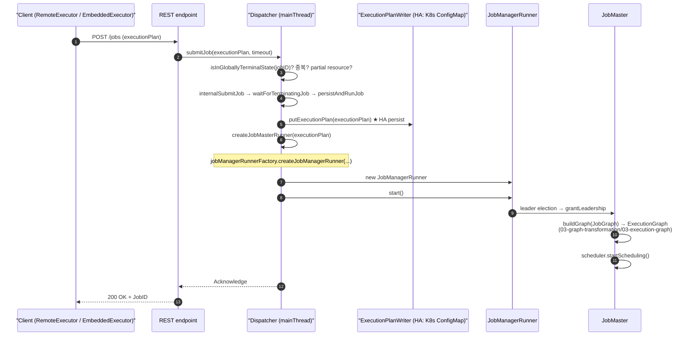

# Dispatcher — Job 제출 수신과 JobMaster 생성

> **요약**: 클라이언트의 `submitJob(executionPlan)`을 RPC로 받아 검증하고 HA 저장소에 영속화한 뒤 잡 1개당 `JobManagerRunner`(=JobMaster) 1개를 spawn해 위임하는 클러스터 측 진입 컴포넌트.
> **모듈**: `flink-runtime/runtime/dispatcher/`
> **기준 버전**: Flink `release-2.0`
> **운영 권장 여부**: ★Production

---

## 1. TL;DR (3문장)

`Dispatcher`는 클러스터의 "잡 접수처" — REST/RPC로 들어오는 `submitJob(executionPlan)`를 받아 중복/터미널 상태/리소스 검증 후 `ExecutionPlanWriter`로 HA 저장소(K8s ConfigMap, ZK 등)에 영속화하고, `JobManagerRunner` 인스턴스 1개를 띄워 잡 실행을 위임한다. JobMaster는 그 안에서 leader election을 거쳐 깨어나 [`ExecutionGraph`를 빌드](../03-graph-transformation/03-execution-graph.md)하고 스케줄링을 시작한다. 본인 환경(K8s + Flink Operator)에서는 보통 `StandaloneDispatcher` (SessionMode) 또는 `MiniDispatcher` (ApplicationMode)가 사용된다.

---

## 2. 사전 지식

### 2.1 Pekko Actor 모델 (Flink RPC의 토대)

`Dispatcher extends FencedRpcEndpoint<DispatcherId>` — `RpcEndpoint`는 Pekko(Akka의 fork) actor 위에 얹힌 Flink RPC 추상. 핵심 보장: **모든 RPC 콜백은 `MainThreadExecutor` 한 스레드에서만 실행**. 즉 actor mailbox 패턴 — 동시 RPC 요청이 와도 직렬화되어 처리되므로 `Dispatcher` 안의 mutable state(jobManagerRunnerRegistry 등)에 lock이 없다. 이 모델 자체는 [`./06-rpc-pekko.md`](06-rpc-pekko.md)에서 깊이 다룸.

### 2.2 `FencedRpcEndpoint` (펜싱 토큰 기반 leader 보호)

`Dispatcher`는 leader가 바뀔 수 있다 (HA failover 시). 옛 leader가 살아남아 같은 RPC를 받지 못하게 매 epoch마다 `DispatcherId`(=fencing token)를 발급, 모든 incoming RPC가 자기 token 일치 여부를 검사. 일치 안 하면 거부 → 옛 leader가 새 leader 작업을 방해 못함.

### 2.3 `CompletableFuture.thenComposeAsync(..., mainThreadExecutor)`

`submitJob`이 자주 쓰는 패턴 — IO 후 mainThread로 다시 돌아와서 mutable state 업데이트. CompletableFuture가 RPC + 단일 스레드 모델의 결합점.

---

## 3. 핵심 클래스 / 진입점

| 역할 | 클래스 | 위치 |
|------|------|------|
| 추상 베이스 | `Dispatcher` (`extends FencedRpcEndpoint<DispatcherId>`, `implements DispatcherGateway`) | `flink-runtime/src/main/java/org/apache/flink/runtime/dispatcher/Dispatcher.java` |
| Session 모드 구현 | `StandaloneDispatcher` | `flink-runtime/src/main/java/org/apache/flink/runtime/dispatcher/StandaloneDispatcher.java` |
| ApplicationMode 구현 | `MiniDispatcher` | `flink-runtime/src/main/java/org/apache/flink/runtime/dispatcher/MiniDispatcher.java` |
| RPC 게이트웨이 | `DispatcherGateway` (Interface) | `flink-runtime/src/main/java/org/apache/flink/runtime/dispatcher/DispatcherGateway.java` |
| Job 영속화 | `ExecutionPlanWriter` (Interface) — HA 저장소 wrapping | `flink-runtime/src/main/java/org/apache/flink/runtime/dispatcher/ExecutionPlanWriter.java` |
| JM 생성 팩토리 | `JobManagerRunnerFactory` | `flink-runtime/src/main/java/org/apache/flink/runtime/dispatcher/JobManagerRunnerFactory.java` |
| Dispatcher 자체 lifecycle | `DefaultDispatcherRunner` (leader election 포함) | `flink-runtime/src/main/java/org/apache/flink/runtime/dispatcher/runner/DefaultDispatcherRunner.java` |

---

## 4. 데이터 / 제어 흐름



---

## 5. 코드 워크스루

### 5.1 `Dispatcher.submitJob` — 진입점

`flink-runtime/.../Dispatcher.java:522-562`:

```java
@Override
public CompletableFuture<Acknowledge> submitJob(ExecutionPlan executionPlan, Duration timeout) {
    final JobID jobID = executionPlan.getJobID();
    try (MdcCloseable ignored = MdcUtils.withContext(MdcUtils.asContextData(jobID))) {
        log.info("Received job submission '{}' ({}).", executionPlan.getName(), jobID);
    }
    return isInGloballyTerminalState(jobID)
            .thenComposeAsync(
                    isTerminated -> {
                        if (isTerminated) {
                            // 같은 JobID의 잡이 이전에 globally-terminal이면 거부
                            return FutureUtils.completedExceptionally(
                                    DuplicateJobSubmissionException.ofGloballyTerminated(jobID));
                        } else if (jobManagerRunnerRegistry.isRegistered(jobID)
                                || submittedAndWaitingTerminationJobIDs.contains(jobID)) {
                            // 같은 JobID로 이미 동작 중인 잡이 있음
                            return FutureUtils.completedExceptionally(
                                    DuplicateJobSubmissionException.of(jobID));
                        } else if (executionPlan.isPartialResourceConfigured()) {
                            // 일부 vertex만 resource 명시된 경우 거부 (제약 사항)
                            return FutureUtils.completedExceptionally(
                                    new JobSubmissionException(jobID, "..."));
                        } else {
                            return internalSubmitJob(executionPlan);
                        }
                    },
                    getMainThreadExecutor(jobID));
}
```

세 가지 거부 케이스:
- 같은 jobId의 잡이 **이미 globally-terminal** (FINISHED/CANCELED/FAILED 상태로 저장됨)
- 같은 jobId의 잡이 **이미 등록 중**
- vertex 일부만 resource configured (전부 또는 전무여야 함)

`thenComposeAsync(..., getMainThreadExecutor(jobID))`로 IO 검증 후 main thread로 돌아와 mutable state 접근.

### 5.2 `internalSubmitJob` — 영속화 후 실행

`flink-runtime/.../Dispatcher.java:592-614`:

```java
private CompletableFuture<Acknowledge> internalSubmitJob(ExecutionPlan executionPlan) {
    if (executionPlan instanceof JobGraph) {
        applyParallelismOverrides((JobGraph) executionPlan);   // (a) 외부에서 주입된 parallelism override 적용
    }

    log.info("Submitting job '{}' ({}).", executionPlan.getName(), executionPlan.getJobID());

    submittedAndWaitingTerminationJobIDs.add(executionPlan.getJobID());   // (b) outstanding 표시

    return waitForTerminatingJob(                              // (c) 같은 JobID의 이전 잡이 종료 중이면 대기
                    executionPlan.getJobID(), executionPlan, this::persistAndRunJob)
            .handle(/* error 처리 */)
            .thenCompose(Function.identity())
            .whenComplete(
                    (ignored, throwable) ->
                            submittedAndWaitingTerminationJobIDs.remove(executionPlan.getJobID()));
}
```

핵심:
- **(a)** `applyParallelismOverrides` — REST API의 declarative resource management (FLIP-291) 또는 K8s Operator autoscaler가 내려준 parallelism 변경을 반영.
- **(c)** `waitForTerminatingJob` — 같은 `JobID`의 이전 inst가 cleanup 중일 수 있어 끝날 때까지 대기 → 끝난 뒤 `persistAndRunJob` 호출.

### 5.3 `persistAndRunJob` — HA 영속화 + 실행

`flink-runtime/.../Dispatcher.java:644-648`:

```java
private void persistAndRunJob(ExecutionPlan executionPlan) throws Exception {
    executionPlanWriter.putExecutionPlan(executionPlan);     // (a) HA 저장소에 영속화
    initJobClientExpiredTime(executionPlan);                  // (b) detached client aliveness 타이머 초기화
    runJob(createJobMasterRunner(executionPlan), ExecutionType.SUBMISSION);  // (c) JM 띄움
}
```

**(a) `executionPlanWriter.putExecutionPlan`** — 본인 환경(K8s)에선 `KubernetesStateHandleStore`가 ConfigMap에 직렬화된 ExecutionPlan을 저장한다 → JM Pod이 죽어도 새 JM Pod이 이걸 읽어서 잡을 복구. 자세한 동작은 [`../09-kubernetes-integration/k8s-ha-leader-election.md`](../09-kubernetes-integration/04-k8s-ha-leader-election.md).

### 5.4 `createJobMasterRunner` — JobMasterRunner 생성

`flink-runtime/.../Dispatcher.java:650-663`:

```java
private JobManagerRunner createJobMasterRunner(ExecutionPlan executionPlan) throws Exception {
    Preconditions.checkState(!jobManagerRunnerRegistry.isRegistered(executionPlan.getJobID()));
    return jobManagerRunnerFactory.createJobManagerRunner(
            executionPlan,
            configuration,
            getRpcService(),
            highAvailabilityServices,
            heartbeatServices,
            jobManagerSharedServices,
            new DefaultJobManagerJobMetricGroupFactory(jobManagerMetricGroup),
            fatalErrorHandler,
            failureEnrichers,
            System.currentTimeMillis());
    }
```

`JobManagerRunner`는 `JobMaster`의 wrapper로 leader election + lifecycle 관리를 담당. JobMaster 자체는 [`./03-job-master.md`](03-job-master.md)에서 깊이 다룸.

### 5.5 `runJob` — 실제 실행 시작

`flink-runtime/.../Dispatcher.java:674-`:

```java
private void runJob(JobManagerRunner jobManagerRunner, ExecutionType executionType)
        throws Exception {
    jobManagerRunner.start();                                // (a) leader election 등록
    jobManagerRunnerRegistry.register(jobManagerRunner);    // (b) Dispatcher 측 등록

    final JobID jobId = jobManagerRunner.getJobID();

    final CompletableFuture<CleanupJobState> cleanupJobStateFuture =
            jobManagerRunner
                    .getResultFuture()                       // (c) 잡 종료 future 등록
                    .handleAsync(
                            (jobManagerRunnerResult, throwable) -> {
                                // 결과 처리 또는 실패 처리
                                if (jobManagerRunnerResult != null) {
                                    return handleJobManagerRunnerResult(jobManagerRunnerResult, executionType);
                                } else {
                                    return CompletableFuture.completedFuture(
                                            jobManagerRunnerFailed(jobId, JobStatus.FAILED, throwable));
                                }
                            },
                            ...);
}
```

핵심 패턴: **future-driven lifecycle**. `jobManagerRunner.getResultFuture()`가 잡이 끝날 때(성공/실패 모두) 완료되고, 그 핸들러가 cleanup을 트리거.

### 5.6 `DispatcherGateway` 인터페이스 — 외부에서 보이는 API

`flink-runtime/.../DispatcherGateway.java:36-127` (대표 메서드들):

```java
public interface DispatcherGateway extends FencedRpcGateway<DispatcherId>, RestfulGateway {

    CompletableFuture<Acknowledge> submitJob(ExecutionPlan executionPlan, @RpcTimeout Duration timeout);
    CompletableFuture<Acknowledge> submitFailedJob(JobID jobId, String jobName, Throwable exception);
    CompletableFuture<Collection<JobID>> listJobs(@RpcTimeout Duration timeout);
    CompletableFuture<Integer> getBlobServerPort(@RpcTimeout Duration timeout);

    default CompletableFuture<Acknowledge> shutDownCluster(ApplicationStatus applicationStatus);

    default CompletableFuture<String> triggerCheckpoint(JobID jobID, @RpcTimeout Duration timeout);

    default CompletableFuture<String> triggerSavepointAndGetLocation(
            JobID jobId, String targetDirectory, SavepointFormatType formatType,
            TriggerSavepointMode savepointMode, @RpcTimeout Duration timeout);

    default CompletableFuture<String> stopWithSavepointAndGetLocation(...);

    default CompletableFuture<Long> triggerCheckpointAndGetCheckpointID(
            final JobID jobId, final CheckpointType checkpointType, final Duration timeout);
}
```

**REST/CLI에서 자주 호출되는 것**:
- `submitJob` — `flink run` / `kubectl ... apply -f flinkdeployment.yaml`의 결과
- `triggerSavepointAndGetLocation` — `flink savepoint <jobId>` / Operator의 savepoint 트리거
- `stopWithSavepointAndGetLocation` — graceful shutdown
- `triggerCheckpointAndGetCheckpointID` — REST `/jobs/<id>/checkpoints` POST

### 5.7 `StandaloneDispatcher` (Session 모드) vs `MiniDispatcher` (ApplicationMode)

`flink-runtime/.../StandaloneDispatcher.java:34-51`:

```java
/**
 * Dispatcher implementation which spawns a {@link JobMaster} for each submitted {@link JobGraph}
 * within in the same process. This dispatcher can be used as the default for all different session
 * clusters.
 */
public class StandaloneDispatcher extends Dispatcher {
    public StandaloneDispatcher(
            RpcService rpcService, DispatcherId fencingToken,
            Collection<ExecutionPlan> recoveredJobs, Collection<JobResult> recoveredDirtyJobResults,
            DispatcherBootstrapFactory dispatcherBootstrapFactory,
            DispatcherServices dispatcherServices) throws Exception {
        super(rpcService, fencingToken, recoveredJobs, recoveredDirtyJobResults,
                dispatcherBootstrapFactory, dispatcherServices);
    }
}
```

**거의 빈 클래스** — 모든 로직은 `Dispatcher` 추상 클래스에. SessionMode (다중 잡) 컨텍스트.

`MiniDispatcher`는 ApplicationMode용 — 잡 1개가 끝나면 클러스터 전체를 종료시키는 차이.

---

## 6. 사용자 환경 매핑

### 6.1 K8s SessionMode

```
[Operator가 띄운 JM Pod]
KubernetesSessionClusterEntrypoint.main()
  → ClusterEntrypoint → DispatcherResourceManagerComponent
    → DefaultDispatcherRunner.create() — leader election 시작
      → leader 획득 시 StandaloneDispatcher 생성
        → recovered jobs (HA 저장소에서 복구) 자동 재시작
        → REST endpoint listening (port 8081)
```

본인이 `flink run -m <jm-host>:8081` 또는 Operator의 CR 적용 → REST → `submitJob(executionPlan)` → 위 흐름 발동.

### 6.2 K8s ApplicationMode

```
[Operator가 띄운 단일 JM Pod (사용자 JAR 포함)]
KubernetesApplicationClusterEntrypoint.main()
  → ApplicationDispatcherBootstrap이 사용자 main() 실행
    → env.execute() → EmbeddedExecutor → DispatcherGateway.submitJob (REST 우회, 같은 JVM)
      → MiniDispatcher → JobMasterRunner → ExecutionGraph → 스케줄링
```

**핵심 차이**: ApplicationMode는 사용자 main()이 JM Pod 안에서 돌아 client-side JVM이 따로 없음. `EmbeddedExecutor`가 같은 프로세스의 `DispatcherGateway`를 직접 호출 (REST + 직렬화 우회).

### 6.3 HA 저장소 (K8s ConfigMap)

`executionPlanWriter.putExecutionPlan(executionPlan)`가 쓰는 backing store는 환경에 따라:
- **Kubernetes**: `KubernetesStateHandleStore` → ConfigMap에 직렬화된 plan 저장
- ZooKeeper: `ZooKeeperStateHandleStore` → ZK znode

본인 환경은 K8s. JM Pod 재시작 시 새 Pod이 ConfigMap을 읽어 `recoveredJobs`에 적재 → 자동 재시작.

---

## 7. 관련 FLIP / JIRA

- [FLIP-6: Flink Deployment and Process Model — ResourceManager, JobManager, TaskManager](https://cwiki.apache.org/confluence/display/FLINK/FLIP-6+-+Flink+Deployment+and+Process+Model+-+ResourceManager%2C+JobManager%2C+TaskManager) — Dispatcher가 분리된 컴포넌트가 된 배경 (1.5+)
- [FLIP-85: Flink Application Mode](https://cwiki.apache.org/confluence/display/FLINK/FLIP-85+Flink+Application+Mode) — `MiniDispatcher` 도입
- [FLIP-185: Shorter Recovery Time](https://cwiki.apache.org/confluence/display/FLINK/FLIP-185%3A+Shorter+Recovery+Time+for+JobManager) — JM failover 시 ExecutionPlan 빠른 재처리
- [FLIP-291: Externalized Declarative Resource Management](https://cwiki.apache.org/confluence/display/FLINK/FLIP-291%3A+Externalized+Declarative+Resource+Management) — `applyParallelismOverrides`의 배경

---

## 8. 디버깅 & 실험

### 8.1 REST로 직접 호출

```bash
# 잡 목록
curl http://<jm-rest>:8081/jobs/overview

# 잡 상세
curl http://<jm-rest>:8081/jobs/<jobId>

# 잡 cancel
curl -X PATCH http://<jm-rest>:8081/jobs/<jobId>?mode=cancel

# 체크포인트 트리거
curl -X POST http://<jm-rest>:8081/jobs/<jobId>/checkpoints
```

내부적으로 모두 `DispatcherGateway`의 메서드로 매핑됨.

### 8.2 코드로 따라가기

브레이크포인트 위치:
- `Dispatcher.java:522` — submitJob 진입
- `Dispatcher.java:592` — internalSubmitJob (검증 통과 후)
- `Dispatcher.java:644` — persistAndRunJob (HA persist 시작)
- `Dispatcher.java:674` — runJob (JobManagerRunner 시작)

MiniCluster를 띄워 IDE에서 `flink-runtime/.../minicluster/MiniCluster.java`에 잡을 제출하면 위 흐름이 그대로 실행된다.

### 8.3 K8s 환경에서 HA 저장 확인

```bash
kubectl get configmap -n <flink-ns> | grep <cluster-id>
# *-config-map: 일반 설정
# *-leaderlatch-*: leader election
# *-jobgraph-*: ExecutionPlan 저장
```

---

## 9. FAQ

**Q1. Dispatcher와 JobMaster 차이?**
A. **Dispatcher = 잡 접수처** (1 클러스터당 1개), **JobMaster = 잡 1개의 매니저** (JobMaster 인스턴스는 잡 수만큼 존재). Dispatcher가 잡 1개를 받을 때마다 JobMaster를 새로 spawn.

**Q2. Dispatcher 자체의 leader election은 어떻게?**
A. `DefaultDispatcherRunner`가 `LeaderElectionService`(K8s ConfigMap 또는 ZK)에 리더 후보로 등록. 리더가 되면 `StandaloneDispatcher`/`MiniDispatcher` 인스턴스를 만들어 활성화. 이 부분은 [`../09-kubernetes-integration/k8s-ha-leader-election.md`](../09-kubernetes-integration/04-k8s-ha-leader-election.md).

**Q3. `submittedAndWaitingTerminationJobIDs`는 왜 필요?**
A. 사용자가 같은 jobId로 두 번 submit하는 race를 막기 위함. 첫 번째가 cleanup 중인 사이에 두 번째가 들어오면 거부.

**Q4. ApplicationMode에서 `MiniDispatcher`는 잡 끝나면 클러스터를 죽이나?**
A. 그렇다. `JobStatusHook`을 통해 globally-terminal 도달 시 `shutDownCluster(applicationStatus)`를 호출 → entrypoint가 종료되어 Pod도 종료.

**Q5. 사용자 main이 throw하면 어떻게?**
A. ApplicationMode의 경우 `ApplicationDispatcherBootstrap`가 `submitFailedJob(...)` 호출 → MiniDispatcher가 실패 상태를 globally persist 후 cluster shutdown.

---

## 10. 다음에 읽을 문서

- ResourceManager (slot 관리, K8s pod 요청): [`./02-resource-manager.md`](02-resource-manager.md)
- JobMaster (한 잡의 매니저): [`./03-job-master.md`](03-job-master.md)
- TaskExecutor (slot 호스팅, task 실행): [`./04-task-executor.md`](04-task-executor.md)
- StreamTask mailbox 모델 (각 subtask가 어떻게 record를 처리하는가): [`./05-stream-task-mailbox.md`](05-stream-task-mailbox.md)
- RPC (Pekko 기반 actor): [`./06-rpc-pekko.md`](06-rpc-pekko.md)
