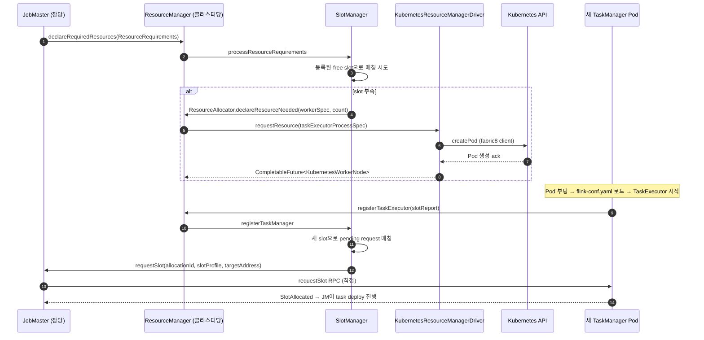

# ResourceManager — Slot 관리와 K8s Worker(=TaskManager) Pod 요청

> **요약**: 클러스터의 슬롯 인벤토리를 관리하고, 슬롯이 부족할 때 외부 시스템(K8s, YARN)에 새 TaskManager 워커를 요청하는 컴포넌트. K8s 환경에서는 `KubernetesResourceManagerDriver`가 fabric8 K8s 클라이언트로 TM Pod을 생성/삭제한다.
> **모듈**: `flink-runtime/runtime/resourcemanager/`, `flink-kubernetes/`
> **기준 버전**: Flink `release-2.0`
> **운영 권장 여부**: ★Production

---

## 1. TL;DR (3문장)

`ResourceManager`(RM)는 클러스터당 1개로, TaskManager들의 등록을 받고 그 슬롯 인벤토리를 `SlotManager`로 관리하며 JobMaster의 `ResourceRequirements` 선언을 받아 매칭한다. 슬롯이 부족하면 `ActiveResourceManager` + `ResourceManagerDriver`(K8s/YARN 구현체)가 외부에 새 워커(=TaskManager Pod) 생성을 요청 — 본인 환경에선 `KubernetesResourceManagerDriver`가 fabric8 K8s API로 Pod을 띄운다. 슬롯이 남으면 idle TM 회수, 워커 등록 실패 시 backoff 재시도까지 모두 RM의 책임.

---

## 2. 사전 지식

### 2.1 Slot의 의미

**Slot은 task가 실행될 자원 단위** — 1 slot = 1 TM의 1 thread + 일정량의 managed memory + (fine-grained면) 명시적 CPU/heap. 1 TM은 보통 N개 slot을 가진다(=`taskmanager.numberOfTaskSlots`). slot sharing group이 같은 다른 task와 같은 slot을 공유 가능 ([`../03-graph-transformation/02-job-graph.md`](../03-graph-transformation/02-job-graph.md) 5.4 참조).

### 2.2 Declarative vs Imperative slot 요청

- **옛날 (1.x)**: JobMaster가 "subtask X를 위해 slot 1개 주세요" — slot 단위 요청
- **지금 (FLIP-138 declarative)**: JobMaster가 "현재 잡이 필요한 총 자원은 N슬롯입니다" — `ResourceRequirements` 단위 선언, RM이 알아서 매칭

본인 환경의 `AdaptiveScheduler` + Operator autoscaler는 declarative 모델 위에서 동작.

### 2.3 fabric8 Kubernetes Java Client

K8s API와 통신하는 표준 Java 라이브러리. `KubernetesResourceManagerDriver`가 사용. Pod CRUD, Watch(=long-poll로 상태 변화 stream) 등 제공. 자세한 동작은 [`../09-kubernetes-integration/kubeclient-decorators.md`](../09-kubernetes-integration/02-kubeclient-decorators.md).

---

## 3. 핵심 클래스 / 진입점

| 역할 | 클래스 | 위치 |
|------|------|------|
| 추상 베이스 | `ResourceManager<WorkerType>` (`extends FencedRpcEndpoint<ResourceManagerId>`) | `flink-runtime/src/main/java/org/apache/flink/runtime/resourcemanager/ResourceManager.java` |
| Standalone (TM이 외부에서 직접 뜨는 모드) | `StandaloneResourceManager` | `flink-runtime/.../resourcemanager/StandaloneResourceManager.java` |
| Active (외부 시스템과 통신) | `ActiveResourceManager<WorkerType>` (`implements ResourceEventHandler<WorkerType>`) | `flink-runtime/.../resourcemanager/active/ActiveResourceManager.java` |
| 외부 시스템 driver 추상 | `ResourceManagerDriver<WorkerType>` (Interface) | `flink-runtime/.../resourcemanager/active/ResourceManagerDriver.java` |
| K8s driver 구현 | `KubernetesResourceManagerDriver` (`extends AbstractResourceManagerDriver<KubernetesWorkerNode>`) | `flink-kubernetes/src/main/java/org/apache/flink/kubernetes/KubernetesResourceManagerDriver.java` |
| K8s 워커 노드 표현 | `KubernetesWorkerNode` | `flink-kubernetes/.../KubernetesWorkerNode.java` |
| K8s RM factory | `KubernetesResourceManagerFactory` | `flink-kubernetes/.../entrypoint/KubernetesResourceManagerFactory.java` |
| Slot 인벤토리 추상 | `SlotManager` (Interface) | `flink-runtime/.../resourcemanager/slotmanager/SlotManager.java` |
| Declarative 구현 (기본) | `DeclarativeSlotManager` | `flink-runtime/.../resourcemanager/slotmanager/DeclarativeSlotManager.java` |
| Fine-grained 구현 | `FineGrainedSlotManager` | `flink-runtime/.../resourcemanager/slotmanager/FineGrainedSlotManager.java` |

---

## 4. 데이터 / 제어 흐름 (K8s Active 모드)



본인 환경의 Operator autoscaler는 (1)~(3) 사이에 **REST로 parallelism 변경 명령을 JM에 줌** → JM의 AdaptiveScheduler가 새 ResourceRequirements 선언 → 이후 흐름 동일.

---

## 5. 코드 워크스루

### 5.1 `ResourceManager` 추상 베이스

`flink-runtime/.../ResourceManager.java:108-`:

```java
/**
 * ResourceManager implementation. The resource manager is responsible for resource de-/allocation
 * and bookkeeping.
 *
 * <p>It offers the following methods as part of its rpc interface to interact with him remotely:
 *  - registerJobMaster(...)
 *  - registerTaskExecutor(...)
 *  - declareRequiredResources(...)
 *  - sendSlotReport(...)
 *  - heartbeatFromTaskManager(...)
 */
public abstract class ResourceManager<WorkerType extends ResourceIDRetrievable>
        extends FencedRpcEndpoint<ResourceManagerId>
        implements DelegationTokenManager.Listener, ResourceManagerGateway {

    public static final String RESOURCE_MANAGER_NAME = "resourcemanager";

    private final ResourceID resourceId;
    // ... slotManager, jobLeaderIdService, jmGatewayRetrievers, taskExecutors, ...
}
```

핵심 RPC 표면 (gateway 메서드):
- `registerJobMaster(jobMasterId, ...)` — JobMaster가 RM에 자신 등록 (잡 시작 시 1번)
- `registerTaskExecutor(taskExecutorId, slotReport)` — 새 TM 등록 (TM 부팅 시)
- `declareRequiredResources(jobMasterId, ResourceRequirements)` — JM이 자원 선언
- `sendSlotReport(...)` — TM이 주기적으로 slot 상태 보고
- `heartbeatFromTaskManager(taskExecutorId, slotReport)` — TM heartbeat + slot 상태

### 5.2 `ActiveResourceManager` — Driver를 거쳐 동적 워커 관리

`flink-runtime/.../ActiveResourceManager.java:76-105`:

```java
/**
 * An active implementation of {@link ResourceManager}.
 *
 * <p>This resource manager actively requests and releases resources from/to the external resource
 * management frameworks. With different {@link ResourceManagerDriver} provided, this resource
 * manager can work with various frameworks.
 */
public class ActiveResourceManager<WorkerType extends ResourceIDRetrievable>
        extends ResourceManager<WorkerType> implements ResourceEventHandler<WorkerType> {

    protected final Configuration flinkConfig;
    private final Duration startWorkerRetryInterval;
    private final ResourceManagerDriver<WorkerType> resourceManagerDriver;   // ★ K8s/YARN

    /** All workers maintained by ActiveResourceManager. */
    private final Map<ResourceID, WorkerType> workerNodeMap;

    /** Number of requested and not registered workers per worker resource spec. */
    private final WorkerCounter pendingWorkerCounter;

    private final Map<ResourceID, WorkerResourceSpec> workerResourceSpecs;
    private final Map<CompletableFuture<WorkerType>, WorkerResourceSpec> unallocatedWorkerFutures;
    private final Set<ResourceID> currentAttemptUnregisteredWorkers;
    private final Set<ResourceID> previousAttemptUnregisteredWorkers;
    private final ThresholdMeter startWorkerFailureRater;
    private final Duration workerRegistrationTimeout;
}
```

핵심 책임:
- `resourceManagerDriver`로 외부에 워커 요청/해제
- pending worker 추적 (`pendingWorkerCounter`, `unallocatedWorkerFutures`)
- 등록 timeout (Pod 띄웠는데 timeout 안에 RM에 register 안 하면 회수)
- 시작 실패 rate 추적 (`ThresholdMeter`) → 너무 자주 실패하면 alarm

### 5.3 `ResourceManagerDriver` 인터페이스

`flink-runtime/.../active/ResourceManagerDriver.java:34-`:

```java
/**
 * A {@link ResourceManagerDriver} is responsible for requesting and releasing resources from/to a
 * particular external resource manager.
 */
public interface ResourceManagerDriver<WorkerType extends ResourceIDRetrievable> {

    void initialize(
            ResourceEventHandler<WorkerType> resourceEventHandler,
            ScheduledExecutor mainThreadExecutor,
            Executor ioExecutor,
            BlockedNodeRetriever blockedNodeRetriever) throws Exception;

    void terminate() throws Exception;

    void deregisterApplication(ApplicationStatus finalStatus, @Nullable String optionalDiagnostics)
            throws Exception;

    /** ★ Request resource from the external resource manager. */
    CompletableFuture<WorkerType> requestResource(TaskExecutorProcessSpec taskExecutorProcessSpec);

    /** ★ Release resource to the external resource manager. */
    void releaseResource(WorkerType worker);
}
```

이 인터페이스 위에 K8s/YARN 구현체가 얹힌다. 사용자가 직접 구현체를 만들기는 어렵지만(Internal annotated), SPI 매커니즘 없이 entrypoint별로 hard-coded.

### 5.4 `KubernetesResourceManagerDriver` — K8s 측 진짜 동작

`flink-kubernetes/.../KubernetesResourceManagerDriver.java:71-117`:

```java
/** Implementation of {@link ResourceManagerDriver} for Kubernetes deployment. */
public class KubernetesResourceManagerDriver
        extends AbstractResourceManagerDriver<KubernetesWorkerNode> {

    /** The taskmanager pod name pattern is {clusterId}-{taskmanager}-{attemptId}-{podIndex}. */
    private static final String TASK_MANAGER_POD_FORMAT = "%s-taskmanager-%d-%d";

    private final String clusterId;
    private final String webInterfaceUrl;
    private final FlinkKubeClient flinkKubeClient;          // ★ fabric8 wrapper

    /** Request resource futures, keyed by pod names. */
    private final Map<String, CompletableFuture<KubernetesWorkerNode>> requestResourceFutures;

    private long currentMaxAttemptId = 0;
    private long currentMaxPodId = 0;

    private CompletableFuture<KubernetesWatch> podsWatchOptFuture =
            FutureUtils.completedExceptionally(...);

    private volatile boolean running;
    private FlinkPod taskManagerPodTemplate;

    public KubernetesResourceManagerDriver(
            Configuration flinkConfig,
            FlinkKubeClient flinkKubeClient,
            KubernetesResourceManagerDriverConfiguration configuration) {
        super(flinkConfig, GlobalConfiguration.loadConfiguration());
        this.clusterId = Preconditions.checkNotNull(configuration.getClusterId());
        this.webInterfaceUrl = configuration.getWebInterfaceUrl();
        this.flinkKubeClient = Preconditions.checkNotNull(flinkKubeClient);
        this.requestResourceFutures = new HashMap<>();
        this.running = false;
    }

    @Override
    protected void initializeInternal() throws Exception {
        podsWatchOptFuture = watchTaskManagerPods();           // (a) Pod 변화 watch 시작
        final File podTemplateFile = KubernetesUtils.getTaskManagerPodTemplateFileInPod();
        if (podTemplateFile.exists()) {
            taskManagerPodTemplate = KubernetesUtils.loadPodFromTemplateFile(...);  // (b) podTemplate 로드
        } else {
            taskManagerPodTemplate = new FlinkPod.Builder().build();
        }
    }
}
```

핵심:
- `flinkKubeClient`: fabric8 K8s 클라이언트의 Flink wrapper (인증/네임스페이스 등 처리)
- `taskManagerPodTemplate`: 사용자가 `FlinkDeployment` CR에 명시한 `podTemplate` 또는 기본값. `requestResource`가 호출될 때 이 템플릿을 베이스로 새 Pod spec 생성.
- `podsWatchOptFuture`: K8s API의 watch endpoint long-poll → Pod의 ADDED/MODIFIED/DELETED 이벤트를 수신 → `resourceEventHandler.onWorkerTerminated(...)` 호출

### 5.5 `requestResource` — 실제 Pod 요청 (개요)

`flink-kubernetes/.../KubernetesResourceManagerDriver.java:174-` (핵심 발췌):

```java
public CompletableFuture<KubernetesWorkerNode> requestResource(
        TaskExecutorProcessSpec taskExecutorProcessSpec) {
    // ...
    final CompletableFuture<KubernetesWorkerNode> requestResourceFuture = new CompletableFuture<>();

    requestResourceFutures.put(podName, requestResourceFuture);

    // pod spec 생성 (podTemplate + TM 자원 spec + container args)
    // ... 
    flinkKubeClient.createTaskManagerPod(taskManagerPod)
            .whenComplete((ignore, throwable) -> {
                if (throwable != null) {
                    requestResourceFutures.remove(taskManagerPod.getName());
                    requestResourceFuture.completeExceptionally(throwable);
                }
                if (requestResourceFuture.isCancelled()) {
                    // RM이 더 이상 안 필요하다고 판단 → Pod 회수
                    flinkKubeClient.stopPod(taskManagerPod.getName());
                }
            });

    requestResourceFuture.handle(/* timeout 처리 */);
    return requestResourceFuture;
}
```

흐름:
1. 새 podName 생성 (`{clusterId}-taskmanager-{attemptId}-{podId}`)
2. `taskManagerPodTemplate` + `TaskExecutorProcessSpec`(memory, CPU 등)로 실제 Pod spec 빌드
3. `flinkKubeClient.createTaskManagerPod(...)` — fabric8가 K8s API에 POST
4. future를 등록 — 나중에 watch로 Pod이 RUNNING이 되거나 실패하면 complete

### 5.6 `SlotManager` — Slot 인벤토리 + 매칭 엔진

`flink-runtime/.../slotmanager/SlotManager.java:30-90`:

```java
/**
 * The slot manager is responsible for maintaining a view on all registered task manager slots,
 * their allocation and all pending slot requests. Whenever a new slot is registered or an allocated
 * slot is freed, then it tries to fulfill another pending slot request. Whenever there are not
 * enough slots available the slot manager will notify the resource manager about it via {@link
 * ResourceAllocator#declareResourceNeeded}.
 *
 * <p>In order to free resources and avoid resource leaks, idling task managers (task managers whose
 * slots are currently not used) and pending slot requests time out triggering their release and
 * failure, respectively.
 */
public interface SlotManager extends AutoCloseable {
    int getNumberRegisteredSlots();
    int getNumberFreeSlots();
    ResourceProfile getRegisteredResource();
    ResourceProfile getFreeResource();
    Collection<SlotInfo> getAllocatedSlotsOf(InstanceID instanceID);

    void start(
            ResourceManagerId newResourceManagerId,
            Executor newMainThreadExecutor,
            ResourceAllocator newResourceAllocator,
            ResourceEventListener resourceEventListener,
            BlockedTaskManagerChecker newBlockedTaskManagerChecker);

    void suspend();

    void clearResourceRequirements(JobID jobId);
    void processResourceRequirements(ResourceRequirements resourceRequirements);
    boolean registerTaskManager(TaskExecutorConnection taskExecutorConnection, SlotReport initialSlotReport, ResourceProfile totalResourceProfile, ResourceProfile defaultSlotResourceProfile);
    boolean unregisterTaskManager(InstanceID instanceId, Exception cause);
    boolean reportSlotStatus(InstanceID instanceId, SlotReport slotReport);
}
```

핵심 동작:
- `processResourceRequirements(rr)`: JM의 선언을 받아 free slot으로 매칭. 부족하면 `ResourceAllocator.declareResourceNeeded(...)`로 RM에게 워커 요청 신호.
- `registerTaskManager(...)`: 새 TM이 와서 slot을 알리면, pending request를 매칭 시도.
- `processSlotStatus(slotReport)`: 주기적 slot report에 따른 상태 업데이트.
- `idle TM` 처리: 일정 시간 unallocated 상태인 TM은 release 트리거 (autoscaler 입장의 scale-down).

### 5.7 두 `SlotManager` 구현체

| 구현 | 특징 | 언제 |
|------|------|------|
| `DeclarativeSlotManager` | 잡 단위로 ResourceRequirements 선언, slot은 동일 default profile | 보통 사용 (FLIP-138) |
| `FineGrainedSlotManager` | 각 task가 명시적 ResourceProfile (heap/CPU/managed mem) 가능 | FLIP-156 fine-grained 켜졌을 때 |

본인 환경 (AdaptiveScheduler + Operator autoscaler)은 `DeclarativeSlotManager`로 충분.

---

## 6. 사용자 환경 매핑

### 6.1 K8s + Operator + AdaptiveScheduler 흐름

```
[Operator]                           [Flink 클러스터]
FlinkDeployment CR 적용
  ↓
JM Pod 생성 (ConfigMap, Service 포함)
  ↓
                                     KubernetesSessionClusterEntrypoint 시작
                                       ↓
                                     ResourceManagerComponent 안에 ActiveResourceManager 생성
                                       + KubernetesResourceManagerDriver 주입
                                       ↓
                                     watchTaskManagerPods() 시작 (K8s watch)

사용자 잡 submit
  ↓
                                     Dispatcher → JobMaster
                                       ↓
                                     AdaptiveScheduler가 ResourceRequirements 선언
                                       ↓
                                     SlotManager: 등록된 free slot 없음 → declareResourceNeeded
                                       ↓
                                     RM → KubernetesResourceManagerDriver.requestResource(spec)
                                       ↓
                                     fabric8 → K8s API: createPod(taskManagerPodTemplate + spec)
                                       ↓
TM Pod 생성
  ↓
TaskExecutor 시작
  ↓
                                     RM.registerTaskExecutor(slotReport) RPC
                                       ↓
                                     SlotManager: pending request에 매칭
                                       ↓
                                     JM → TM: requestSlot RPC → SlotAllocated → task deploy
```

Operator autoscaler 동작:
- 메트릭 수집 (utilization, busy time, backpressure) → 새 parallelism 산출
- REST → JM AdaptiveScheduler에 변경 명령
- AdaptiveScheduler → 새 ResourceRequirements 선언 → SlotManager → RM → Driver → 추가/감소 Pod

### 6.2 Pod 스펙 결정의 두 측

본인 환경에서 TM Pod이 어떻게 보이는가:
- **Operator (외부 레포)**: `FlinkDeployment` CR의 `taskManager.podTemplate` 필드 — 사용자가 명시한 base.
- **Flink 측 (`flink-kubernetes`)**: `taskManagerPodTemplate`을 베이스로 받고, 그 위에 TaskExecutor 컨테이너 args, 메모리/CPU spec, 환경 변수, ConfigMap volume mount 등을 데코레이터 패턴으로 덧붙임 → 최종 Pod spec.

데코레이터 자세한 동작은 [`../09-kubernetes-integration/kubeclient-decorators.md`](../09-kubernetes-integration/02-kubeclient-decorators.md).

---

## 7. 관련 FLIP / JIRA

- [FLIP-6: Flink Deployment and Process Model](https://cwiki.apache.org/confluence/display/FLINK/FLIP-6+-+Flink+Deployment+and+Process+Model+-+ResourceManager%2C+JobManager%2C+TaskManager) — RM 분리의 토대
- [FLIP-138: Declarative Resource management](https://cwiki.apache.org/confluence/display/FLINK/FLIP-138%3A+Declarative+Resource+management) — `ResourceRequirements` 모델
- [FLIP-156: Runtime Interfaces for Fine-Grained Resource Requirements](https://cwiki.apache.org/confluence/display/FLINK/FLIP-156%3A+Runtime+Interfaces+for+Fine-Grained+Resource+Requirements) — `FineGrainedSlotManager`
- [FLIP-160: Adaptive Scheduler](https://cwiki.apache.org/confluence/display/FLINK/FLIP-160:+Adaptive+Scheduler) — declarative slot 요청의 활용
- [FLIP-291: Externalized Declarative Resource Management](https://cwiki.apache.org/confluence/display/FLINK/FLIP-291%3A+Externalized+Declarative+Resource+Management) — REST를 통한 외부 자원 관리

---

## 8. 디버깅 & 실험

### 8.1 슬롯 상태 REST 조회

```bash
curl http://<jm-rest>:8081/taskmanagers
curl http://<jm-rest>:8081/jobs/<jobId>/checkpoints/details/<id>
```

### 8.2 K8s 측 직접 확인

```bash
# RM이 만든 TM Pod
kubectl get pods -n <flink-ns> -l app=<cluster-id>,component=taskmanager

# RM이 K8s에 무슨 요청을 했는지 (audit log)
kubectl logs -n <flink-ns> <jm-pod> | grep -i "request.*pod\|create.*taskmanager"
```

### 8.3 IDE 브레이크포인트

- `ActiveResourceManager.requestNewWorker(...)` — 워커 요청 진입
- `KubernetesResourceManagerDriver.java:174` — `requestResource` 진입
- `DeclarativeSlotManager.processResourceRequirements(...)` — JM의 선언 처리
- `ResourceManager.registerTaskExecutor(...)` — 새 TM 등록

---

## 9. FAQ

**Q1. RM이 죽으면?**
A. RM도 leader election (HA). Standby RM이 살아남아 leader가 되면 기존 TM들과 재연결 (`registerTaskExecutor` 다시 받음). HA 저장소(K8s ConfigMap)에 워커 ID들을 적어둬서 잃은 워커도 회수 가능.

**Q2. TM Pod이 OOMKilled되면?**
A. K8s가 Pod 종료 → watch 이벤트 → `onWorkerTerminated` → `ActiveResourceManager`가 워커 회수 → 만약 잡이 여전히 자원 필요하면 `requestResource` 재호출. start failure rate가 임계 넘으면 alarm.

**Q3. autoscaler가 줄이라고 하면 어떤 TM이 회수되나?**
A. SlotManager는 idle TM(=allocated slot 0개)을 우선. 단순 LRU 또는 정책에 따라 다름. AdaptiveScheduler가 새 parallelism으로 ExecutionGraph 재구성 → 사용 안 하는 task가 종료 → slot free → idle TM 발생 → release.

**Q4. `taskmanager.numberOfTaskSlots`가 8일 때 1 task만 돌아도 8 slot이 묶이나?**
A. 다른 task가 같은 TM의 다른 slot을 쓸 수 있다 (slot sharing 또는 다른 잡). `DeclarativeSlotManager`는 잡 간 slot 공유를 안 함 (slot은 잡 1개에 전용). 그래서 1잡만 1 task로 쓰면 7 slot이 idle.

**Q5. K8s Operator 없이 직접 `flink run-application`으로 띄울 때도 같은 RM?**
A. 그렇다. `KubernetesApplicationClusterEntrypoint`가 ApplicationMode로 띄울 때도 같은 `KubernetesResourceManagerDriver` 사용. Operator는 그저 CR을 watch해서 entrypoint 명령을 내려주는 역할.

---

## 10. 다음에 읽을 문서

- JobMaster (한 잡의 매니저 — RM과 협상): [`./03-job-master.md`](03-job-master.md)
- TaskExecutor (slot 호스팅, task 실행): [`./04-task-executor.md`](04-task-executor.md)
- StreamTask 메인 루프: [`./05-stream-task-mailbox.md`](05-stream-task-mailbox.md)
- AdaptiveScheduler ↔ ResourceRequirements 자세히: [`../10-scheduling-failover/adaptive-scheduler.md`](../10-scheduling-failover/01-adaptive-scheduler.md)
- K8s 통합 (Operator 경계, decorator, podTemplate): [`../09-kubernetes-integration/`](../09-kubernetes-integration/) (예정)
