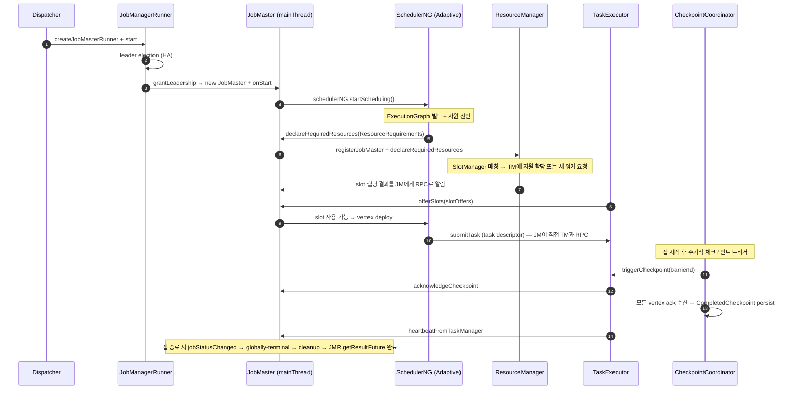

# JobMaster — 한 잡의 매니저

> **요약**: Dispatcher가 잡 1개당 spawn하는 컴포넌트. ExecutionGraph 빌드, Scheduler 위임, RM과 자원 협상, TM과 슬롯 협상, 체크포인트 트리거, 잡 종료 처리까지 **한 잡의 전체 lifecycle을 책임진다**.
> **모듈**: `flink-runtime/runtime/jobmaster/`
> **기준 버전**: Flink `release-2.0`
> **운영 권장 여부**: ★Production

---

## 1. TL;DR (3문장)

`JobMaster`는 잡 인스턴스 1개의 owner — Dispatcher가 잡을 받을 때마다 새 `JobMaster`가 만들어져 [`ExecutionGraph`를 빌드하고](../03-graph-transformation/03-execution-graph.md) `SchedulerNG`(`DefaultScheduler` 또는 `AdaptiveScheduler`)에 스케줄링을 위임한다. RM과는 `ResourceRequirements`로 슬롯을 선언하고, TM과는 직접 RPC로 슬롯 offer를 받고 task를 deploy하며, 체크포인트는 `CheckpointCoordinator`가 트리거한다. JobMaster는 `JobManagerRunner`로 wrapping되어 leader election + JM failover를 거치는데, 본인 환경(K8s + HA)에서 JM Pod 재시작 시 새 JM이 같은 잡 ID로 부활.

---

## 2. 사전 지식

### 2.1 `RpcEndpoint` mainThread 모델 (재강조)

`JobMaster extends FencedRpcEndpoint<JobMasterId>` — 모든 RPC 콜백이 단일 main thread에서 직렬화 실행. `validateRunsInMainThread()`가 곳곳에 있는 이유. 다른 스레드(executor)에서 비동기 작업 후 결과를 main thread로 다시 가져올 땐 `runAsync(...)` / `callAsync(...)` 사용.

### 2.2 fencing token (`JobMasterId`)

JM도 leader election → JobMaster 인스턴스가 leader가 될 때마다 새 `JobMasterId` 발급. 모든 incoming RPC가 발신자가 가진 ID와 자기 ID 일치 여부 검사. 옛 leader의 stale RPC를 거부.

### 2.3 `SchedulerNG` (스케줄러 인터페이스)

JobMaster는 스케줄링 정책을 직접 알지 않음 — `SchedulerNG` 추상 뒤에 숨김. 두 구현체:
- `DefaultScheduler`: 고정 parallelism, region-based failover
- `AdaptiveScheduler`: 가변 parallelism, slot 변동에 적응

본인 환경은 `AdaptiveScheduler`. 자세한 동작은 [`../10-scheduling-failover/adaptive-scheduler.md`](../10-scheduling-failover/) (예정).

---

## 3. 핵심 클래스 / 진입점

| 역할 | 클래스 | 위치 |
|------|------|------|
| 본체 | `JobMaster` (`extends FencedRpcEndpoint<JobMasterId>`, `implements JobMasterGateway, JobMasterService`) | `flink-runtime/src/main/java/org/apache/flink/runtime/jobmaster/JobMaster.java` |
| RPC 게이트웨이 | `JobMasterGateway` (Interface) | `flink-runtime/.../jobmaster/JobMasterGateway.java` |
| 서비스 추상 | `JobMasterService` (Interface) | `flink-runtime/.../jobmaster/JobMasterService.java` |
| Lifecycle wrapper | `JobManagerRunner` (Interface) | `flink-runtime/.../jobmaster/JobManagerRunner.java` |
| 기본 wrapper 구현 | `DefaultJobMasterServiceProcess` | `flink-runtime/.../jobmaster/DefaultJobMasterServiceProcess.java` |
| Scheduler 추상 | `SchedulerNG` (Interface) | `flink-runtime/.../scheduler/SchedulerNG.java` |
| Scheduler 구현 1 | `DefaultScheduler` | `flink-runtime/.../scheduler/DefaultScheduler.java` |
| Scheduler 구현 2 (★ 본인 환경) | `AdaptiveScheduler` | `flink-runtime/.../scheduler/adaptive/AdaptiveScheduler.java` |

---

## 4. 데이터 / 제어 흐름



---

## 5. 코드 워크스루

### 5.1 `JobMaster` 클래스 본체

`flink-runtime/.../JobMaster.java:142-`:

```java
/**
 * JobMaster implementation. The job master is responsible for the execution of a single {@link
 * ExecutionPlan}.
 *
 * <p>It offers the following methods as part of its rpc interface to interact with the JobMaster
 * remotely:
 *  - updateTaskExecutionState updates the task execution state for given task
 */
public class JobMaster extends FencedRpcEndpoint<JobMasterId>
        implements JobMasterGateway, JobMasterService {

    public static final String JOB_MANAGER_NAME = "jobmanager";

    // ... resourceManagerLeaderRetriever, slotPool, schedulerNG,
    //     checkpointCoordinator (via schedulerNG), partitionTracker, ...
}
```

JobMaster 내부의 핵심 협력자들:
- `slotPool`: 이 잡이 가진 free/allocated slot 풀 — RM이 할당해준 slot을 풀에 보관, scheduler가 vertex deploy 시 사용
- `schedulerNG`: 실제 스케줄러 (Default/Adaptive)
- `partitionTracker`: 이 잡의 IntermediateResultPartition들의 위치 추적 (ResultPartition 회수에 필요)
- `resourceManagerLeaderRetriever`: RM의 leader 변경 watch (HA 시 새 RM에 재등록)
- `taskManagerHeartbeatManager` / `resourceManagerHeartbeatManager`: heartbeat 추적

### 5.2 `startScheduling` — 스케줄링 시작

`flink-runtime/.../JobMaster.java:1239-1241`:

```java
private void startScheduling() {
    schedulerNG.startScheduling();
}
```

JM 자체는 **거의 아무것도 안 함** — 모든 진짜 스케줄링은 `SchedulerNG` 구현체 안에. JM의 역할은 **inbound RPC를 받아 적절한 컴포넌트로 위임**.

### 5.3 `JobMasterGateway` — 외부에서 보이는 API

`flink-runtime/.../JobMasterGateway.java:78-317` (대표 메서드):

```java
// task lifecycle
CompletableFuture<Acknowledge> updateTaskExecutionState(TaskExecutionState taskExecutionState);
CompletableFuture<SerializedInputSplit> requestNextInputSplit(JobVertexID vertexID, ExecutionAttemptID executionAttempt);
CompletableFuture<ExecutionState> requestPartitionState(IntermediateDataSetID resultId, ResultPartitionID partitionId);

// TM 측 등록
CompletableFuture<RegistrationResponse> registerTaskManager(...);
CompletableFuture<Collection<SlotOffer>> offerSlots(ResourceID taskManagerId, Collection<SlotOffer> slots, Duration timeout);
CompletableFuture<Acknowledge> disconnectTaskManager(ResourceID resourceID, Exception cause);

// heartbeat
CompletableFuture<Void> heartbeatFromTaskManager(ResourceID resourceID, TaskExecutorToJobManagerHeartbeatPayload payload);
CompletableFuture<Void> heartbeatFromResourceManager(ResourceID resourceID);

// 잡 메타
CompletableFuture<JobStatus> requestJobStatus(Duration timeout);
CompletableFuture<ExecutionGraphInfo> requestJob(Duration timeout);
CompletableFuture<CheckpointStatsSnapshot> requestCheckpointStats(Duration timeout);

// 사용자 액션
CompletableFuture<Acknowledge> cancel(Duration timeout);
CompletableFuture<String> triggerSavepoint(...);
CompletableFuture<CompletedCheckpoint> triggerCheckpoint(...);
CompletableFuture<String> stopWithSavepoint(...);

// OperatorCoordinator 통신 (Source/Sink V2)
CompletableFuture<CoordinationResponse> deliverCoordinationRequestToCoordinator(...);
```

이 인터페이스가 **JobMaster의 외부 표면**. Dispatcher가 trigger하는 것, TM이 보고하는 것, REST 사용자 액션 모두 여기로 들어옴.

### 5.4 `jobStatusChanged` — 잡 종료 처리

`flink-runtime/.../JobMaster.java:1264-`:

```java
private void jobStatusChanged(final JobStatus newJobStatus) {
    validateRunsInMainThread();
    if (newJobStatus.isGloballyTerminalState()) {
        CompletableFuture<Void> partitionPromoteFuture;
        if (newJobStatus == JobStatus.FINISHED) {
            // 정상 종료: cluster partition은 promote (다음 잡이 재사용 가능)
            Collection<ResultPartitionID> jobPartitions = partitionTracker
                    .getAllTrackedNonClusterPartitions().stream()
                    .map(d -> d.getShuffleDescriptor().getResultPartitionID())
                    .collect(Collectors.toList());
            partitionTracker.stopTrackingAndReleasePartitions(jobPartitions);
            Collection<ResultPartitionID> clusterPartitions = partitionTracker
                    .getAllTrackedClusterPartitions().stream()
                    .map(...).collect(Collectors.toList());
            partitionPromoteFuture = partitionTracker.stopTrackingAndPromotePartitions(clusterPartitions);
        } else {
            // 실패/취소: 모든 partition release
            Collection<ResultPartitionID> allTracked = partitionTracker
                    .getAllTrackedPartitions().stream()
                    .map(...).collect(Collectors.toList());
            partitionTracker.stopTrackingAndReleasePartitions(allTracked);
            partitionPromoteFuture = CompletableFuture.completedFuture(null);
        }

        final ExecutionGraphInfo executionGraphInfo = schedulerNG.requestJob();
        // ... jobCompletionActions로 결과 전달 → JobManagerRunner.getResultFuture 완료
    }
}
```

핵심 포인트:
- `validateRunsInMainThread()` — 강제 single-thread 모델
- 정상 종료 시 cluster partition 보존 (batch에서 다음 잡이 재사용)
- 실패/취소 시 모든 partition release
- 끝나면 `JobManagerRunner.getResultFuture()`가 완료되어 Dispatcher의 cleanup 트리거

### 5.5 `JobManagerRunner` — JobMaster wrapper (lifecycle + leader election)

`flink-runtime/.../jobmaster/JobManagerRunner.java`:

```java
/**
 * Runner for a JobMaster. Handles the lifecycle of the JobMaster, including HA leader election.
 */
public interface JobManagerRunner extends AutoCloseable {
    JobID getJobID();
    void start() throws Exception;
    CompletableFuture<JobMasterGateway> getJobMasterGateway();
    CompletableFuture<JobManagerRunnerResult> getResultFuture();
    boolean isInitialized();
    // ...
}
```

기본 구현 `JobManagerRunnerImpl`(또는 `DefaultJobMasterServiceProcess` 안에) — leader election, JobMaster 인스턴스 생성/파괴, getResultFuture 관리. JM Pod이 죽거나 다른 leader가 생기면 이 wrapper가 처리.

### 5.6 `DefaultJobMasterServiceProcess` — JobMaster 프로세스 단위

JM 1개 = `JobMasterService` 1개. `DefaultJobMasterServiceProcess`는 leader 획득 후 `JobMaster` 인스턴스를 만들어 service로 노출. leader 잃으면 service 정지.

이 분리 덕에 leader 변경이 잦은 환경(불안정 ZK, K8s API 일시 장애)에서도 JobMaster 인스턴스 자체는 깔끔하게 새로 만들어진다.

---

## 6. 사용자 환경 매핑

### 6.1 K8s + HA + AdaptiveScheduler

```
[K8s ConfigMap에 JobGraph + completed checkpoints 영속화]
       ↓
JM Pod 부팅 → DispatcherResourceManagerComponent → JobManagerRunner.start()
       ↓
LeaderElection (K8s ConfigMap) → leader 획득
       ↓
new JobMaster (with AdaptiveScheduler)
       ↓
schedulerNG.startScheduling()
       ↓
AdaptiveScheduler:
  1. ExecutionPlan(StreamGraph) → JobGraph (StreamingJobGraphGenerator)
  2. JobGraph → ExecutionGraph (DefaultExecutionGraphBuilder)
  3. ResourceRequirements 선언 → JobMaster → RM → 슬롯 매칭/Pod 요청
  4. 슬롯 받으면 ExecutionVertex deploy → TM에 submitTask RPC
       ↓
실행 시작 → 주기적 CheckpointCoordinator 트리거 → state snapshot → MinIO에 영속화
```

### 6.2 Operator autoscaler 변경 시

```
Operator: REST PATCH /jobs/<id>/resource-requirements (ResourceRequirements 변경)
   ↓
JobMaster: 해당 요청을 AdaptiveScheduler에 전달
   ↓
AdaptiveScheduler:
  - 현재 RUNNING 상태에서 새 ResourceRequirements가 다르면
  - 새 ExecutionGraph 빌드 시작 (parallelism 조정)
  - 기존 task 종료 → 마지막 checkpoint에서 새 task 복구
  - 새 ExecutionGraph로 deploy
   ↓
JobMaster: 새 그래프의 ResourceRequirements를 RM에 다시 선언
```

이 메커니즘 덕에 JM은 죽지 않고 안에서 ExecutionGraph만 교체된다 — 외부에서 보면 같은 JobMaster.

### 6.3 JM Pod 재시작 (HA failover)

```
[옛 JM Pod 죽음 또는 K8s reschedule]
   ↓
새 JM Pod 부팅 (clusterId 동일)
   ↓
LeaderElection: 같은 ConfigMap watch → leader 획득
   ↓
recoveredJobs (ConfigMap에서 읽음) → 자동 재제출
   ↓
new JobMaster — 같은 jobId, 같은 ExecutionPlan
   ↓
AdaptiveScheduler가 마지막 completed checkpoint에서 state restore
   ↓
실행 재개
```

---

## 7. 관련 FLIP / JIRA

- [FLIP-6: Flink Deployment and Process Model](https://cwiki.apache.org/confluence/display/FLINK/FLIP-6+-+Flink+Deployment+and+Process+Model+-+ResourceManager%2C+JobManager%2C+TaskManager) — JobMaster 분리의 토대
- [FLIP-126: Unify (and rework) watermark assigners](https://cwiki.apache.org/confluence/display/FLINK/FLIP-126%3A+Unify+%28and+rework%29+watermark+assigners) — JM에서 처리되는 source coordinator 메커니즘 영향
- [FLIP-160: Adaptive Scheduler](https://cwiki.apache.org/confluence/display/FLINK/FLIP-160:+Adaptive+Scheduler) — JobMaster 안의 SchedulerNG 다형성
- [FLIP-185: Shorter Recovery Time](https://cwiki.apache.org/confluence/display/FLINK/FLIP-185%3A+Shorter+Recovery+Time+for+JobManager) — JM failover 시 빠른 재시작
- [FLIP-291: Externalized Declarative Resource Management](https://cwiki.apache.org/confluence/display/FLINK/FLIP-291%3A+Externalized+Declarative+Resource+Management) — Operator autoscaler가 호출하는 REST endpoint

---

## 8. 디버깅 & 실험

### 8.1 REST endpoint로 JM 상태 확인

```bash
# 잡 상태
curl http://<jm-rest>:8081/jobs/<jobId>

# 체크포인트 상세
curl http://<jm-rest>:8081/jobs/<jobId>/checkpoints/details/<checkpointId>

# 강제 체크포인트
curl -X POST http://<jm-rest>:8081/jobs/<jobId>/checkpoints

# Savepoint 트리거
curl -X POST http://<jm-rest>:8081/jobs/<jobId>/savepoints \
  -H "Content-Type: application/json" \
  -d '{"target-directory":"s3://flink-savepoints/job-x/","cancel-job":false}'
```

### 8.2 JM Pod 로그 모니터링 핵심 키워드

```bash
kubectl logs -n <ns> <jm-pod> -f | grep -iE \
  "Submitting job|Triggering checkpoint|Decline|Restoring from|Job .* (FAILED|FINISHED|CANCELED)|RECONCILING"
```

### 8.3 IDE 브레이크포인트

- `JobMaster.startScheduling` (`JobMaster.java:1239`)
- `JobMaster.offerSlots` — TM이 slot 제공할 때
- `JobMaster.updateTaskExecutionState` — TM이 task 상태 보고 시
- `JobMaster.jobStatusChanged` — 잡 종료 처리

---

## 9. FAQ

**Q1. JobMaster와 JobManagerRunner 차이?**
A. JobMaster = 실제 잡 매니저 (잡 동안만 살아있음). JobManagerRunner = JM의 wrapper (leader election, JM 인스턴스 lifecycle 관리, JM 죽어도 다시 생성 가능). JM 1개 = JMR 1개.

**Q2. 같은 잡 ID로 새 JM이 만들어지면 옛 JM의 작업은?**
A. 옛 JM은 fencing token이 무효화 → 모든 RPC 거부됨. graceful shutdown 시도 후 강제 종료. 새 JM이 옛 JM의 progress(체크포인트)에서 복구 시작.

**Q3. CheckpointCoordinator는 어디 있나?**
A. JobMaster의 `schedulerNG` 안에. 정확히는 `DefaultExecutionGraph.enableCheckpointing(...)` 시 ExecutionGraph 안에 생성됨 (`ExecutionGraph.getCheckpointCoordinator()`로 접근). JobMaster는 trigger RPC만 받아서 위임. 자세한 동작은 [`../05-state-checkpoint/checkpoint-coordinator.md`](../05-state-checkpoint/) (예정).

**Q4. JM이 RM 없이 동작 가능?**
A. 불가. RM에 등록 못 하면 slot 받을 수 없음 → 어떤 task도 deploy 못 함. JobMaster는 시작 시 `ResourceManagerLeaderRetriever`로 RM leader 찾아 등록. RM도 leader change에 따라 재등록.

**Q5. 잡 1개에 JobMaster 1개 vs N개?**
A. **1개**. JobMaster 인스턴스가 잡 1개의 단일 권위. JMR이 leader 잃으면 인스턴스 종료, 새 leader가 새 인스턴스 생성. 동시에 두 JM이 같은 잡을 책임지는 경우는 fencing token으로 방지.

**Q6. ApplicationMode에서 JobMaster는 어떻게 다른가?**
A. 동일한 `JobMaster` 클래스 사용. 차이는 위 ApplicationMode dispatcher가 `MiniDispatcher`이고 잡 끝나면 cluster shutdown까지 트리거하는 점. JobMaster 자체 코드 경로는 SessionMode와 동일.

---

## 10. 다음에 읽을 문서

- TaskExecutor (slot 호스팅, 실제 task 실행): [`./04-task-executor.md`](./) (예정)
- StreamTask 메인 루프 (mailbox 모델): [`./05-stream-task-mailbox.md`](./) (예정)
- RPC (Pekko Actor 모델): [`./06-rpc-pekko.md`](./) (예정)
- AdaptiveScheduler 본체: [`../10-scheduling-failover/adaptive-scheduler.md`](../10-scheduling-failover/) (예정)
- CheckpointCoordinator: [`../05-state-checkpoint/checkpoint-coordinator.md`](../05-state-checkpoint/) (예정)
