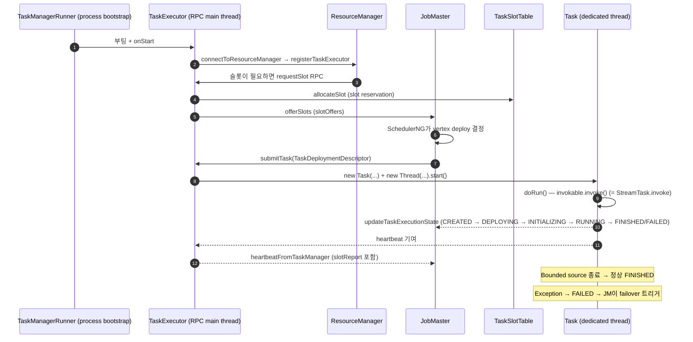

# TaskExecutor — Slot 호스팅과 Task 실행 컨테이너

> **요약**: TaskManager 프로세스의 RPC endpoint. RM에 등록해 슬롯 인벤토리를 보고하고, JM의 `submitTask` RPC를 받아 `Task` 인스턴스를 만들어 dedicated 스레드에서 실행한다.
> **모듈**: `flink-runtime/runtime/taskexecutor/`, `flink-runtime/runtime/taskmanager/`
> **기준 버전**: Flink `release-2.0`
> **운영 권장 여부**: ★Production

---

## 1. TL;DR (3문장)

`TaskExecutor`는 TM 프로세스의 두뇌 — RM에 등록해 슬롯을 알리고, RM이 `requestSlot`을 보내면 `TaskSlotTable`에 reservation을 만들어 JM에 `offerSlots`로 제공하며, JM이 `submitTask(TaskDeploymentDescriptor)`를 호출하면 `Task` 인스턴스를 생성해 자기 thread group 내 새 스레드에서 `run()`한다. `Task`는 `Runnable` 구현체로 `TaskInvokable`(=`StreamTask` 등 진짜 operator runner)을 wrapping해 라이프사이클·예외 처리·네트워크 연결을 담당. 본인 환경에서 한 TM Pod = 한 TaskExecutor JVM = N개 slot = 다수의 Task 동시 실행.

---

## 2. 사전 지식

### 2.1 `Runnable` + dedicated thread

`Task implements Runnable` — JVM의 표준 `Thread`로 실행. `Each Task is run by one dedicated thread.` (javadoc) — Flink는 task별로 OS 스레드 1개를 할당. heavy하지만 간단·예측 가능.

### 2.2 `AtomicReferenceFieldUpdater` (lock-free state)

`Task`의 `executionState` 필드는 `AtomicReferenceFieldUpdater`로 CAS 업데이트 → lock 없이 동시성 안전. Execution(JM 측)도 같은 패턴.

### 2.3 `ThreadGroup` (관리·모니터링용)

`Task.TASK_THREADS_GROUP = new ThreadGroup("Flink Task Threads")` — 모든 task 스레드를 그룹화. JVM 모니터링 도구로 한 번에 보기 쉽고, uncaughtException 처리도 그룹 단위.

---

## 3. 핵심 클래스 / 진입점

| 역할 | 클래스 | 위치 |
|------|------|------|
| TM의 RPC endpoint | `TaskExecutor` (`extends RpcEndpoint`, `implements TaskExecutorGateway`) | `flink-runtime/src/main/java/org/apache/flink/runtime/taskexecutor/TaskExecutor.java` |
| RPC gateway | `TaskExecutorGateway` (Interface) | `flink-runtime/.../taskexecutor/TaskExecutorGateway.java` |
| 한 task 실행 | `Task` (`implements Runnable, TaskSlotPayload`) | `flink-runtime/.../taskmanager/Task.java` |
| Slot 인벤토리 | `TaskSlotTable<T>` | `flink-runtime/.../taskexecutor/slot/TaskSlotTable.java` |
| TM 부팅 | `TaskManagerRunner` | `flink-runtime/.../taskexecutor/TaskManagerRunner.java` |
| 사용자 operator wrapper (Task가 위임) | `TaskInvokable` (Interface) | `flink-runtime/.../jobgraph/tasks/TaskInvokable.java` |
| 대표 Invokable | `StreamTask`, `OneInputStreamTask`, `SourceOperatorStreamTask` 등 | `flink-runtime/.../streaming/runtime/tasks/` |

---

## 4. 데이터 / 제어 흐름



---

## 5. 코드 워크스루

### 5.1 `TaskExecutor` 클래스 본체

`flink-runtime/.../TaskExecutor.java:198-`:

```java
/**
 * TaskExecutor implementation. The task executor is responsible for the execution of multiple
 * {@link Task}.
 */
public class TaskExecutor extends RpcEndpoint implements TaskExecutorGateway {

    public static final String TASK_MANAGER_NAME = "taskmanager";

    private final HighAvailabilityServices haServices;
    private final TaskManagerServices taskExecutorServices;
    private final TaskManagerConfiguration taskManagerConfiguration;
    private final FatalErrorHandler fatalErrorHandler;
    private final TaskExecutorBlobService taskExecutorBlobService;
    private final LibraryCacheManager libraryCacheManager;

    @Nullable private final String metricQueryServiceAddress;

    private final UnresolvedTaskManagerLocation unresolvedTaskManagerLocation;
    private final TaskManagerMetricGroup taskManagerMetricGroup;

    /** The state manager for this task, providing state managers per slot. */
    private final TaskExecutorLocalStateStoresManager localStateStoresManager;

    /** The file merging manager for this task, providing file merging snapshot manager per job. */
    private final TaskExecutorFileMergingManager fileMergingManager;

    /** The changelog manager for this task, providing changelog storage per job. */
    // ... (many more services: networkEnvironment, kvStateService, jobLeaderService, ...)
}
```

핵심 협력자들:
- `taskExecutorServices` — TM 전체에 공유되는 서비스 묶음 (memory manager, IO manager, network environment, BLOB cache)
- `localStateStoresManager` — slot별 local state store (Local Recovery용)
- `fileMergingManager` — 작은 체크포인트 파일들을 큰 파일로 머지 (FLIP-306)
- `libraryCacheManager` — 사용자 JAR cached classloader 관리
- `jobLeaderService` — JM leader 변경 watch (잡당 JM이 다를 수 있음, 잡별로 구독)

### 5.2 `TaskExecutor.onStart` — 부팅

`flink-runtime/.../TaskExecutor.java` (`onStart` 메서드):

```java
@Override
public void onStart() throws Exception {
    try {
        startTaskExecutorServices();   // (a) 내부 서비스들 시작
    } catch (Throwable t) {
        ...
    }
    
    startRegistrationTimeout();          // (b) RM 등록 타임아웃 시작
    
    // RM leader retrieval 등록 → leader 발견 시 connectToResourceManager
}
```

`startTaskExecutorServices()`가 하는 일:
- network environment 초기화 (Netty 서버 listen)
- BLOB cache 시작
- HA service 연결
- KV state service 시작 (queryable state)

### 5.3 `connectToResourceManager` — RM 등록

`flink-runtime/.../TaskExecutor.java` (`connectToResourceManager` 메서드):

```java
private void connectToResourceManager() {
    // (a) RM과 RPC 연결 수립
    // (b) registerTaskExecutor(taskExecutorRegistration) 호출
    // (c) 등록 응답으로 받은 fencingToken (RM의 leader id) 저장
    // (d) slotReport 주기 시작
}
```

등록 응답 (`TaskExecutorRegistrationSuccess`)에는 RM의 leader id, 클러스터 partition info 등이 포함. 등록 후 TE는 RM의 fencing token을 가지고 있어야 RM에 RPC를 보낼 수 있다.

### 5.4 `requestSlot` — RM이 슬롯 reservation 요청

`flink-runtime/.../TaskExecutor.java:1188`:

```java
public CompletableFuture<Acknowledge> requestSlot(
        SlotID slotId, JobID jobId, AllocationID allocationId, ResourceProfile resourceProfile,
        String targetAddress, ResourceManagerId resourceManagerId, Duration timeout) {
    // (a) fencingToken 검증
    // (b) slotTable에 slot 예약
    // (c) 해당 잡의 JM과 connection 만들기
    // (d) JM에 offerSlots RPC
}
```

핵심: RM이 "이 잡(jobId)의 이 allocationId용으로 너의 slotId를 예약해라"라고 명령 → TE는 slot table에 reservation 만들고 → 그 slot을 즉시 JM에 offer.

### 5.5 `submitTask` — JM이 task deploy 명령

`flink-runtime/.../TaskExecutor.java:659`:

```java
public CompletableFuture<Acknowledge> submitTask(
        TaskDeploymentDescriptor tdd, JobMasterId jobMasterId, Duration timeout) {
    // (a) jobMasterId 검증 (fencing)
    // (b) tdd 역직렬화 (TaskInformation, JobInformation)
    // (c) network/checkpoint/state services 준비
    // (d) new Task(...) 생성
    // (e) task.startTaskThread() → new Thread(task).start()
    // (f) tasks 맵에 등록
    // (g) ack 반환
}
```

`TaskDeploymentDescriptor`(=tdd) 안에는:
- `JobInformation` (`JobID`, classloader 정보, BLOB key)
- `TaskInformation` (`JobVertexID`, parallelism, `invokableClassName`, serialized config)
- `ExecutionAttemptID` (잡 안 attempt 유일 ID)
- 입력/출력 partition descriptor (어떤 IntermediateResultPartition을 읽고/쓰는지)
- (가능하면) state assignment (savepoint/checkpoint 복구 시)

### 5.6 `Task` — 한 subtask의 실행 컨테이너

`flink-runtime/.../Task.java:128-`:

```java
/**
 * The Task represents one execution of a parallel subtask on a TaskManager. A Task wraps a Flink
 * operator (which may be a user function) and runs it, providing all services necessary for example
 * to consume input data, produce its results (intermediate result partitions) and communicate with
 * the JobManager.
 *
 * <p>The Flink operators (implemented as subclasses of {@link TaskInvokable} have only data
 * readers, writers, and certain event callbacks. The task connects those to the network stack and
 * actor messages, and tracks the state of the execution and handles exceptions.
 *
 * <p>Tasks have no knowledge about how they relate to other tasks, or whether they are the first
 * attempt to execute the task, or a repeated attempt. All of that is only known to the JobManager.
 * All the task knows are its own runnable code, the task's configuration, and the IDs of the
 * intermediate results to consume and produce (if any).
 *
 * <p>Each Task is run by one dedicated thread.
 */
public class Task
        implements Runnable, TaskSlotPayload, TaskActions, PartitionProducerStateProvider {

    private static final Logger LOG = LoggerFactory.getLogger(Task.class);
    private static final ThreadGroup TASK_THREADS_GROUP = new ThreadGroup("Flink Task Threads");

    /** For atomic state updates. */
    private static final AtomicReferenceFieldUpdater<Task, ExecutionState> STATE_UPDATER =
            AtomicReferenceFieldUpdater.newUpdater(
                    Task.class, ExecutionState.class, "executionState");
    
    // ... (config, executionAttemptID, taskInfo, input/output gates, state, ...)
}
```

Task의 책임 (javadoc 정리):
- `TaskInvokable`(=실제 operator runner)을 wrapping
- 네트워크 stack 연결 (`InputGate`, `ResultPartition`)
- 실행 상태 추적 (CAS 업데이트)
- 예외 처리 (Failure → JM 통보)

**Task가 모르는 것**: 다른 task와의 관계, 자기가 첫 attempt인지 재시도인지. 그 정보는 JM에만. Task는 자기 코드, config, 입출력 partition ID만 안다.

### 5.7 `Task.run()` — 실행 메인

`Task.run()`(같은 파일, `doRun()`로 위임)이 하는 일 (개념):

```java
public void run() {
    try {
        doRun();
    } finally {
        // cleanup
    }
}

private void doRun() {
    // 1. CREATED → DEPLOYING 상태 전이, JM에 통보
    transitionState(ExecutionState.CREATED, ExecutionState.DEPLOYING);
    notifyJobManager(...);
    
    // 2. classloader 준비 (사용자 JAR)
    UserCodeClassLoader userCodeClassLoader = createUserCodeClassloader();
    
    // 3. invokable 인스턴스화 (TaskInvokable의 구현체, 보통 StreamTask 종류)
    TaskInvokable invokable = invokableClass.getConstructor(Environment.class).newInstance(env);
    
    // 4. DEPLOYING → INITIALIZING → RUNNING
    transitionState(...);
    
    // 5. invokable.invoke() ← 진짜 record processing이 여기서 일어남
    invokable.invoke();
    
    // 6. 정상 종료 → RUNNING → FINISHED
    transitionState(ExecutionState.RUNNING, ExecutionState.FINISHED);
}
```

`invokable.invoke()` 안에서 `StreamTask`의 mailbox 메인 루프가 돌아가며 record를 처리. 자세한 동작은 [`./05-stream-task-mailbox.md`](./) (예정).

---

## 6. 사용자 환경 매핑

### 6.1 K8s에서 한 TM Pod 안의 구조

```
[TM Pod]
JVM process
  ├─ TaskManagerRunner.main()
  │    ↓
  ├─ TaskExecutor (RPC endpoint, mainThread)
  │    ├─ taskExecutorServices (memory, network, IO, BLOB)
  │    ├─ TaskSlotTable (N개 slot)
  │    ├─ tasks: Map<ExecutionAttemptID, Task>
  │    └─ jobLeaderService (잡별 JM 추적)
  │
  ├─ Task #1 thread (subtask Source.0)
  ├─ Task #2 thread (subtask map.0)
  ├─ Task #3 thread (subtask process.0)
  └─ ... (총 N slot까지 task 배치 가능)
```

본인 환경의 보통 설정:
- `taskmanager.numberOfTaskSlots = 8` → 1 Pod = 8 slot = 최대 8 task 동시 실행
- `taskmanager.memory.process.size = 4g` → 8 slot가 4GB 공유
- 슬롯당 평균 메모리 = 500MB (state + network buffer + sort heap 등)

### 6.2 Slot sharing 영향

같은 잡의 다른 vertex가 같은 slot sharing group이면 한 slot 안에 함께 들어갈 수 있다. 예: Source/Map/Process가 모두 default group이면 1 slot에 3 task가 함께 (3 thread). 본인 환경의 chained 잡은 chain 단위가 task 단위이므로 chain 5개라면 5 slot 필요.

### 6.3 TM 죽을 때 일어나는 일

```
TM Pod OOMKilled / liveness probe 실패
   ↓
K8s가 Pod 재시작
   ↓
TaskExecutor heartbeat 누락 (일정 시간)
   ↓
RM이 TM 등록 무효화
   ↓
JM이 해당 TM 위 모든 task의 Execution을 FAILED로 마킹
   ↓
AdaptiveScheduler: 새 ExecutionGraph로 재구성 또는 재시도
   ↓
RM: 새 TM Pod 자동 요청 (KubernetesResourceManagerDriver.requestResource)
```

---

## 7. 관련 FLIP / JIRA

- [FLIP-6: Flink Deployment and Process Model](https://cwiki.apache.org/confluence/display/FLINK/FLIP-6+-+Flink+Deployment+and+Process+Model+-+ResourceManager%2C+JobManager%2C+TaskManager) — TM/TaskExecutor 분리
- [FLIP-49: Unified Memory Configuration for TaskExecutors](https://cwiki.apache.org/confluence/display/FLINK/FLIP-49%3A+Unified+Memory+Configuration+for+TaskExecutors) — TM 메모리 모델
- [FLIP-185: Shorter Recovery Time](https://cwiki.apache.org/confluence/display/FLINK/FLIP-185%3A+Shorter+Recovery+Time+for+JobManager) — TM 측 task 재시작 단축
- [FLIP-306: Unified File Merging Mechanism for Checkpoints](https://cwiki.apache.org/confluence/display/FLINK/FLIP-306%3A+Unified+File+Merging+Mechanism+for+Checkpoints) — `fileMergingManager`의 배경

---

## 8. 디버깅 & 실험

### 8.1 TM thread dump

```bash
# JM Pod에서 모든 TM의 thread dump 요청
curl http://<jm-rest>:8081/taskmanagers/<tm-id>/thread-dump

# kubectl로 직접
kubectl exec -n <ns> <tm-pod> -- jstack 1
```

"Flink Task Threads" group에 task 스레드들이 보임 (이름: `Source: KafkaSource (1/8)#0` 등).

### 8.2 IDE 브레이크포인트

- `TaskExecutor.connectToResourceManager` — RM 등록 시점
- `TaskExecutor.submitTask` (`TaskExecutor.java:659`) — JM이 task 보낼 때
- `Task.doRun()` — 새 task 스레드 시작
- `Task.transitionState(...)` — 상태 전이마다

### 8.3 slot 상태 REST

```bash
curl http://<jm-rest>:8081/taskmanagers
# → 각 TM의 slotsTotal, slotsAvailable, hardware metrics

curl http://<jm-rest>:8081/taskmanagers/<tm-id>/details
# → 슬롯별 할당된 task 정보
```

---

## 9. FAQ

**Q1. 1 TM Pod = 1 TaskExecutor = 1 JVM?**
A. 그렇다. K8s에서 보통 1 TM Pod = 1 컨테이너 = 1 JVM 프로세스. JVM 안에 TaskExecutor 1개 + Task N개 (각각 dedicated thread).

**Q2. `TaskInvokable`과 `Task`의 관계?**
A. `Task = Runnable` (TM 측 wrapper, 라이프사이클/예외 처리). `TaskInvokable = 실제 record processing 코드` (`StreamTask`, `BatchTask`). Task가 invokable을 인스턴스화 후 `invoke()` 호출.

**Q3. 같은 slot에 다른 잡의 task가 들어갈 수 있나?**
A. **불가**. Slot은 잡 단위 — 한 잡의 task들만 (slot sharing group으로) 공유. 다른 잡이 그 slot을 쓰려면 회수 후 재할당 필요.

**Q4. `localStateStoresManager`는 무엇?**
A. Local Recovery (FLIP-34) 지원 — checkpoint snapshot의 사본을 TM 로컬 디스크에 두어, 같은 TM에서 task 재시작 시 원격 storage에서 다시 fetch 안 하고 로컬에서 빠르게 복구. 본인 환경에서 큰 RocksDB state 잡에 핵심 — 자세한 동작은 [`../05-state-checkpoint/`](../05-state-checkpoint/) 에서 다룸.

**Q5. TM이 RM에 등록 못 하면?**
A. `startRegistrationTimeout`이 만료되면 TaskExecutor가 fatal error 처리 → JVM 종료 → K8s가 Pod 재시작. 무한 retry 방지.

**Q6. `submitTask` 시 user JAR은 어디서 옴?**
A. `LibraryCacheManager`가 BLOB cache로부터 사용자 JAR을 가져와 `URLClassLoader`(child-first)로 로드. JM이 BLOB key를 tdd에 넣어주고, TM은 그 키로 BLOB cache(또는 BLOB server)에서 JAR fetch.

---

## 10. 다음에 읽을 문서

- StreamTask 메인 루프 (mailbox 모델 — task 안에서 record 어떻게 처리): [`./05-stream-task-mailbox.md`](./) (예정)
- RPC (Pekko Actor 모델): [`./06-rpc-pekko.md`](./) (예정)
- IntermediateResultPartition의 데이터 송수신 (network shuffle): [`../11-network-shuffle/`](../11-network-shuffle/) (예정)
- State 복구 시 LocalStateStores 활용: [`../05-state-checkpoint/`](../05-state-checkpoint/) (예정)
