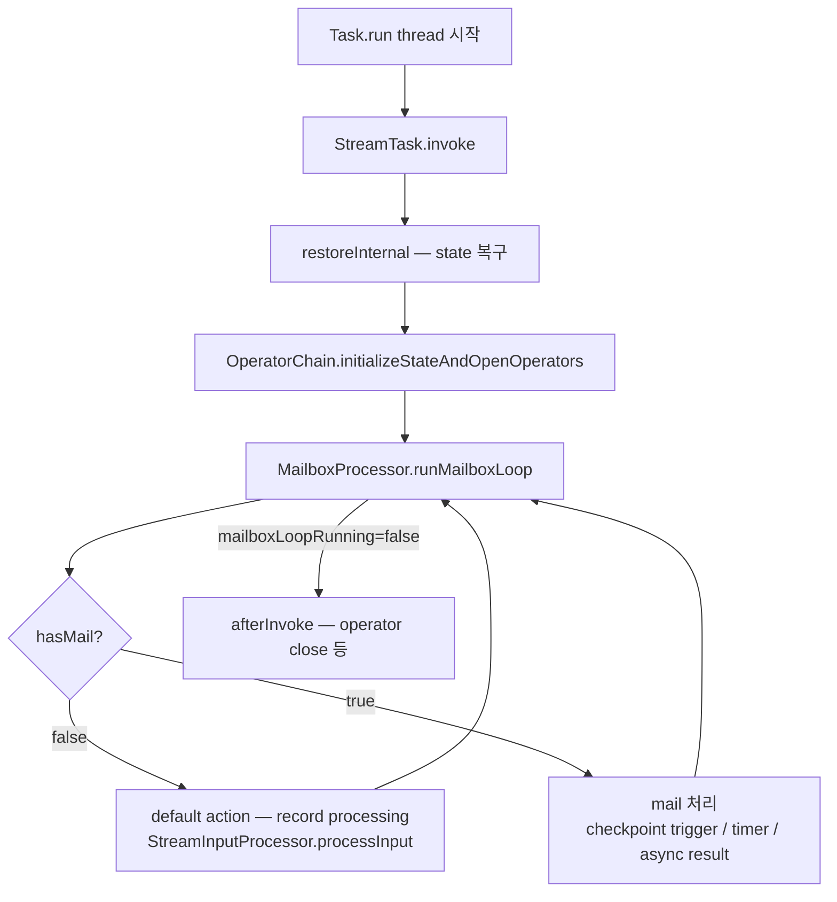

# StreamTask & Mailbox 모델 — Subtask의 메인 루프

> **요약**: `StreamTask`가 한 subtask의 진짜 실행 단위. operator chain을 들고 단일 thread mailbox 모델로 record processing(default action)과 control event(checkpoint trigger, timer, watermark, async result)를 같은 스레드에서 직렬화 처리한다.
> **모듈**: `flink-runtime/runtime/streaming/runtime/tasks/`, `.../tasks/mailbox/`
> **기준 버전**: Flink `release-2.0`
> **운영 권장 여부**: ★Production

---

## 1. TL;DR (3문장)

`StreamTask`는 `TaskInvokable` 구현체로 [`Task`(=TM 측 wrapper)](./04-task-executor.md)가 새 thread에서 `invoke()` 호출하며, 이 invoke는 결국 `MailboxProcessor.runMailboxLoop()`로 들어간다 — 이 루프가 record processing을 default action으로 반복하면서 mailbox에 쌓인 control mail (checkpoint trigger, timer, async I/O 결과 등)을 우선 처리한다. **단일 thread 모델**의 미덕: operator state·timer 접근 시 lock 불필요, race 없음, async 작업도 mail로 다시 들어와 직렬화 실행. 이 모델이 본인 환경의 backpressure / checkpoint barrier alignment의 동작 원리이기도 함.

---

## 2. 사전 지식

### 2.1 Single-thread mailbox 모델

전통적 RPC actor와 비슷 — 하나의 큐(=mailbox)에 들어온 메시지를 한 스레드가 직렬 처리. Flink는 record processing을 **default action**으로 두고, mail이 없는 동안은 그것만 반복 → mail이 들어오면 그것 우선 처리. 이 모델 덕에:
- operator 내 state 접근에 lock 없음
- async I/O 결과가 main thread로 자연스럽게 돌아옴
- checkpoint barrier가 record 처리와 같은 스레드에서 처리되어 정합성 보장

### 2.2 `LinkedBlockingQueue<Mail>` (mailbox의 backing)

`TaskMailboxImpl`이 사용. write는 thread-safe (다른 스레드에서도 가능), read는 **mailbox thread만 가능** (`isMailboxThread()` 검사). 이 비대칭이 single-thread 모델의 외부 인터페이스.

### 2.3 hot path 최적화

mailbox loop의 **expected hot path = "mail 없음 + default action 반복"**. 이 경로가 빠르도록 `hasMail()` 검사가 `mailboxLoopRunning`/`suspendedDefaultAction` 같은 control flag와 묶여 있다. mail이 없을 때는 매우 빠르게 default action 다시 호출.

---

## 3. 핵심 클래스 / 진입점

| 역할 | 클래스 | 위치 |
|------|------|------|
| 메인 task abstract base | `StreamTask<OUT, OP>` (`extends AbstractInvokable`, `implements TaskInvokable`) | `flink-runtime/src/main/java/org/apache/flink/streaming/runtime/tasks/StreamTask.java` |
| 1-input 구현 | `OneInputStreamTask` | `flink-runtime/.../tasks/OneInputStreamTask.java` |
| 2-input 구현 | `AbstractTwoInputStreamTask` (sub: `TwoInputStreamTask`) | `flink-runtime/.../tasks/` |
| 다중 입력 | `MultipleInputStreamTask` | `flink-runtime/.../tasks/MultipleInputStreamTask.java` |
| Source V2 task | `SourceOperatorStreamTask` | `flink-runtime/.../tasks/SourceOperatorStreamTask.java` |
| Source 레거시 | `SourceStreamTask` | `flink-runtime/.../tasks/SourceStreamTask.java` |
| Operator chain (chained operator들 wrapping) | `OperatorChain` | `flink-runtime/.../tasks/OperatorChain.java` |
| Mailbox 실행 엔진 | `MailboxProcessor` | `flink-runtime/.../tasks/mailbox/MailboxProcessor.java` |
| Mailbox 자료구조 | `TaskMailbox` (Interface), `TaskMailboxImpl` | `flink-runtime/.../tasks/mailbox/` |

---

## 4. 데이터 / 제어 흐름



mail이 들어오는 경로:
- **CheckpointCoordinator** (RPC) → `triggerCheckpointAsync` → mail로 enqueue → mailbox thread에서 barrier inject
- **InternalTimerService** → 시간이 도래 → mail로 enqueue → 핸들러 실행
- **OperatorEventDispatcher** → JM의 OperatorCoordinator가 보낸 event → mail
- **AsyncWaitOperator** → async I/O future 완료 → mail
- **MailboxExecutor** (사용자 측) → 사용자가 명시적으로 mail enqueue

---

## 5. 코드 워크스루

### 5.1 `StreamTask` 클래스 javadoc

`flink-runtime/.../StreamTask.java:155-`:

```java
/**
 * Base class for all streaming tasks. A task is the unit of local processing that is deployed and
 * executed by the TaskManagers. Each task runs one or more {@link StreamOperator}s which form the
 * Task's operator chain. Operators that are chained together execute synchronously in the same
 * thread and hence on the same stream partition.
 */
```

핵심: **chain된 operator들은 같은 thread에서 synchronous 호출**. 따라서 chain 안에서는 operator 사이의 `collect()` 호출이 단순한 메서드 호출 (직렬화/네트워크 없음).

### 5.2 `StreamTask.invoke()` — 진짜 진입

`flink-runtime/.../StreamTask.java:902-924`:

```java
@Override
public final void invoke() throws Exception {
    // Allow invoking method 'invoke' without having to call 'restore' before it.
    if (!isRunning) {
        LOG.debug("Restoring during invoke will be called.");
        restoreInternal();         // (a) state 복구 (체크포인트/savepoint에서)
    }

    // final check to exit early before starting to run
    ensureNotCanceled();

    scheduleBufferDebloater();      // (b) buffer debloating 활성화 (FLIP-183)

    // let the task do its work
    getEnvironment().getMetricGroup().getIOMetricGroup().markTaskStart();
    runMailboxLoop();               // (c) ★ 메인 루프

    // if this left the run() method cleanly despite the fact that this was canceled,
    // make sure the "clean shutdown" is not attempted
    ensureNotCanceled();

    afterInvoke();                  // (d) operator close, metric flush
}
```

3단계:
- **(a) `restoreInternal()`** — state 복구. 새 잡이면 빈 state, savepoint/checkpoint에서 시작이면 `OperatorChain`의 각 operator에 state 주입. 자세한 동작은 [`../05-state-checkpoint/`](../05-state-checkpoint/).
- **(c) `runMailboxLoop()`** — 본 문서의 메인.
- **(d) `afterInvoke()`** — graceful shutdown — operator chain close, sink writer flush 등.

### 5.3 `MailboxProcessor` javadoc

`flink-runtime/.../mailbox/MailboxProcessor.java:38-65`:

```java
/**
 * This class encapsulates the logic of the mailbox-based execution model. At the core of this model
 * {@link #runMailboxLoop()} that continuously executes the provided {@link MailboxDefaultAction} in
 * a loop. On each iteration, the method also checks if there are pending actions in the mailbox and
 * executes such actions. This model ensures single-threaded execution between the default action
 * (e.g. record processing) and mailbox actions (e.g. checkpoint trigger, timer firing, ...).
 *
 * <p>The {@link MailboxDefaultAction} interacts with this class through the {@link
 * MailboxController} to communicate control flow changes to the mailbox loop, e.g. that invocations
 * of the default action are temporarily or permanently exhausted.
 *
 * <p>The design of {@link #runMailboxLoop()} is centered around the idea of keeping the expected
 * hot path (default action, no mail) as fast as possible. ...
 *
 * <p>This class has an open-prepareClose-close lifecycle that is connected with and maps to the
 * lifecycle of the encapsulated {@link TaskMailbox} (which is open-quiesce-close).
 */
@Internal
public class MailboxProcessor implements Closeable {

    protected final TaskMailbox mailbox;
    protected final MailboxDefaultAction mailboxDefaultAction;

    private boolean mailboxLoopRunning;            // 루프 종료 플래그
    private boolean suspended;                      // 일시 정지
    private DefaultActionSuspension suspendedDefaultAction;  // default action 일시 중단
    
    private final StreamTaskActionExecutor actionExecutor;
    private final MailboxMetricsController mailboxMetricsControl;
}
```

### 5.4 `runMailboxLoop` (개념적 의사코드)

`flink-runtime/.../mailbox/MailboxProcessor.java:214-` (실제 코드는 hot path 최적화로 복잡 — 핵심만 설명):

```java
public void runMailboxLoop() throws Exception {
    final TaskMailbox localMailbox = mailbox;
    
    while (isMailboxLoopRunning()) {
        // 1. mail이 있으면 처리
        Optional<Mail> maybeMail;
        if ((maybeMail = localMailbox.tryTake(MIN_PRIORITY)).isPresent()) {
            maybeMail.get().run();
            continue;
        }
        
        // 2. mail 없고 default action이 suspended 아니면 default action 실행
        MailboxDefaultAction.Controller controller = ...;
        if (!isDefaultActionUnavailable()) {
            mailboxDefaultAction.runDefaultAction(controller);  // ← record processing
        } else {
            // default action도 suspended → 새 mail 올 때까지 block
            localMailbox.take(MIN_PRIORITY).run();
        }
    }
}
```

핵심 결정:
- mail이 있으면 즉시 처리 (record보다 우선)
- 없으면 default action (record processing) 1회
- default action이 suspended 상태면 mail이 올 때까지 block (input 없거나 backpressure)

### 5.5 `OperatorChain` — chained operator들 묶음

`flink-runtime/.../tasks/OperatorChain.java`:

```java
public class OperatorChain<...> implements ... {
    // chain 안의 모든 operator를 들고 있음
    // headOperator: 입력을 받는 첫 operator
    // chainedOperators: 그 뒤에 chained된 operator들
    // chainedOutputs: 각 operator의 출력 (다음 operator의 input 또는 ResultPartition)
}
```

핵심:
- **headOperator**: 입력 record를 받는 진입점
- chained operator들은 collector 콜백으로 연결 — `headOp.processElement(rec)` → 그 안에서 `output.collect(transformedRec)` → 다음 chained operator의 `processElement` 호출 → ...
- 마지막 operator의 output은 `RecordWriter`로 연결되어 ResultPartition으로 송출

### 5.6 default action — `StreamInputProcessor.processInput`

`StreamTask`의 default action은 보통 `StreamInputProcessor.processInput(controller)`. 이 메서드가:
1. `InputGate`에서 record 1개(또는 batch) 읽음
2. headOperator의 `processElement(rec)` 호출 → chain 전체가 in-thread 호출로 실행
3. 출력은 마지막 operator의 collector 통해 다음 ResultPartition으로
4. 입력이 비어 있거나 backpressure 시 `controller.suspendDefaultAction()` 호출 → mailbox loop가 mail 대기 모드로

### 5.7 Source task의 차이

`SourceOperatorStreamTask`(FLIP-27 Source V2)는 `init()`에서 `SourceOperator`를 만들고 default action으로 `sourceOperator.emitNext(output)` 호출. SourceCoordinator(JM 측)에서 split을 받아 reader를 돌려 record를 emit. 자세한 동작은 [`../06-source-sink-spi/01-source-v2-overview.md`](../06-source-sink-spi/01-source-v2-overview.md).

---

## 6. 사용자 환경 매핑

### 6.1 본인 잡 한 subtask의 mailbox 동작

본인 환경의 `Source → process → Sink` chain에서 한 subtask:

```
[StreamTask thread]
runMailboxLoop:
  - default action: InputGate에서 record 받기 → process 함수 호출 → Sink writer.write
  - mail 1: 매 30초마다 CheckpointCoordinator가 trigger → barrier 주입 → state snapshot
  - mail 2: process 안 timer (예: window timeout) → window operator의 onProcessingTime 호출
  - mail 3: Sink writer가 async upload future 완료 → upload 결과 처리
  - mail 4: SourceCoordinator (Kafka)가 새 split 할당 → SourceReader.addSplits
```

이 모든 게 **한 thread에서 직렬 실행** — race condition 없음.

### 6.2 Backpressure 메커니즘과 mailbox

downstream Sink가 느려지면:
1. ResultPartition의 buffer가 가득 참
2. RecordWriter가 buffer 못 받아 block
3. 결과적으로 default action(record processing)이 멈춤
4. mailbox는 여전히 control mail (checkpoint trigger 등)을 처리할 수 있음 → checkpoint는 작동

→ "backpressure 중에도 unaligned checkpoint는 즉시 작동"의 코드 레벨 이유.

### 6.3 Iceberg Sink의 async commit과 mailbox

Iceberg writer가 file을 만들어 MinIO에 upload (async I/O) → 완료되면 `MailboxExecutor.execute(...)`로 mail enqueue → mailbox thread에서 commit 메타데이터 업데이트 → 다음 checkpoint 때 GlobalCommitter에 보고. 이 모델 덕에 user code 측에선 thread 안전 신경 안 써도 됨.

---

## 7. 관련 FLIP / JIRA

- [FLIP-58: Mailbox Model](https://cwiki.apache.org/confluence/display/FLINK/FLIP-58%3A+Pull-based+ASYNC+side+task+execution+model) — 옛 multi-thread 모델 → mailbox로 전환
- [FLIP-27: Refactor Source Interface](https://cwiki.apache.org/confluence/display/FLINK/FLIP-27%3A+Refactor+Source+Interface) — SourceOperator의 mailbox 통합
- [FLIP-183: Dynamic buffer size adjustment](https://cwiki.apache.org/confluence/display/FLINK/FLIP-183%3A+Dynamic+buffer+size+adjustment) — `scheduleBufferDebloater`
- [FLIP-76: Unaligned Checkpoints](https://cwiki.apache.org/confluence/display/FLINK/FLIP-76%3A+Unaligned+Checkpoints) — backpressure에서 checkpoint 작동 원리

---

## 8. 디버깅 & 실험

### 8.1 Thread dump에서 task thread 식별

```bash
kubectl exec -n <ns> <tm-pod> -- jstack 1 | grep -A20 "Source: KafkaSource"
```

mailbox loop가 `runMailboxLoop`에 머물러 있으면 정상. block된 위치 파악 가능 (record receive, network buffer, async I/O).

### 8.2 Mailbox 메트릭

`MailboxMetricsController` (위 `MailboxProcessor` 필드)가 노출하는 메트릭:
- `mailboxThroughput` (mail 처리 rate)
- `mailboxLatency` (mail enqueue → 실행까지 지연)
- `numMailsProcessed`

REST: `/jobs/<id>/vertices/<vid>/subtasks/<idx>/metrics?get=...`

### 8.3 IDE 브레이크포인트

- `StreamTask.invoke()` (`StreamTask.java:902`)
- `MailboxProcessor.runMailboxLoop()` (`MailboxProcessor.java:214`)
- `StreamInputProcessor.processInput(...)` — record 읽는 진입점
- `OperatorChain.processWatermark` — watermark 전파

---

## 9. FAQ

**Q1. record processing이 너무 오래 걸리면 mail이 안 처리되나?**
A. 그렇다. default action(`processInput`)이 record 1개 처리하는 동안은 mail 처리 안 됨. **`processInput`은 빨리 끝나야 함** — 보통 record 1개 또는 작은 batch 처리 후 yield. async I/O 같은 long-running 작업은 별도 executor로 던지고 결과를 mail로 받음.

**Q2. checkpoint barrier는 어떻게 들어오나?**
A. CheckpointCoordinator(JM)가 `triggerCheckpointAsync(barrierId)` RPC 호출 → TM 측 `Task`가 mail로 enqueue → mailbox thread에서 barrier를 input gate로 inject → 정상 record 흐름과 함께 처리. 이 덕에 state snapshot이 record processing과 같은 thread 정합성 안에서 일어남.

**Q3. Timer는 정확히 언제 fire되나?**
A. `InternalTimerService`(processing time 또는 event time)가 시간 도래 시 mail enqueue. mailbox thread에서 처리되므로 정확한 실행 시점은 mail 우선순위 + 큐 상태에 따라 약간 지연 가능. record processing에 block돼 있으면 그게 끝나고 fire.

**Q4. 사용자 코드에서 mailbox에 직접 mail을 넣을 수 있나?**
A. `RuntimeContext.getMailboxExecutor()` (`MailboxExecutor`) 통해 가능. async I/O 패턴 (`AsyncWaitOperator`)이 이 메커니즘을 사용. 사용자 코드는 thread safe 신경 안 써도 됨.

**Q5. SourceTask가 record를 능동적으로 emit하는데 mailbox loop와 어떻게 섞이나?**
A. `SourceOperatorStreamTask`의 default action이 `sourceOperator.emitNext(output)` — 한 번 호출에 record 1개 emit. emit 끝나면 default action 종료 → mailbox 다시 → mail 처리 → default action 다시. 즉 source도 다른 task와 동일한 mailbox 모델.

**Q6. 두 input task의 fairness는?**
A. `TwoInputStreamTask`의 default action이 `StreamTwoInputProcessor`를 통해 두 input gate 중 하나에서 record를 읽음. 정책은 `InputProcessor`(보통 round-robin 또는 watermark-aware) 결정. 한 input이 너무 많이 읽혀 다른 input이 starve 되는 것을 방지.

---

## 10. 다음에 읽을 문서

- RPC (Pekko Actor 모델 — Dispatcher/RM/JM/TaskExecutor 모두의 토대): [`./06-rpc-pekko.md`](06-rpc-pekko.md)
- CheckpointCoordinator → mailbox barrier inject (체크포인트 메커니즘): [`../05-state-checkpoint/checkpoint-coordinator.md`](../05-state-checkpoint/01-checkpoint-coordinator.md)
- IntermediateResultPartition 데이터 송수신 (network shuffle): [`../11-network-shuffle/`](../11-network-shuffle/)
- SourceOperatorStreamTask + SourceCoordinator: [`../06-source-sink-spi/source-coordinator.md`](../06-source-sink-spi/02-source-coordinator.md)
