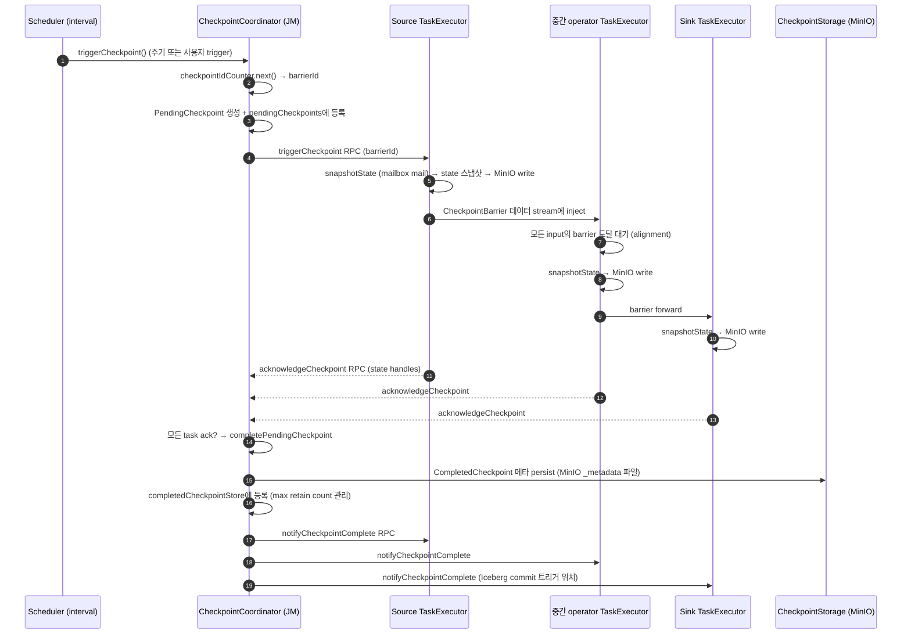

# CheckpointCoordinator — 분산 스냅샷의 트리거 & 조율자

> **요약**: JM 측 컴포넌트로 주기적으로(또는 외부 trigger로) 모든 source task에 `CheckpointBarrier`를 보내고, 모든 task의 ack를 모아 `CompletedCheckpoint`를 만들어 메타를 영속화한다. Chandy-Lamport 알고리즘 기반 분산 일관 스냅샷의 중앙 조정자.
> **모듈**: `flink-runtime/runtime/checkpoint/`
> **기준 버전**: Flink `release-2.0`
> **운영 권장 여부**: ★Production

---

## 1. TL;DR (3문장)

`CheckpointCoordinator`는 잡당 1개로 `ExecutionGraph` 안에 살며 `startCheckpointScheduler()`로 주기 trigger를 시작 — 매 interval마다 `triggerCheckpoint()`가 (1) `CheckpointIDCounter`로 새 ID 발급, (2) 각 source task에 RPC로 `triggerCheckpoint(barrierId)` 전송, (3) `PendingCheckpoint` 객체 생성. Source가 `CheckpointBarrier`를 데이터 stream에 inject → barrier가 downstream으로 전파되며 각 operator가 자기 state 스냅샷 → TM이 `acknowledgeCheckpoint(...)` RPC로 JM에 보고 → 모든 ack 수신 시 `completePendingCheckpoint()`가 메타를 `CompletedCheckpointStore`에 persist. 본인 환경에선 메타와 state는 모두 MinIO에 저장되며, 마지막 `CompletedCheckpoint`로부터 잡 복구 가능.

---

## 2. 사전 지식

### 2.1 Chandy-Lamport 알고리즘

분산 시스템의 일관 스냅샷 (1985 논문). 핵심: marker(=barrier)를 채널에 inject → 각 process가 marker를 받으면 자기 state 기록 + 모든 outgoing 채널에 marker forward. Flink는 이를 streaming에 맞게 변형: barrier는 record 사이에 흐르며 record와 함께 직렬화. 자세한 변형(unaligned 등)은 후속 문서.

### 2.2 `@GuardedBy("lock")` (annotation)

`PendingCheckpoint` 코드에 자주 보이는 javax.annotation. compile-time 도구(SpotBugs, ErrorProne)가 lock 보유 검증. 멀티 스레드 접근 가능한 필드를 명시.

### 2.3 RpcEndpoint mainThread 모델 (재상기)

`CheckpointCoordinator`의 메서드는 JM main thread에서 호출됨 (RpcEndpoint의 main thread). I/O가 필요한 작업(state 영속화 등)은 별도 `executor`로 던지고 결과를 main thread로 다시 가져옴.

---

## 3. 핵심 클래스 / 진입점

| 역할 | 클래스 | 위치 |
|------|------|------|
| 조율자 본체 | `CheckpointCoordinator` | `flink-runtime/src/main/java/org/apache/flink/runtime/checkpoint/CheckpointCoordinator.java` |
| 진행 중 체크포인트 | `PendingCheckpoint` | `flink-runtime/.../checkpoint/PendingCheckpoint.java` |
| 완료 체크포인트 | `CompletedCheckpoint` | `flink-runtime/.../checkpoint/CompletedCheckpoint.java` |
| Barrier 메시지 (네트워크) | `CheckpointBarrier` | `flink-runtime/.../io/network/api/CheckpointBarrier.java` |
| 완료 체크포인트 저장 | `CompletedCheckpointStore` (Interface) | `flink-runtime/.../checkpoint/CompletedCheckpointStore.java` |
| ID 발급기 | `CheckpointIDCounter` (Interface) | `flink-runtime/.../checkpoint/CheckpointIDCounter.java` |
| 메타데이터 저장소 추상 | `CheckpointStorage` (Interface) | `flink-runtime/.../state/CheckpointStorage.java` |
| 파일시스템 storage 구현 | `FileSystemCheckpointStorage` | `flink-runtime/.../state/storage/FileSystemCheckpointStorage.java` |
| Sub-task 측 조율자 | `SubtaskCheckpointCoordinator` (Interface, in `flink-streaming-java`) | TM 측 |

---

## 4. 데이터 / 제어 흐름



---

## 5. 코드 워크스루

### 5.1 `CheckpointCoordinator` 클래스

`flink-runtime/.../CheckpointCoordinator.java:97-`:

```java
/**
 * The checkpoint coordinator coordinates the distributed snapshots of operators and state. It
 * triggers the checkpoint by sending the messages to the relevant tasks and collects the checkpoint
 * acknowledgements. It also collects and maintains the overview of the state handles reported by
 * the tasks that acknowledge the checkpoint.
 */
public class CheckpointCoordinator {

    private static final int NUM_GHOST_CHECKPOINT_IDS = 16;

    /** Coordinator-wide lock to safeguard the checkpoint updates. */
    private final Object lock = new Object();

    private final JobID job;
    private final CheckpointProperties checkpointProperties;
    private final Executor executor;
    private final CheckpointsCleaner checkpointsCleaner;
    private final Collection<OperatorCoordinatorCheckpointContext> coordinatorsToCheckpoint;

    /** Map from checkpoint ID to the pending checkpoint. */
    @GuardedBy("lock")
    private final Map<Long, PendingCheckpoint> pendingCheckpoints;

    /** Completed checkpoints. Implementations can be blocking. ... */
    private final CompletedCheckpointStore completedCheckpointStore;

    /** The root checkpoint state backend, which is responsible for initializing the checkpoint,
     *  storing the metadata, and cleaning up the checkpoint. */
    private final CheckpointStorageCoordinatorView checkpointStorageView;

    /** A list of recent expired checkpoint IDs, to identify late messages (vs invalid ones). */
    private final ArrayDeque<Long> recentExpiredCheckpoints;

    /** Checkpoint ID counter to ensure ascending IDs. */
    private final CheckpointIDCounter checkpointIdCounter;

    /** The checkpoint interval ... */
    private final long baseInterval;
    // ... (maxConcurrentCheckpointAttempts, minPauseBetweenCheckpoints, timeout, ...)
}
```

핵심 필드:
- `pendingCheckpoints` — 진행 중 체크포인트들 (보통 1~N개, max concurrent 설정)
- `completedCheckpointStore` — 완료된 체크포인트 메타 저장소 (max retain count 관리)
- `checkpointIdCounter` — 단조증가 ID (HA 저장소에 영속화 — JM failover 후에도 ID가 이어짐)
- `checkpointStorageView` — `MinIO/S3/HDFS` 등 root storage 추상
- `coordinatorsToCheckpoint` — `OperatorCoordinator`들 (Source V2의 `SourceCoordinator`, Sink V2의 `CommitterOperatorCoordinator` 등)

### 5.2 `triggerCheckpoint` — 새 체크포인트 시작

`flink-runtime/.../CheckpointCoordinator.java:573-`:

```java
public CompletableFuture<CompletedCheckpoint> triggerCheckpoint(boolean isPeriodic) {
    return triggerCheckpoint(checkpointProperties, null, isPeriodic);
}

public CompletableFuture<CompletedCheckpoint> triggerCheckpoint(CheckpointType checkpointType) {
    // ... CheckpointProperties로 변환 후 위임
}
```

내부 동작 (개념):
1. `lock` 획득
2. `canTriggerCheckpoint()` 검사 — 동시 진행 한계, min-pause, 잡 상태 확인
3. `checkpointIdCounter.getAndIncrement()` → 새 ID
4. `CheckpointStorageCoordinatorView.initializeLocationForCheckpoint(id)` — `MinIO`에 chk-NN 디렉토리 생성
5. `PendingCheckpoint(id, properties, expectedAcknowledgers)` 생성
6. `pendingCheckpoints.put(id, pendingCheckpoint)`
7. 각 `OperatorCoordinator.checkpointCoordinator(id, ...)` 호출 (Source V2 측 등)
8. 각 source `Execution`에 `triggerCheckpoint(barrierId, ...)` RPC

### 5.3 `receiveAcknowledgeMessage` — TM의 ack 처리

`flink-runtime/.../CheckpointCoordinator.java` (`receiveAcknowledgeMessage`):

```java
public void receiveAcknowledgeMessage(
        AcknowledgeCheckpoint message, String taskManagerLocationInfo) {
    // ...
    long checkpointId = message.getCheckpointId();
    
    synchronized (lock) {
        PendingCheckpoint checkpoint = pendingCheckpoints.get(checkpointId);
        
        if (checkpoint == null) {
            // late message — recentExpiredCheckpoints 검사 → log만 또는 reject
            return;
        }
        
        switch (checkpoint.acknowledgeTask(
                message.getTaskExecutionId(), message.getSubtaskState(),
                message.getCheckpointMetrics())) {
            case SUCCESS:
                if (checkpoint.areTasksFullyAcknowledged()) {
                    completePendingCheckpoint(checkpoint);
                }
                break;
            case DUPLICATE:
                // already acknowledged — ignore
                break;
            case UNKNOWN:
                // task not in expected list — abort
                break;
            case DISCARDED:
                // pending checkpoint already discarded — release subtaskState
                break;
        }
    }
}
```

핵심: `PendingCheckpoint`가 expected ack 집합을 들고 있고, 모든 task의 ack가 모이면 complete. `lock` 동기화로 동시 ack 처리 안전.

### 5.4 `completePendingCheckpoint` — 완료 처리

`flink-runtime/.../CheckpointCoordinator.java`:

```java
private void completePendingCheckpoint(PendingCheckpoint pendingCheckpoint) throws CheckpointException {
    long checkpointId = pendingCheckpoint.getCheckpointId();
    
    // 1. PendingCheckpoint → CompletedCheckpoint 변환 (state handles 묶음)
    CompletedCheckpoint completedCheckpoint = pendingCheckpoint.finalizeCheckpoint(...);
    
    // 2. CompletedCheckpointStore에 등록 (HA 저장소에 메타 영속화)
    completedCheckpointStore.addCheckpointAndSubsumeOldestOne(completedCheckpoint, ...);
    
    // 3. pendingCheckpoints에서 제거
    pendingCheckpoints.remove(checkpointId);
    
    // 4. 모든 task에 notifyCheckpointComplete RPC
    for (ExecutionVertex ev : tasksToCommit) {
        ev.getCurrentExecutionAttempt().notifyCheckpointOnComplete(checkpointId, ...);
    }
}
```

`notifyCheckpointComplete`이 중요한 이유:
- **Sink V2 / 2PC**: writer가 pre-commit만 한 상태였다가 이 시그널 받으면 commit (Iceberg 메타 commit)
- Kafka Source: 이 시점까지 처리한 offset을 외부 system에 commit
- 일반 operator는 cleanup 또는 무시

### 5.5 `CheckpointBarrier` — 데이터 stream의 marker

`flink-runtime/.../io/network/api/CheckpointBarrier.java:30-72`:

```java
/**
 * Checkpoint barriers are used to align checkpoints throughout the streaming topology. The barriers
 * are emitted by the sources when instructed to do so by the JobManager. When operators receive a
 * CheckpointBarrier on one of its inputs, it knows that this is the point between the
 * pre-checkpoint and post-checkpoint data.
 *
 * <p>Once an operator has received a checkpoint barrier from all its input channels, it knows that
 * a certain checkpoint is complete. ...
 *
 * <p>Depending on the semantic guarantees, may hold off post-checkpoint data until the checkpoint
 * is complete (exactly once).
 *
 * <p>The checkpoint barrier IDs are strictly monotonous increasing.
 */
public class CheckpointBarrier extends RuntimeEvent {
    private final long id;
    private final long timestamp;
    private final CheckpointOptions checkpointOptions;
    
    // ...
}
```

barrier는 `RuntimeEvent`의 일종으로 record 사이에 직렬화되어 전송. 각 operator가 받으면 자기 state 스냅샷 후 forward.

### 5.6 `PendingCheckpoint`

`flink-runtime/.../checkpoint/PendingCheckpoint.java:65-`:

```java
/**
 * A pending checkpoint is a checkpoint that has been started, but has not been acknowledged by all
 * tasks that need to acknowledge it. Once all tasks have acknowledged it, it becomes a
 * {@link CompletedCheckpoint}.
 *
 * <p>Note that the pending checkpoint, as well as the successful checkpoint keep the state handles
 * always as serialized values, never as actual values.
 */
@NotThreadSafe
public class PendingCheckpoint implements Checkpoint {

    public enum TaskAcknowledgeResult {
        SUCCESS, DUPLICATE, UNKNOWN, DISCARDED
    }

    private final JobID jobId;
    private final long checkpointId;
    private final long checkpointTimestamp;
    private final Map<OperatorID, OperatorState> operatorStates;
    private final CheckpointPlan checkpointPlan;
    private final Map<ExecutionAttemptID, ExecutionVertex> notYetAcknowledgedTasks;
    private final Set<OperatorID> notYetAcknowledgedOperatorCoordinators;
    private final List<MasterState> masterStates;
    private final Set<String> notYetAcknowledgedMasterStates;
    private final Set<ExecutionAttemptID> acknowledgedTasks;
    // ...
}
```

핵심 자료구조:
- `notYetAcknowledgedTasks` — ack 대기 중인 task들 (각 ack가 들어오면 제거)
- `acknowledgedTasks` — ack 받은 task들
- `notYetAcknowledgedOperatorCoordinators` — JM 측 coordinator들도 ack 필요
- `notYetAcknowledgedMasterStates` — `MasterTriggerRestoreHook`이 보고하는 master-side state
- `operatorStates` — 누적되는 state handle 묶음 (각 operator의 키 그룹별 state ref)

### 5.7 `CheckpointStorage` — 어디에 저장할 것인가

`flink-runtime/.../state/CheckpointStorage.java:25-65`:

```java
/**
 * CheckpointStorage defines how StateBackend's store their state for fault tolerance in
 * streaming applications. ...
 *
 * <p>{@link FileSystemCheckpointStorage} stores checkpoints in a filesystem. For systems like HDFS,
 * NFS Drives, S3, and GCS, this storage policy supports large state size, in the magnitude of many
 * terabytes while providing a highly available foundation for stateful applications. This
 * checkpoint storage policy is recommended for most production deployments.
 */
@PublicEvolving
public interface CheckpointStorage extends java.io.Serializable {

    CompletedCheckpointStorageLocation resolveCheckpoint(String externalPointer) throws IOException;
    CheckpointStorageAccess createCheckpointStorage(JobID jobID) throws IOException;
}
```

본인 환경에선 `FileSystemCheckpointStorage(s3://bucket/checkpoints/)` 설정 — `flink-conf.yaml`:
```yaml
state.checkpoints.dir: s3://flink-checkpoints/
state.savepoints.dir: s3://flink-savepoints/
state.backend: rocksdb
state.backend.incremental: true
```

`s3://`는 `flink-s3-fs-presto` 또는 `flink-s3-fs-hadoop` 플러그인이 처리 (자세한 동작은 [`../07-filesystem-checkpoint-store/`](../07-filesystem-checkpoint-store/) 예정).

---

## 6. 사용자 환경 매핑

### 6.1 K8s + MinIO 흐름

본인 환경 (Kafka→keyBy→process→Iceberg, RocksDB state, MinIO checkpoint storage):

```
[잡 시작 후 30초 (default interval)]
JobMaster의 CheckpointCoordinator.triggerCheckpoint
   ↓ RPC
Kafka Source TaskExecutor
   ↓ snapshotState
State (Kafka offset 등) → RocksDB local snapshot → MinIO upload (incremental: 새 SST file만)
   ↓ CheckpointBarrier inject
다음 Process operator (chained라면 in-thread)
   ↓ snapshotState
State → MinIO upload
   ↓ CheckpointBarrier forward
Iceberg Sink Writer
   ↓ pre-commit (write data file → MinIO, but Iceberg metadata 미commit)
acknowledgeCheckpoint RPC → JM
   ↓ 모든 ack 수신
CheckpointCoordinator.completePendingCheckpoint
   ↓ 메타 persist (MinIO의 chk-NN/_metadata)
notifyCheckpointComplete RPC → 모든 task
   ↓
Iceberg Sink GlobalCommitter: 누적된 data file들로 Iceberg snapshot commit (Polaris REST)
```

### 6.2 Exactly-once 보장의 코드 레벨 의미

barrier alignment + notifyCheckpointComplete + Sink V2 2PC 조합으로:
1. barrier가 record와 함께 흐르므로 **state는 정확히 barrier 이전 record까지** 반영
2. Sink writer는 barrier 시점까지만 pre-commit (data 파일은 만들었지만 Iceberg 메타 미반영)
3. checkpoint complete 시점에야 commit → checkpoint 실패 시 rollback (Iceberg metadata 변경 없음)

→ Kafka `offset` ↔ Iceberg `snapshot`이 같은 checkpoint barrier에 묶여 atomicity 보장.

### 6.3 RocksDB 증분 체크포인트의 효과

`state.backend.incremental: true` (필수) 시:
- 매 체크포인트마다 RocksDB의 새 SST file만 MinIO에 업로드 (이전 SST는 재사용)
- 큰 state(10GB+) 잡도 체크포인트가 빠름
- MinIO 비용도 stable

자세한 동작은 [`./03-rocksdb-state-backend.md`](./) (예정).

---

## 7. 관련 FLIP / JIRA

- [FLIP-43: Savepoint Connector](https://cwiki.apache.org/confluence/display/FLINK/FLIP-43%3A+Savepoint+Connector) — savepoint 외부 도구 영향
- [FLIP-76: Unaligned Checkpoints](https://cwiki.apache.org/confluence/display/FLINK/FLIP-76%3A+Unaligned+Checkpoints) — backpressure 시 alignment skip
- [FLIP-158: Generalized incremental checkpoints](https://cwiki.apache.org/confluence/display/FLINK/FLIP-158%3A+Generalized+incremental+checkpoints) — Changelog state backend
- [FLIP-183: Dynamic buffer size adjustment](https://cwiki.apache.org/confluence/display/FLINK/FLIP-183%3A+Dynamic+buffer+size+adjustment) — alignment latency 단축
- [FLIP-203: Incremental savepoints](https://cwiki.apache.org/confluence/display/FLINK/FLIP-203%3A+Incremental+savepoints) — savepoint도 increment 가능
- [FLIP-227: Support overdraft buffer](https://cwiki.apache.org/confluence/display/FLINK/FLIP-227%3A+Support+overdraft+buffer) — backpressure + checkpoint 조합
- [FLIP-306: Unified File Merging](https://cwiki.apache.org/confluence/display/FLINK/FLIP-306%3A+Unified+File+Merging+Mechanism+for+Checkpoints) — small file merge

---

## 8. 디버깅 & 실험

### 8.1 REST 체크포인트 정보

```bash
curl http://<jm-rest>:8081/jobs/<jobId>/checkpoints
# 최근 체크포인트 목록 + 통계

curl http://<jm-rest>:8081/jobs/<jobId>/checkpoints/details/<chkId>
# 특정 checkpoint의 task별 상세 (어떤 task가 늦었는지, alignment time, sync/async time)
```

체크포인트 디버깅의 첫 단계 — 어느 task의 어느 phase가 느린가?

### 8.2 MinIO 측 직접 확인

```bash
# 체크포인트 디렉토리 구조
mc ls flink-checkpoints/<jobId>/
# chk-100/  (체크포인트 100의 메타)
# shared/   (RocksDB shared SST files — incremental)

mc cat flink-checkpoints/<jobId>/chk-100/_metadata | head
# 메타 바이트 (직렬화된 CompletedCheckpoint)
```

### 8.3 IDE 브레이크포인트

- `CheckpointCoordinator.triggerCheckpoint` (`CheckpointCoordinator.java:573`)
- `CheckpointCoordinator.receiveAcknowledgeMessage`
- `CheckpointCoordinator.completePendingCheckpoint`
- `PendingCheckpoint.acknowledgeTask`

### 8.4 강제 체크포인트 트리거 (수동)

```bash
curl -X POST http://<jm-rest>:8081/jobs/<jobId>/checkpoints
```

응답에 `{"request-id": "..."}` → 진행 상태 폴링 가능.

---

## 9. FAQ

**Q1. 체크포인트 interval은 어디서 설정?**
A. `execution.checkpointing.interval: 30s` (flink-conf.yaml) 또는 코드에서 `env.enableCheckpointing(30000)`. `CheckpointCoordinator`의 `baseInterval`에 박힘. 0 또는 미설정이면 체크포인트 비활성화.

**Q2. `max concurrent checkpoints`는 왜?**
A. 한 번에 진행 중인 PendingCheckpoint 수 제한 (default 1). 늘리면 alignment 시간이 길 때 다음 체크포인트가 일찍 시작 가능 → throughput 향상. 단 메모리 사용 증가.

**Q3. checkpoint 실패하면?**
A. Coordinator가 fail한 PendingCheckpoint를 abort + cleanup (state file 삭제). **잡은 계속 실행** — 단지 그 ID는 expired에 들어감. 연속 실패 시 잡 fail 정책 적용 (`tolerable-failed-checkpoints` 설정).

**Q4. JM 죽고 재시작되면?**
A. `CheckpointIDCounter`(HA 저장소)에서 마지막 ID 읽어 이어감. `CompletedCheckpointStore`에서 마지막 completed 메타 읽음 → 잡 복구.

**Q5. unaligned checkpoint란?**
A. backpressure 시 input의 buffer가 차서 alignment에 오래 걸리는 문제 해결 — barrier가 채널의 buffer를 "추월"해 즉시 forward, 미처리 buffer는 state에 포함. 자세한 동작은 [`./02-checkpoint-barrier.md`](./) (예정).

**Q6. savepoint와 checkpoint 차이?**
A. 메커니즘은 동일 (Coordinator + barrier). 차이:
- **trigger**: checkpoint=주기적/자동, savepoint=수동
- **format**: savepoint는 호환성 유지, checkpoint는 backend별 최적화
- **lifecycle**: savepoint는 사용자가 명시적으로 삭제, checkpoint는 retain count로 자동 회수
- **목적**: savepoint=잡 마이그레이션/업그레이드, checkpoint=failover

**Q7. notifyCheckpointComplete가 왜 중요?**
A. 2PC 패턴의 commit phase. Kafka offset commit, Iceberg metadata commit 등 외부 시스템에 영향이 가는 작업은 이 시그널을 받고 진행. 체크포인트 메타가 영속화된 후라야 안전한 commit 보장.

---

## 10. 다음에 읽을 문서

- Checkpoint barrier alignment 메커니즘 + unaligned checkpoint: [`./02-checkpoint-barrier.md`](./) (예정)
- State backend 비교 (HashMap, RocksDB, ForSt): [`./03-state-backend-overview.md`](./) (예정)
- RocksDB state backend 운영 깊이: [`./04-rocksdb-state-backend.md`](./) (예정)
- ForSt PoC 가이드: [`./05-forst-poc-guide.md`](./) (예정)
- State V2 async API: [`./06-state-v2-async-api.md`](./) (예정)
- FileSystem 추상 + S3 RecoverableWriter: [`../07-filesystem-checkpoint-store/`](../07-filesystem-checkpoint-store/) (예정)
- Sink V2 2PC commit (Iceberg 매핑): [`../06-source-sink-spi/two-phase-commit.md`](../06-source-sink-spi/) (예정)
