# CheckpointBarrier — Alignment, Unaligned, Backpressure 대응

> **요약**: source가 inject한 `CheckpointBarrier`가 channel을 따라 흐르며 각 operator에서 alignment(모든 input의 barrier 도달 대기) 후 state 스냅샷을 트리거. backpressure 시 alignment가 오래 걸리는 문제는 **unaligned checkpoint**가 채널 buffer 자체를 state로 흡수해 해결.
> **모듈**: `flink-runtime/streaming/runtime/io/checkpointing/`
> **기준 버전**: Flink `release-2.0`
> **운영 권장 여부**: ★Production (aligned는 기본, unaligned는 backpressure 환경에서 활성화)
> **선행**: [`./01-checkpoint-coordinator.md`](./01-checkpoint-coordinator.md)

---

## 1. TL;DR (3문장)

`CheckpointedInputGate`가 모든 입력 channel을 wrapping해서 `CheckpointBarrierHandler`(정확히는 `SingleCheckpointBarrierHandler` 또는 `CheckpointBarrierTracker`)에 incoming barrier를 위임 — exactly-once 모드면 `SingleCheckpointBarrierHandler`가 한 channel의 barrier가 도달하면 그 channel을 block하고 다른 channel의 barrier 대기 (=alignment), 모두 도달하면 operator의 `triggerCheckpoint`를 호출. backpressure 시 channel buffer가 가득 차면 alignment가 무한정 길어질 수 있어, **unaligned checkpoint** 모드에선 barrier가 도달하면 즉시 forward하고 미처리 buffer를 state에 직렬화해 포함. 본인 환경에서 평소엔 aligned가 빠르고 가벼우며, backpressure 발생 시 unaligned로 전환하는 정책이 권장됨.

---

## 2. 사전 지식

### 2.1 Multi-input operator의 alignment 의미

2-input operator (예: `CoProcessFunction`, `Join`)는 두 input의 record가 동시에 흐르는데, checkpoint barrier가 각 input에서 다른 시점에 도달할 수 있다. **aligned** 모드: 두 input 모두 barrier 도달까지 대기 → state 스냅샷이 두 input의 같은 "time-slice" 반영 → exactly-once. **at-least-once** 모드: barrier 도달 시 즉시 스냅샷 (alignment 없음) → 빠르지만 일부 record가 두 번 반영될 수 있음.

### 2.2 Channel-level state (unaligned에서 새로 등장)

unaligned 모드에선 barrier "이전"의 buffer (다른 channel에서 barrier 도달 후에야 처리될 record)를 state에 직렬화해 함께 저장. 복구 시 그 buffer가 먼저 재생되어 정합성 유지. `ChannelStateWriter`가 이를 담당.

### 2.3 alignment timeout (FLIP-76 후속)

aligned 모드에서 alignment 시간이 임계 초과 시 **자동 unaligned로 전환** (alternating mode). 이 정책이 본인 환경에서 backpressure 일시 발생 시 자동 회복에 매우 유용.

---

## 3. 핵심 클래스 / 진입점

| 역할 | 클래스 | 위치 |
|------|------|------|
| Input gate wrapper (barrier 처리 진입) | `CheckpointedInputGate` | `flink-runtime/src/main/java/org/apache/flink/streaming/runtime/io/checkpointing/CheckpointedInputGate.java` |
| Barrier handler 추상 | `CheckpointBarrierHandler` (Abstract) | `flink-runtime/.../checkpointing/CheckpointBarrierHandler.java` |
| Exactly-once 핸들러 (aligned + unaligned 모두) | `SingleCheckpointBarrierHandler` | `flink-runtime/.../checkpointing/SingleCheckpointBarrierHandler.java` |
| At-least-once tracker | `CheckpointBarrierTracker` | `flink-runtime/.../checkpointing/CheckpointBarrierTracker.java` |
| Aligned/unaligned 상태 | `BarrierHandlerState` (Interface), 구현체 `AlternatingCollectingBarriers`, `WaitingForFirstBarrier` 등 | 같은 패키지 |
| Alignment 유틸 | `BarrierAlignmentUtil` | `flink-runtime/.../checkpointing/BarrierAlignmentUtil.java` |
| Sub-task 측 조율 | `SubtaskCheckpointCoordinator` (Interface) | `flink-runtime/.../streaming/runtime/tasks/SubtaskCheckpointCoordinatorImpl.java` |
| Channel state writer (unaligned용) | `ChannelStateWriter` (Interface) | `flink-runtime/.../checkpoint/channel/ChannelStateWriter.java` |

---

## 4. 데이터 / 제어 흐름 (aligned vs unaligned)

```mermaid
flowchart TD
    Source["Source: barrier(N) inject to all output channels"]
    OpA["2-input Operator A"]
    OpB["2-input Operator A"]
    Sink["Sink"]
    
    subgraph Aligned["Aligned 모드 (exactly-once)"]
        ChA1[Channel 1 barrier 도달] --> BlockA1[Channel 1 buffer block]
        BlockA1 --> WaitA[Channel 2 barrier 대기]
        WaitA --> ChA2[Channel 2 barrier 도달]
        ChA2 --> SnapA[snapshotState 트리거]
        SnapA --> ForwardA[barrier downstream forward + 모든 channel unblock]
    end
    
    subgraph Unaligned["Unaligned 모드 (backpressure 친화)"]
        ChU1[Channel 1 barrier 도달] --> ImmU[즉시 forward]
        ImmU --> WriteU["Channel 2의 in-flight buffer를 ChannelStateWriter로 state에 기록"]
        WriteU --> SnapU[snapshotState]
        SnapU --> ContinueU[Channel 2 barrier 도달 시 통과]
    end
```



---

## 5. 코드 워크스루

### 5.1 `CheckpointedInputGate` — input gate의 wrapper

`flink-runtime/.../CheckpointedInputGate.java:50-93`:

```java
/**
 * The {@link CheckpointedInputGate} uses {@link CheckpointBarrierHandler} to handle incoming
 * {@link CheckpointBarrier} from the {@link InputGate}.
 */
@Internal
public class CheckpointedInputGate implements PullingAsyncDataInput<BufferOrEvent>, Closeable {

    private final CheckpointBarrierHandler barrierHandler;
    private final UpstreamRecoveryTracker upstreamRecoveryTracker;
    private final InputGate inputGate;
    private final MailboxExecutor mailboxExecutor;
    private boolean isFinished;

    public CheckpointedInputGate(
            InputGate inputGate,
            CheckpointBarrierHandler barrierHandler,
            MailboxExecutor mailboxExecutor,
            UpstreamRecoveryTracker upstreamRecoveryTracker) {
        this.inputGate = inputGate;
        this.barrierHandler = barrierHandler;
        this.mailboxExecutor = mailboxExecutor;
        this.upstreamRecoveryTracker = upstreamRecoveryTracker;
        waitForPriorityEvents(inputGate, mailboxExecutor);
    }
}
```

`InputGate`(=네트워크 측 추상 — 실제 데이터 채널)를 wrapping해서:
- record는 그대로 pass-through
- `CheckpointBarrier` 같은 RuntimeEvent는 `barrierHandler`에 위임
- `MailboxExecutor` 사용 — 모든 핸들링이 mailbox thread에서 직렬화 (앞 문서의 mailbox 모델)

### 5.2 `SingleCheckpointBarrierHandler` — Exactly-once 핸들러

`flink-runtime/.../SingleCheckpointBarrierHandler.java:55-100`:

```java
/**
 * {@link SingleCheckpointBarrierHandler} is used for triggering checkpoint while reading the first
 * barrier and keeping track of the number of received barriers and consumed barriers. It can
 * handle/track just single checkpoint at a time. The behaviour when to actually trigger the
 * checkpoint and what the {@link CheckpointableInput} should do is controlled by {@link
 * BarrierHandlerState}.
 */
@Internal
@NotThreadSafe
public class SingleCheckpointBarrierHandler extends CheckpointBarrierHandler {

    private final String taskName;
    private final ControllerImpl context;
    private final DelayableTimer registerTimer;
    private final SubtaskCheckpointCoordinator subTaskCheckpointCoordinator;
    private final CheckpointableInput[] inputs;

    private long currentCheckpointId = -1L;
    @Nullable private CheckpointBarrier pendingCheckpointBarrier;
    private final Set<InputChannelInfo> alignedChannels = new HashSet<>();
    private int targetChannelCount;
    private long lastCancelledOrCompletedCheckpointId = -1L;
    private int numOpenChannels;
    private CompletableFuture<Void> allBarriersReceivedFuture = new CompletableFuture<>();

    private BarrierHandlerState currentState;       // ★ aligned/unaligned/transition state
    private Cancellable currentAlignmentTimer;
    private final boolean alternating;
}
```

핵심:
- `alignedChannels` — 현재 체크포인트의 barrier가 이미 도달한 channel들 (HashSet)
- `targetChannelCount` — 도달해야 할 channel 수 (대개 input channel 수)
- `currentState: BarrierHandlerState` — 상태 머신 패턴 — aligned/unaligned/transition 중 하나
- `alternating` — alignment timeout 시 unaligned 자동 전환 모드 (FLIP-76 후속)
- `currentAlignmentTimer` — alignment 시간 측정/timeout 트리거

### 5.3 `BarrierHandlerState` — 상태 머신 패턴

aligned vs unaligned vs transitioning 상태를 클래스로 캡슐화. 주요 구현체 (개념):
- `WaitingForFirstBarrier` — 모든 channel에 첫 barrier 대기
- `CollectingBarriers` (aligned) — 일부 channel에서 barrier 받음, 나머지 대기 중
- `CollectingBarriersUnaligned` (unaligned) — 첫 barrier 받자마자 forward + 다른 channel buffer를 state에 기록
- `AlternatingCollectingBarriers` — alignment 시간 측정 중, timeout이면 unaligned로 전환

각 state의 `barrierReceived(...)` 호출이 핸들러의 동작을 결정.

### 5.4 `CheckpointBarrierTracker` — At-least-once

`flink-runtime/.../CheckpointBarrierTracker.java:47-`:

```java
/**
 * The {@link CheckpointBarrierTracker} keeps track of what checkpoint barriers have been received
 * from which input channels. Once it has observed all checkpoint barriers for a checkpoint ID, it
 * notifies its listener of a completed checkpoint.
 *
 * <p>Unlike the {@link SingleCheckpointBarrierHandler}, the BarrierTracker does not block the input
 * channels that have sent barriers, so it cannot be used to gain "exactly-once" processing
 * guarantees. It can, however, be used to gain "at least once" processing guarantees.
 *
 * <p>NOTE: This implementation strictly assumes that newer checkpoints have higher checkpoint IDs.
 */
@Internal
public class CheckpointBarrierTracker extends CheckpointBarrierHandler {
    private static final int MAX_CHECKPOINTS_TO_TRACK = 50;
    
    private int numOpenChannels;
    private final ArrayDeque<CheckpointBarrierCount> pendingCheckpoints;
    // ...
}
```

차이: barrier 도달 시 channel을 block하지 않음 → record가 다른 input의 barrier를 추월할 수 있음. **at-least-once 모드** (기본값 아님).

### 5.5 Aligned 흐름 단계별

1. `CheckpointedInputGate.pollNext()` → `InputGate.pollNext()` 호출 → `BufferOrEvent` 반환
2. event가 `CheckpointBarrier`면 → `barrierHandler.processBarrier(barrier, channelInfo)`
3. `SingleCheckpointBarrierHandler.processBarrier`:
   - `currentCheckpointId = -1` (첫 barrier)이면 trigger 시작 (timer arm + alignment 시작)
   - 해당 channel을 `alignedChannels`에 추가 + `inputs[chan].blockConsumption(channel)`
   - `alignedChannels.size() == targetChannelCount`이면 `triggerCheckpoint(barrier)` → 모든 channel unblock + barrier downstream forward
4. `triggerCheckpoint`가 `subTaskCheckpointCoordinator.checkpointState(...)` 호출 → operator의 `snapshotState`
5. async snapshot 완료 → JM에 `acknowledgeCheckpoint` RPC

### 5.6 Unaligned 흐름

1. 첫 barrier 도달 즉시 `currentState`를 unaligned로 전환
2. 다른 channel의 in-flight buffer (그 channel에서 아직 처리 안 한 record들)를 `ChannelStateWriter`로 state에 기록
3. barrier를 모든 output channel에 forward
4. snapshotState 호출 + channel state도 함께 영속화
5. 복구 시 channel state를 먼저 재생 → 그 후 정상 record 처리

trade-off:
- aligned: state 작음, alignment 시간 길어질 수 있음
- unaligned: state 큼 (channel buffer 포함), alignment 즉시 → low latency

---

## 6. 사용자 환경 매핑

### 6.1 본인 환경의 권장 설정

본인 잡(Kafka→keyBy→process→Iceberg, 보통 backpressure 심하지 않음):

```yaml
execution.checkpointing.interval: 30s
execution.checkpointing.mode: EXACTLY_ONCE  # → SingleCheckpointBarrierHandler 선택
execution.checkpointing.unaligned: true     # backpressure 시 자동 전환 허용
execution.checkpointing.aligned-checkpoint-timeout: 30s  # 30초 alignment 후 unaligned 전환
```

평소에는 aligned로 빠른 체크포인트, backpressure 발생 시 자동으로 unaligned 전환 → 잡이 멈추지 않음.

### 6.2 backpressure 디버깅 시

REST `/jobs/<id>/checkpoints/details/<chkId>` 응답의 `tasks` 필드에서:
- `alignment_duration` — alignment에 걸린 시간. 평소 ~10ms, backpressure 시 수십 초
- `start_delay` — barrier가 task에 도달하기까지의 지연
- `sync_duration` — synchronous part (state writer 블로킹 호출)
- `async_duration` — asynchronous part (실제 MinIO upload)

`alignment_duration`이 크면 → unaligned 활성화 또는 backpressure 원인 추적 필요.

### 6.3 Iceberg Sink과 unaligned

Iceberg writer는 in-flight buffer가 비교적 작으므로 unaligned 채택 시 channel state 오버헤드 적음. 본인 환경의 sink가 큰 batch buffer를 들고 있으면 channel state 크기 주의 (체크포인트 크기 증가).

---

## 7. 관련 FLIP / JIRA

- [FLIP-76: Unaligned Checkpoints](https://cwiki.apache.org/confluence/display/FLINK/FLIP-76%3A+Unaligned+Checkpoints) — unaligned 도입
- [FLIP-183: Dynamic buffer size adjustment](https://cwiki.apache.org/confluence/display/FLINK/FLIP-183%3A+Dynamic+buffer+size+adjustment) — alignment 단축
- [FLIP-227: Support overdraft buffer](https://cwiki.apache.org/confluence/display/FLINK/FLIP-227%3A+Support+overdraft+buffer) — checkpoint와 backpressure 조합 개선

---

## 8. 디버깅 & 실험

### 8.1 alignment 시간 메트릭

REST `/jobs/<id>/checkpoints/details/<chkId>` → 각 task의 `alignment_duration` 확인.

### 8.2 unaligned 강제 전환 실험

```yaml
execution.checkpointing.unaligned: true
execution.checkpointing.aligned-checkpoint-timeout: 0s   # 즉시 unaligned
```

→ 모든 체크포인트가 unaligned 모드. channel state 크기를 메트릭으로 관찰 가능.

### 8.3 IDE 브레이크포인트

- `CheckpointedInputGate.pollNext` — record/event 수신
- `SingleCheckpointBarrierHandler.processBarrier` — barrier 도달 처리
- `BarrierHandlerState` 구현체의 `barrierReceived` — 상태 전환 시점

---

## 9. FAQ

**Q1. aligned vs unaligned 어느 게 기본?**
A. Flink 기본 `EXACTLY_ONCE` 모드는 aligned. `unaligned: true` 명시해야 활성화. 기본 timeout은 0(즉시 unaligned 전환 안 함) — alignment timeout 설정 시 자동 전환 활성화.

**Q2. unaligned 모드에서 state 크기 얼마나 늘어나나?**
A. 채널 buffer 양에 비례. backpressure 심한 환경 + 큰 buffer 설정이면 GB 단위 추가 가능. `taskmanager.network.numberOfBuffers` 설정과 연동.

**Q3. multi-input operator만 alignment?**
A. 1-input operator도 같은 메커니즘 — channel이 1개라 trivially "aligned". 의미 있는 alignment는 2+ input 또는 keyBy 후 같은 operator 안에서.

**Q4. `CheckpointBarrierTracker` 언제 쓰나?**
A. `EXACTLY_ONCE` 아닌 `AT_LEAST_ONCE` 모드. 보통 latency 우선 잡 (state 정합성 덜 중요한 monitoring 등). 본인 환경(Iceberg + Kafka exactly-once)은 사용 안 함.

**Q5. barrier가 record와 같은 채널로 흐르는데 순서가 깨질 수 있나?**
A. **불가**. barrier는 `RuntimeEvent`로 record와 같은 buffer/channel에 직렬화 — 송신 순서 = 수신 순서 보장. 네트워크 stack(Netty)이 ordered.

**Q6. unaligned로 시작했는데 alignment 가능한 시점이 오면 다시 aligned로?**
A. 한 체크포인트 안에서는 한 번 unaligned 전환되면 그 체크포인트 내내 unaligned. 다음 체크포인트는 다시 aligned로 시작 (alternating 모드 기준).

---

## 10. 다음에 읽을 문서

- State backend 비교 (HashMap, RocksDB, ForSt): [`./03-state-backend-overview.md`](03-state-backend-overview.md)
- RocksDB state backend (운영용): [`./04-rocksdb-state-backend.md`](04-rocksdb-state-backend.md)
- ForSt PoC 가이드: [`./05-forst-poc-guide.md`](05-forst-poc-guide.md)
- Network buffer + backpressure 메커니즘: [`../11-network-shuffle/`](../11-network-shuffle/)
