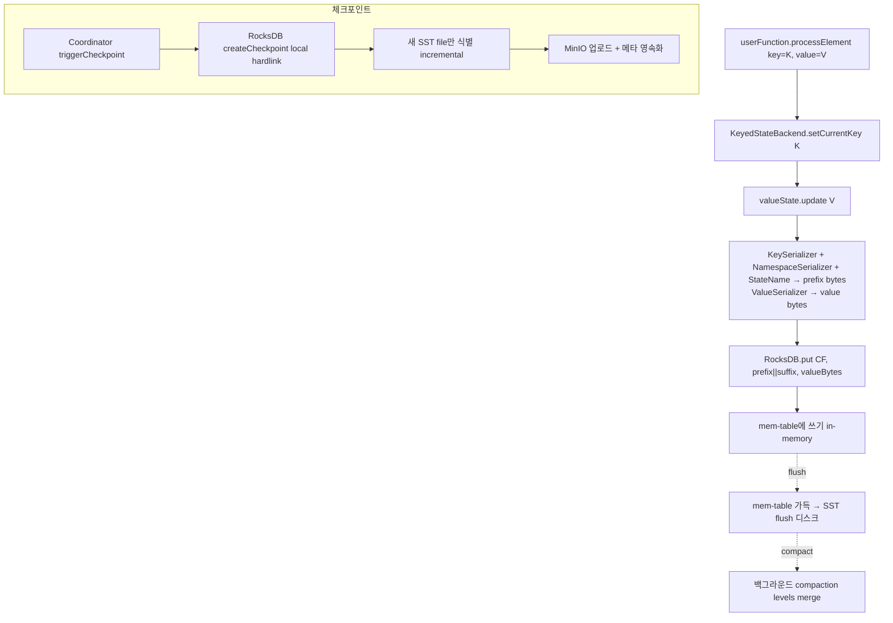

# RocksDB State Backend — 운영 깊이

> **요약**: 본인 환경(K8s + MinIO)의 운영용 메인 state backend. RocksDB 임베디드(LSM-tree)에 key-value bytes로 저장, 매 체크포인트에 새 SST 파일만 MinIO에 업로드(incremental).
> **모듈**: `flink-state-backends/flink-statebackend-rocksdb/`
> **기준 버전**: Flink `release-2.0`
> **운영 권장 여부**: ★★★ Production (본인 환경 메인)
> **선행**: [`./03-state-backend-overview.md`](./03-state-backend-overview.md)

---

## 1. TL;DR (3문장)

`EmbeddedRocksDBStateBackend`는 잡 시작 시 각 TM 슬롯마다 RocksDB 인스턴스를 만들고 (TM당 N개 column family로 한 inst 공유), `setCurrentKey()` 후의 `state.value()`/`update()` 호출은 (key+namespace+stateName) prefix bytes로 RocksDB get/put 호출이 된다. snapshot은 RocksDB의 LSM 구조 — **변경분(새 SST 파일)만 MinIO에 업로드**, 이전 파일은 메타에 reference로 보관 (incremental). 운영에서 가장 중요한 두 튜닝: **(1) `state.backend.rocksdb.memory.managed: true`로 RocksDB 메모리를 Flink managed memory에 위임** (OOM 방지), **(2) 로컬 디스크 공간 확보** (PVC 또는 큰 emptyDir, state 크기 + compaction overhead).

---

## 2. 사전 지식

### 2.1 LSM-tree (RocksDB 내부 자료구조)

Log-Structured Merge tree. write가 먼저 in-memory mem-table에 쌓이고 → 가득 차면 SST 파일로 flush → 백그라운드에서 SST들을 merge (compaction). read는 mem-table → SST level 0 → level 1 → ... 순으로 검색 (block cache로 속도 보강). 특징:
- **write-heavy 친화** (random write를 sequential write로 변환)
- **read는 multiple level 탐색** → block cache가 critical
- **매 SST 파일은 immutable** → incremental snapshot이 자연스럽게 가능

### 2.2 Column Family (CF)

RocksDB에서 같은 instance를 logical하게 분리한 keyspace. Flink는 잡의 **각 state descriptor마다 1 CF** 사용 — `userMapState`, `windowState`, `timersState` 등이 별도 CF로 격리. CF별로 options 다르게 줄 수 있음.

### 2.3 JNI

RocksDB는 C++ — Flink는 JNI(`org.rocksdb.RocksDB` 클래스)로 호출. 그래서 `ROCKSDB_LIB_LOADING_ATTEMPTS`(3회 재시도) 같은 native lib 로딩 코드가 있고, JVM heap과 별도의 RocksDB native 메모리가 운영 시 핵심 변수.

---

## 3. 핵심 클래스

| 역할 | 클래스 | 위치 |
|------|------|------|
| 사용자 facing backend | `EmbeddedRocksDBStateBackend` | `flink-state-backends/flink-statebackend-rocksdb/.../EmbeddedRocksDBStateBackend.java` |
| KeyedStateBackend 구현 | `RocksDBKeyedStateBackend<K>` | 같은 모듈 `RocksDBKeyedStateBackend.java` |
| 5개 state primitive | `RocksDBValueState`, `RocksDBListState`, `RocksDBMapState`, `RocksDBAggregatingState`, `RocksDBReducingState` | 같은 모듈 |
| 옵션 정의 | `RocksDBOptions` (top-level), `RocksDBConfigurableOptions` (column family/세부) | 같은 모듈 |
| Predefined option 묶음 | `PredefinedOptions` (Enum) | 같은 모듈 |
| Native 메트릭 옵션 | `RocksDBNativeMetricOptions` | 같은 모듈 |
| Snapshot 전략 (incremental/full) | `RocksIncrementalSnapshotStrategy`, `RocksFullSnapshotStrategy` | 같은 모듈 |
| Compaction manual 관리 | `RocksDBManualCompactionManager` | 같은 모듈 |

---

## 4. State 동작의 데이터 흐름



---

## 5. 코드 워크스루

### 5.1 `EmbeddedRocksDBStateBackend` (factory)

`flink-state-backends/.../rocksdb/EmbeddedRocksDBStateBackend.java:85-`:

```java
/**
 * A {@link StateBackend} that stores its state in an embedded RocksDB instance. ... can store very
 * large state that exceeds memory and spills to local disk. All key/value state (including windows)
 * is stored in the key/value index of RocksDB. ...
 */
@PublicEvolving
public class EmbeddedRocksDBStateBackend extends AbstractManagedMemoryStateBackend
        implements ConfigurableStateBackend {

    private static final int ROCKSDB_LIB_LOADING_ATTEMPTS = 3;
    private static boolean rocksDbInitialized = false;
    
    // (config) localRocksDbDirectories, predefinedOptions, rocksDbOptionsFactory,
    //         enableIncrementalCheckpointing, useManagedMemory, ...
}
```

핵심 책임:
- JNI 통한 RocksDB native lib 로드 (3회 재시도)
- 로컬 디렉토리 결정 + 잡당 unique sub-dir 생성
- `createKeyedStateBackend()` 호출 시 `RocksDBKeyedStateBackend` 인스턴스화

### 5.2 `RocksDBKeyedStateBackend` (실제 working state)

`flink-state-backends/.../rocksdb/RocksDBKeyedStateBackend.java:120-`:

```java
/**
 * An {@link AbstractKeyedStateBackend} that stores its state in {@code RocksDB} and serializes
 * state to streams provided by a {@link CheckpointStreamFactory} upon checkpointing. This state
 * backend can store very large state that exceeds memory and spills to disk. Except for the
 * snapshotting, this class should be accessed as if it is not threadsafe.
 *
 * <p>This class follows the rules for closing/releasing native RocksDB resources ...
 */
public class RocksDBKeyedStateBackend<K> extends AbstractKeyedStateBackend<K> {

    public static final String MERGE_OPERATOR_NAME = "stringappendtest";

    private static final Map<StateDescriptor.Type, StateCreateFactory> STATE_CREATE_FACTORIES =
            Stream.of(
                    Tuple2.of(StateDescriptor.Type.VALUE,        (StateCreateFactory) RocksDBValueState::create),
                    Tuple2.of(StateDescriptor.Type.LIST,         (StateCreateFactory) RocksDBListState::create),
                    Tuple2.of(StateDescriptor.Type.MAP,          (StateCreateFactory) RocksDBMapState::create),
                    Tuple2.of(StateDescriptor.Type.AGGREGATING,  (StateCreateFactory) RocksDBAggregatingState::create),
                    Tuple2.of(StateDescriptor.Type.REDUCING,     (StateCreateFactory) RocksDBReducingState::create))
                .collect(Collectors.toMap(t -> t.f0, t -> t.f1));
    
    private final RocksDBManualCompactionManager sstMergeManager;
    // ...
}
```

5가지 state primitive (`Value`, `List`, `Map`, `Aggregating`, `Reducing`) — 각각 RocksDB key-value put/get으로 구현. `MapState`는 (mapKey)도 key bytes에 포함.

### 5.3 Key serialization 형식

state value access 시 만들어지는 RocksDB key 형식 (개념):

```
RocksDB key bytes = keyGroupBytes ++ keySerializer(currentKey) ++ namespaceSerializer(namespace) ++ separator
RocksDB value bytes = valueSerializer(value)
```

`keyGroup`이 prefix에 들어가는 이유: rescale 시 key group 단위로 redistribute 가능하게 하기 위함. 같은 key group의 state가 RocksDB key 공간에서 인접해 sequential scan으로 옮길 수 있음.

### 5.4 Snapshot 동작 (incremental)

`RocksDBKeyedStateBackend.snapshot(...)` (개념):

1. **synchronous part** (mailbox thread, fast):
   - `db.createCheckpoint(...)` → RocksDB가 현재 SST 파일들을 hardlink로 local dir에 복사 (zero-copy)
   - 새 SST 파일 set 식별 (이전 체크포인트와 비교)
2. **asynchronous part** (별도 스레드, slow):
   - 새 SST 파일들을 `CheckpointStreamFactory`(=MinIO)로 업로드
   - 메타 (어떤 SST가 어느 체크포인트의 무엇인지)를 직렬화
   - 결과 `IncrementalKeyedStateHandle` 반환 → JM acknowledge

핵심: sync part는 매우 빠름(hardlink만) → mailbox 점유 짧음. async part는 시간 걸리지만 record processing과 병행.

### 5.5 Restore 동작

새 잡 시작 또는 failover 시:
1. `IncrementalKeyedStateHandle` 받음 (CompletedCheckpoint에서)
2. handle 안의 SST 파일 reference로 MinIO에서 download (local recovery 활성화 시 로컬 cache 우선)
3. RocksDB 인스턴스 새로 만들고 download된 SST를 ingest (또는 새 SST 그대로 활용)
4. 메타 정보로 column family 매핑 복원

rescale 시: key group → subtask 매핑 변경 → 각 subtask가 자기 key group range의 SST를 MinIO에서 download.

---

## 6. 본인 환경 운영 가이드

### 6.1 권장 `flink-conf.yaml` (전체)

```yaml
# === 핵심 (필수) ===
state.backend.type: rocksdb
state.backend.incremental: true
state.checkpoint-storage: filesystem
state.checkpoints.dir: s3://flink-checkpoints/
state.savepoints.dir: s3://flink-savepoints/

# === RocksDB 메모리 (managed memory에 위임) ===
state.backend.rocksdb.memory.managed: true       # default true 권장
# 또는 fixed:
# state.backend.rocksdb.memory.fixed-per-slot: 256mb
# state.backend.rocksdb.memory.write-buffer-ratio: 0.5
# state.backend.rocksdb.memory.high-prio-pool-ratio: 0.1

# === 로컬 디렉토리 ===
state.backend.rocksdb.localdir: /flink/rocksdb

# === Predefined options (디스크 종류에 맞춤) ===
state.backend.rocksdb.predefined-options: FLASH_SSD_OPTIMIZED   # 또는 SPINNING_DISK_OPTIMIZED_HIGH_MEM

# === Checkpoint 전송 병렬도 ===
state.backend.rocksdb.checkpoint.transfer-thread.num: 4

# === Local recovery (failover 빠르게) ===
state.backend.local-recovery: true
state.backend.rocksdb.localdir-list-strategy: ROUND_ROBIN

# === Native 메트릭 (디버깅용) ===
state.backend.rocksdb.metrics.estimate-num-keys: true
state.backend.rocksdb.metrics.estimate-table-readers-mem: true
state.backend.rocksdb.metrics.size-all-mem-tables: true
state.backend.rocksdb.metrics.cur-size-active-mem-table: true
state.backend.rocksdb.metrics.num-running-compactions: true
state.backend.rocksdb.metrics.num-running-flushes: true
```

### 6.2 K8s TM Pod 설정

```yaml
spec:
  taskManager:
    podTemplate:
      spec:
        containers:
          - name: flink-main-container
            volumeMounts:
              - name: rocksdb-data
                mountPath: /flink/rocksdb
            resources:
              requests:
                memory: "8Gi"
              limits:
                memory: "8Gi"   # request==limit 권장 (K8s OOMKill 방지)
        volumes:
          - name: rocksdb-data
            emptyDir:
              sizeLimit: 100Gi
              # 또는 PVC for local recovery 보존:
              # persistentVolumeClaim:
              #   claimName: rocksdb-pvc-{{ taskManager.podName }}
```

### 6.3 메모리 분배 (TM 8GB 기준)

```
TM Pod 8GB
  ├─ JVM heap (taskmanager.memory.task.heap.size, default 자동)
  ├─ Managed memory (taskmanager.memory.managed.size, 0.4 = 3.2GB)
  │    └─ RocksDB 메모리가 여기서 할당 (managed: true 시)
  │         ├─ block cache
  │         ├─ write buffer (mem-table)
  │         └─ index/filter
  ├─ Network buffer
  ├─ Framework off-heap
  └─ JVM metaspace + overhead
```

`managed: true` 권장 — RocksDB의 native 메모리가 Flink 통제 안에 들어가 OOMKill 위험 감소.

### 6.4 디스크 사용량 모니터링

```bash
# TM Pod 안에서
kubectl exec <tm-pod> -- du -sh /flink/rocksdb/*
# → state size + compaction 중간 산출물 + WAL
```

state 크기의 **2~3배** 디스크 여유 권장 (compaction이 임시 추가 공간 사용).

---

## 7. 흔한 운영 이슈 & 해결

| 증상 | 원인 | 해결 |
|------|------|------|
| TM Pod 자주 OOMKilled | RocksDB native mem이 limit 넘음 | `state.backend.rocksdb.memory.managed: true` + memory.task.off-heap.size 증가 |
| 체크포인트 시간 점점 증가 | SST 파일 누적, compaction 부족 | `RocksDBManualCompactionManager` 활성화 또는 RocksDB compaction 옵션 튜닝 |
| 디스크 가득 | state 증가 + compaction 임시 공간 | PVC 크기 증가 또는 TTL 설정으로 state 자동 만료 |
| state get latency 큼 | block cache 작음 → disk read 많음 | managed memory 비율 늘리거나 `block-cache-size` 명시 |
| restore 매우 느림 | local recovery 미활성, MinIO에서 전체 download | `state.backend.local-recovery: true` + PVC 사용 |
| Compaction 밀림 | write rate ↑↑, compaction thread 부족 | `max-background-compactions` 증가 또는 write 패턴 검토 |

---

## 8. 관련 FLIP / JIRA

- [FLIP-49: Unified Memory Configuration for TaskExecutors](https://cwiki.apache.org/confluence/display/FLINK/FLIP-49%3A+Unified+Memory+Configuration+for+TaskExecutors) — managed memory에 RocksDB 통합
- [FLIP-34: Local Recovery](https://cwiki.apache.org/confluence/display/FLINK/FLIP-34%3A+Local+Recovery) — local copy로 빠른 restore
- [FLIP-158: Generalized incremental checkpoints](https://cwiki.apache.org/confluence/display/FLINK/FLIP-158%3A+Generalized+incremental+checkpoints) — Changelog (RocksDB와 별도 wrap)
- [FLIP-203: Incremental savepoints](https://cwiki.apache.org/confluence/display/FLINK/FLIP-203%3A+Incremental+savepoints) — RocksDB native format savepoint
- [FLIP-306: Unified File Merging](https://cwiki.apache.org/confluence/display/FLINK/FLIP-306%3A+Unified+File+Merging+Mechanism+for+Checkpoints) — small SST file merge

---

## 9. FAQ

**Q1. RocksDB inst가 1 TM에 1개? slot마다?**
A. **slot마다 1 inst** (정확히는 keyed operator마다). 같은 잡의 같은 operator의 다른 subtask는 다른 TM에 있으면 다른 inst.

**Q2. column family는 자동?**
A. 그렇다. 사용자가 `getRuntimeContext().getState(new ValueStateDescriptor<>("foo", ...))` 부르면 Flink가 "foo"라는 이름의 CF를 자동 생성/재사용.

**Q3. snapshot 시 잡이 멈추나?**
A. **synchronous part**(hardlink)는 매우 짧게 mailbox thread 점유 (수 ms). **asynchronous part**(MinIO upload)는 백그라운드 thread → record processing은 계속됨.

**Q4. SST 파일이 MinIO에서 영원히 누적?**
A. 아니. CompletedCheckpointStore의 retain count(`state.checkpoints.num-retained: 3` default)에 따라 오래된 체크포인트의 SST가 사용 안 되면 cleanup. 단 어떤 SST가 어떤 체크포인트에서 사용 중인지 ref counting 필요 (incremental의 복잡성).

**Q5. local-recovery 켰는데 PVC 없으면?**
A. emptyDir은 Pod 재시작 시 사라져 local-recovery 효과 없음 → 결국 MinIO에서 download. PVC가 가장 효과적.

**Q6. managed memory를 다른 곳(예: ML model loading)에서도 쓰면?**
A. RocksDB가 weight 비율로 할당받음 — `state.backend.rocksdb.memory.managed-fraction`. 다른 사용자 코드가 managed mem 쓰면 RocksDB share가 줄어들어 block cache 작아짐 → 성능 저하.

**Q7. PredefinedOptions 추천?**
A. `SPINNING_DISK_OPTIMIZED_HIGH_MEM` (HDD) 또는 `FLASH_SSD_OPTIMIZED` (SSD). 본인 환경(K8s 노드 SSD 가정) → `FLASH_SSD_OPTIMIZED`.

---

## 10. 다음에 읽을 문서

- ForSt PoC (cloud-native 미래): [`./05-forst-poc-guide.md`](./) (예정)
- State V2 async API (ForSt 활용 전제): [`./06-state-v2-async-api.md`](./) (예정)
- FileSystem 추상 + S3 multipart upload (체크포인트 영속화 메커니즘): [`../07-filesystem-checkpoint-store/`](../07-filesystem-checkpoint-store/) (예정)
