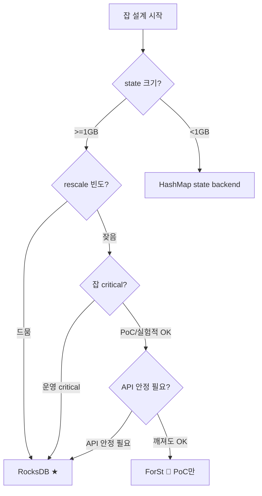

# ForSt — Cloud-Native Disaggregated State (PoC 가이드)

> **요약**: Flink 2.x의 미래 state backend — state를 원격 파일시스템(MinIO/S3)에 직접 저장하고 로컬 디스크는 캐시로만 사용. 빠른 rescale + 작은 로컬 footprint 가능. **2026-04 기준 `@Experimental` — production 비권장**, PoC로 학습 가치 매우 높음.
> **모듈**: `flink-state-backends/flink-statebackend-forst/`
> **기준 버전**: Flink `release-2.0`
> **운영 권장 여부**: 🧪 **PoC만** (2026-04 기준 official 비권장)
> **선행**: [`./04-rocksdb-state-backend.md`](./04-rocksdb-state-backend.md), [`./03-state-backend-overview.md`](./03-state-backend-overview.md)

---

## 1. TL;DR (3문장)

`ForStStateBackend`는 RocksDB의 fork(=ForSt: "For Streaming")를 기반으로, working state의 SST 파일을 **로컬 디스크 대신 원격 파일시스템에 직접 저장**한다(disaggregated) — 로컬 디스크는 빠른 read를 위한 cache만. 효과: state 크기에 무관하게 rescale/restore가 빠름(MinIO에서 다운로드 안 함, 그대로 read), 큰 state(>10TB)도 부담 적음, K8s ephemeral storage로 충분. **단, 2026-04 기준 Flink master 문서가 명시적으로 "experimental, not yet production-ready"라고 적시**하고 SQL async state 미완성 등 한계가 있어, 본인 환경의 결정대로 **운영은 RocksDB 유지 + ForSt는 PoC 트랙으로 학습 병행**.

---

## 2. 사전 지식

### 2.1 ForSt와 RocksDB의 관계

ForSt = Apache Flink가 fork한 RocksDB의 변형. Java 패키지명도 `org.forstdb`(vs RocksDB의 `org.rocksdb`)로 분리. 핵심 차이:
- 원격 file system을 1급 시민으로 (RocksDB는 로컬 file system 가정)
- WAL 비활성/축소 (체크포인트가 본격적 영속화 담당)
- Async API에 친화적 (FLIP-424 State V2)

### 2.2 Disaggregated state의 장단점

| 관점 | 장점 | 단점 |
|------|------|------|
| Rescale | state download 없음 → 매우 빠름 | cache miss 시 latency 증가 |
| 로컬 디스크 | ephemeral 가능 (적은 PVC) | cache 효과를 위해선 그래도 어느 정도 필요 |
| 비용 | local SSD 절약, 원격 storage 사용 | MinIO API 호출 비용 (네트워크 + 트랜잭션) |
| 복구 | downloads 안 함 → 빠름 | 첫 read는 항상 원격 → cold start 느림 |

### 2.3 "experimental"의 정확한 의미 (Flink convention)

`@Experimental` 어노테이션 = API/동작이 마이너 버전에서 깨질 수 있음, production deployment는 보장 안 함. Flink의 다른 experimental → GA 사례: Source V2 (FLIP-27)는 1.10에서 experimental로 도입 → 1.14에서 GA, 약 2년 소요.

---

## 3. 핵심 클래스

| 역할 | 클래스 | 위치 |
|------|------|------|
| Backend (factory) | `ForStStateBackend` (`@Experimental`, `extends AbstractManagedMemoryStateBackend`) | `flink-state-backends/flink-statebackend-forst/.../ForStStateBackend.java` |
| Factory (SPI 등록용) | `ForStStateBackendFactory` (`@Experimental`) | 같은 모듈 |
| 옵션 (`state.backend.forst.*`) | `ForStOptions` (`@Experimental`) | 같은 모듈 |
| Configurable RocksDB-like options | `ForStConfigurableOptions` (`@Experimental`) | 같은 모듈 |
| Native 메트릭 옵션 | `ForStNativeMetricOptions` | 같은 모듈 |
| Async state 진입 | `flink-runtime/runtime/asyncprocessing/` | `AsyncExecutionController` 등 |
| 매핑 ForSt FS | `ForStFlinkFileSystem` | 같은 모듈 |

---

## 4. 공식 입장 (인용)

[Disaggregated State Management — Flink master docs](https://nightlies.apache.org/flink/flink-docs-master/docs/ops/state/disaggregated_state/) (2026-04 기준):

> *"The disaggregated state management is still in **experimental state**. We are working on improving the performance and stability of this feature. **The APIs and configurations may change** in future release."*

이 레포 코드 (release-2.0):

```bash
# 모든 ForSt 진입점에 @Experimental
$ grep -rn "@Experimental" flink-state-backends/flink-statebackend-forst/src/main/java | head
flink-statebackend-forst/.../ForStStateBackendFactory.java:27:@Experimental
flink-statebackend-forst/.../ConfigurableForStOptionsFactory.java:25:@Experimental
flink-statebackend-forst/.../ForStOptionsFactory.java:35:@Experimental
flink-statebackend-forst/.../ForStStateBackend.java:96:@Experimental
flink-statebackend-forst/.../ForStConfigurableOptions.java:65:@Experimental
flink-statebackend-forst/.../ForStOptions.java:36:@Experimental
flink-statebackend-forst/.../ForStNativeMetricOptions.java:50:@Experimental
```

**알려진 한계** (Flink 마스터 문서 기준):
1. SQL의 async state 지원 미완성
2. async state를 지원하는 operator 제한적: Rank, Dedup, Aggregation, Join, Window
3. Mini-batch / two-phase aggregation 미지원
4. **동기 state API를 쓰면 ForSt도 로컬 상태로만 동작** (disaggregation 효과 없음) — 이게 가장 중요
5. API/설정이 마이너 릴리스에서 깨질 수 있음

---

## 5. 코드 워크스루

### 5.1 `ForStStateBackend` 클래스

`flink-state-backends/flink-statebackend-forst/.../ForStStateBackend.java:96`:

```java
@Experimental
public class ForStStateBackend extends AbstractManagedMemoryStateBackend
        implements ConfigurableStateBackend {
    // ... (RocksDB와 매우 유사한 구조)
}
```

`EmbeddedRocksDBStateBackend`와 거의 1:1 대응 — 차이는 file system 측의 추상화에 있음.

### 5.2 `ForStResourceContainer` — 핵심 차이점

`flink-state-backends/flink-statebackend-forst/.../ForStResourceContainer.java`:

```java
// import 부분에 ForSt 자체 패키지 보임 (org.forstdb)
import org.forstdb.BlockBasedTableConfig;
import org.forstdb.BloomFilter;
import org.forstdb.Cache;
import org.forstdb.ColumnFamilyOptions;
import org.forstdb.DBOptions;
import org.forstdb.Filter;
import org.forstdb.FlinkEnv;        // ← Flink-aware FS
import org.forstdb.IndexType;
import org.forstdb.PlainTableConfig;
import org.forstdb.ReadOptions;
import org.forstdb.Statistics;
import org.forstdb.TableFormatConfig;
import org.forstdb.WriteOptions;
```

`org.forstdb.FlinkEnv` — Flink의 FS 추상을 ForSt가 이해하는 형태로 wrap. 이를 통해 ForSt가 직접 MinIO에 read/write.

### 5.3 `ForStOptions` 핵심 설정

```java
@Experimental
public class ForStOptions {

    // 로컬 디렉토리 (메타 + cache)
    public static final ConfigOption<String> LOCAL_DIRECTORIES =
            ConfigOptions.key("state.backend.forst.local-dir")
                    .stringType().noDefaultValue()
                    .withDescription("The local directory ... where ForSt puts some metadata files...");
    
    // 원격 디렉토리 (실제 state)
    public static final ConfigOption<String> REMOTE_DIRECTORIES =
            ConfigOptions.key("state.backend.forst.remote-dir")
                    .stringType().noDefaultValue()
                    .withDescription("The remote directory ...");
    
    // shortcut: 체크포인트와 같은 location 사용
    // CHECKPOINT_DIR_AS_PRIMARY_SHORTCUT — 원격 디렉토리를 체크포인트 dir로 자동 설정
    // LOCAL_DIR_AS_PRIMARY_SHORTCUT — 로컬을 primary로 (사실상 RocksDB 같음)
}
```

이 옵션들이 production에서 깨질 수 있다는 점이 `@Experimental`의 의미.

---

## 6. PoC 실행 가이드

### 6.1 별도 PoC 잡 준비

운영 잡을 그대로 ForSt로 전환 ❌. 별도 PoC 잡을 K8s namespace에 띄움:

```yaml
# flinkdeployment-forst-poc.yaml
apiVersion: flink.apache.org/v1beta1
kind: FlinkDeployment
metadata:
  name: forst-poc
  namespace: flink-poc
spec:
  image: flink:2.0.0
  flinkVersion: v2_0
  flinkConfiguration:
    state.backend.type: forst
    state.backend.forst.remote-dir: s3://flink-forst-poc/
    state.backend.forst.local-dir: /flink/forst-cache
    
    # checkpoint 그대로 MinIO
    state.checkpoint-storage: filesystem
    state.checkpoints.dir: s3://flink-checkpoints-poc/
    
    # State V2 async API 활용 (필수 — disaggregation 효과를 보려면)
    execution.checkpointing.interval: 30s
    execution.checkpointing.mode: EXACTLY_ONCE
  taskManager:
    podTemplate:
      spec:
        containers:
          - name: flink-main-container
            volumeMounts:
              - name: forst-cache
                mountPath: /flink/forst-cache
            resources:
              requests:
                memory: "4Gi"   # local 캐시 부담 적어 RocksDB보다 작아도 OK
        volumes:
          - name: forst-cache
            emptyDir:
              sizeLimit: 20Gi   # state 크기와 무관 (캐시이므로 작아도 됨)
```

### 6.2 PoC에서 측정할 것

| 측정 항목 | 방법 | 비교 대상 (RocksDB) |
|----------|------|---------------------|
| Rescale 시간 | parallelism 변경 → 새 ExecutionGraph 시작까지 | RocksDB는 state download time 포함 |
| Checkpoint 시간 | REST `/jobs/.../checkpoints` 의 `duration` | RocksDB와 비슷 또는 약간 빠를 것으로 예상 |
| State get latency (p99) | 메트릭 `state.value.get.duration` 또는 사용자 함수에서 측정 | cache miss 시 RocksDB보다 느림 |
| MinIO API 호출 비용 | MinIO 측 메트릭 또는 비용 모니터링 | 증가 (ForSt가 직접 자주 호출) |
| Pod 재시작 후 throughput 회복 시간 | 잡 metric (numRecordsOutPerSecond) | RocksDB는 download 완료까지 느림 |

### 6.3 PoC 잡 시나리오 (권장)

본인 환경 닮은 작은 잡:
- Source: Kafka (적은 partition, 작은 throughput)
- Process: keyBy + window (state 1~10GB 정도)
- Sink: Iceberg (Polaris)

State V2 async API를 사용하는 operator(`Aggregation`, `Window`)로 구성해야 disaggregation 효과를 봄. SQL 잡으로 만들면 async state 미지원으로 sync mode → ForSt가 RocksDB처럼 동작 (의미 없음).

---

## 7. RocksDB vs ForSt 결정 흐름



본인 환경의 거의 모든 운영 잡 → RocksDB. PoC 잡 1개로 ForSt 실험.

---

## 8. 관련 FLIP / 논문

- [FLIP-423: Disaggregated State Storage and Management](https://cwiki.apache.org/confluence/display/FLINK/FLIP-423%3A+Disaggregated+State+Storage+and+Management) — 도입 제안
- [FLIP-424: Asynchronous State APIs](https://cwiki.apache.org/confluence/display/FLINK/FLIP-424%3A+Asynchronous+State+APIs) — async API
- [FLIP-427: ForSt — Cloud-Native State Store](https://cwiki.apache.org/confluence/display/FLINK/FLIP-427%3A+ForSt+-+Cloud-Native+State+Store) — ForSt 자체
- [VLDB 2024: Disaggregated State Management in Apache Flink 2.0](https://www.vldb.org/pvldb/vol18/p4846-mei.pdf) — 학술 논문 (Alibaba/Confluent)

---

## 9. 디버깅 / 모니터링

### 9.1 ForSt 활성 여부 확인

```bash
kubectl logs <jm-pod> | grep -i "ForSt\|disaggregated"
```

### 9.2 cache hit rate 메트릭

ForSt 자체 메트릭 (`state.backend.forst.metrics.*`) — `block-cache-hit`, `block-cache-miss`. miss가 너무 많으면 cache 크기 확장 필요.

### 9.3 MinIO 측 트래픽

```bash
mc admin trace --verbose ... 또는 MinIO 메트릭 export
```

ForSt가 너무 자주 read/write 하면 MinIO 부하 + 비용 ↑.

---

## 10. FAQ

**Q1. 운영 잡에 ForSt 써도 되나?**
A. 공식 문서가 명시적으로 "not yet production-ready"라고 함. **권장 ❌**. PoC로 학습 + 향후 GA 시 마이그레이션 준비.

**Q2. 언제 GA될 것 같나?**
A. 추정 — Source V2 사례 (experimental → GA 약 2년) 참조 시 2026~2027 사이. Confluent Cloud가 적극 채택 중이라 압력 높음.

**Q3. ForSt + RocksDB hybrid 가능?**
A. 잡당 backend 선택은 1개. 다른 잡은 다른 backend로 가능. 한 잡 안에서 operator별로 다르게는 불가.

**Q4. State V2 async API 안 쓰면?**
A. ForSt도 sync mode로 동작 → RocksDB와 거의 같음 (disaggregation 효과 없음). State V2 사용이 전제.

**Q5. MinIO API 비용이 RocksDB보다 비쌀까?**
A. 네 — ForSt는 매 read/write가 잠재적 MinIO 호출. cache hit rate가 핵심. self-hosted MinIO면 API 비용 자체는 0이지만 네트워크 IO가 증가.

**Q6. Flink K8s Operator가 ForSt 지원?**
A. backend 선택은 잡 설정 (`flink-conf.yaml`) → Operator는 그저 그 설정으로 잡을 띄움. Operator 자체가 ForSt를 별도 지원할 필요 없음.

**Q7. PoC 결과가 좋으면 운영 도입?**
A. 그래도 1~2년 더 기다리는 게 안전. mid-term 모니터링 필요. 이미 운영하고 있는 RocksDB 잡을 마이그레이션하기보다 새 잡을 ForSt로 시작하는 것이 risk 분산에 더 좋음.

---

## 11. 다음에 읽을 문서

- State V2 async API (ForSt 활용 전제): [`./06-state-v2-async-api.md`](./) (예정)
- Changelog state backend (대안적 latency 단축): [`./07-changelog-state.md`](./) (예정)
- FileSystem 추상 + S3 multipart (ForSt가 사용하는 layer): [`../07-filesystem-checkpoint-store/`](../07-filesystem-checkpoint-store/) (예정)
- Source/Sink V2 SPI (Iceberg/Kafka 매핑): [`../06-source-sink-spi/`](../06-source-sink-spi/) (예정)
