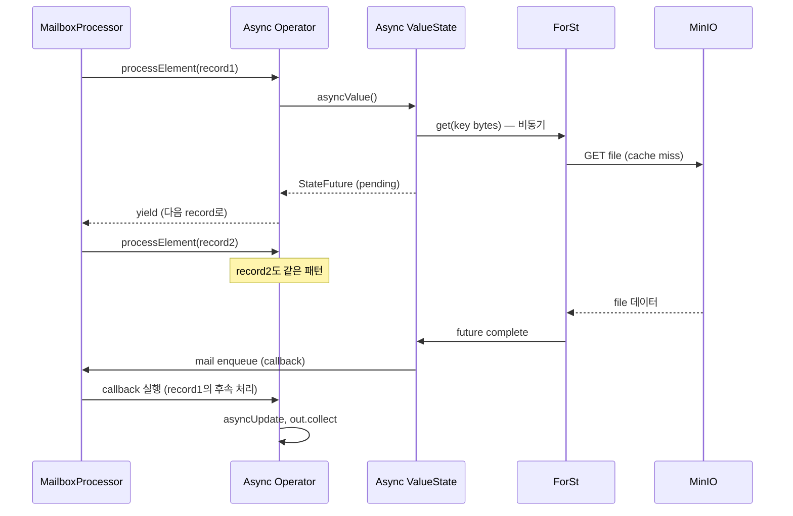

# State V2 Async API (FLIP-424) — ForSt 활용의 전제

> **요약**: 기존 sync state API는 한 record 처리 중 state get/put이 blocking → ForSt 같은 disaggregated backend의 latency를 record processing 멈춤으로 만든다. State V2의 async API는 state 호출이 `StateFuture<T>`를 반환 → mailbox loop가 그동안 다른 record를 처리, future 완료 시 mail로 콜백 실행.
> **모듈**: `flink-runtime/runtime/asyncprocessing/`, `flink-core/core/state/`
> **기준 버전**: Flink `release-2.0`
> **운영 권장 여부**: 🧪 ForSt와 함께 PoC. SQL 미완성 영역 있음.
> **선행**: [`./05-forst-poc-guide.md`](./05-forst-poc-guide.md)

---

## 1. TL;DR (3문장)

State V2 async API의 핵심 클래스는 `StateFuture<T>` — state read/write가 즉시 future를 반환하고, 사용자가 `.thenApply(...)` / `.thenAccept(...)` 콜백을 mailbox에 등록. mailbox loop는 future 완료 대기로 block하지 않고 다른 record/mail을 계속 처리 → ForSt(원격 storage) read latency가 throughput을 죽이지 않음. 본인 환경의 운영 잡(RocksDB sync)은 여전히 sync API 그대로 사용 — async는 ForSt PoC 잡에서만.

---

## 2. 사전 지식

### 2.1 sync vs async state access의 의미

```java
// sync (기존, V1)
ValueState<Long> state = ...;
public void processElement(Event e, Context ctx) {
    Long current = state.value();      // BLOCKING — RocksDB read 동안 thread 멈춤
    state.update(current + 1);         // BLOCKING write
    out.collect(...);
}

// async (V2)
ValueState<Long> state = ...;
public void processElement(Event e, Context ctx) {
    state.asyncValue()                  // 즉시 StateFuture<Long> 반환
        .thenAccept(current -> {        // mailbox에서 future 완료 시 콜백
            state.asyncUpdate(current + 1);
            out.collect(...);
        });
}
```

local RocksDB 환경에선 sync read가 빠름(~1μs) → async overhead가 손해. **원격 storage(ForSt)에서만 async가 의미** — 단일 read가 1ms+ 걸릴 수 있음.

### 2.2 mailbox 모델과 async의 자연스러운 결합

[`../04-runtime-architecture/05-stream-task-mailbox.md`](../04-runtime-architecture/05-stream-task-mailbox.md)에서 본 mailbox loop가 default action(record processing) + mail 처리. async state callback이 mail로 enqueue되어 같은 mailbox thread에서 안전하게 실행.

### 2.3 record 순서 보장과 async

순서 깨짐 방지: 같은 key의 record들은 직렬 처리. 다른 key는 병렬 가능. `AsyncExecutionController`가 key-aware ordering 관리.

---

## 3. 핵심 클래스

| 역할 | 클래스 | 위치 |
|------|------|------|
| Async execution 관리 | `AsyncExecutionController` | `flink-runtime/src/main/java/org/apache/flink/runtime/asyncprocessing/AsyncExecutionController.java` |
| Async state 추상 | `StateFuture<T>` | `flink-core/.../state/StateFuture.java` |
| Async state primitives | `org.apache.flink.api.common.state.v2.*` (`ValueState`, `MapState` 등의 v2) | `flink-core/api/common/state/v2/` |
| Async-aware operator | `AsyncStateProcessing` (Interface) | `flink-streaming-java/api/operators/asyncprocessing/` |
| Async-aware StreamTask | `AbstractAsyncStateStreamOperator` | 같은 패키지 |

---

## 4. 동작 흐름



---

## 5. 코드 사용 예시

### 5.1 V2 async API (사용자 코드)

```java
import org.apache.flink.api.common.state.v2.ValueState;
import org.apache.flink.api.common.state.v2.ValueStateDescriptor;

public class CountingFunction extends KeyedProcessFunction<String, Event, Out>
        implements AsyncStateProcessing {

    private ValueState<Long> count;

    @Override
    public void open(Configuration parameters) {
        count = getRuntimeContext().getState(new ValueStateDescriptor<>("count", Long.class));
    }

    @Override
    public void processElement(Event e, Context ctx, Collector<Out> out) {
        count.asyncValue()                      // StateFuture<Long>
            .thenAccept(current -> {
                long newVal = (current == null ? 1L : current + 1);
                count.asyncUpdate(newVal);
                out.collect(new Out(e.key, newVal));
            });
    }
}
```

핵심:
- `asyncValue()` 호출은 즉시 반환 → mailbox는 다음 record 처리 가능
- `thenAccept` 콜백은 mailbox thread에서 실행 → thread safe
- 같은 key의 record는 순서 보장 (AsyncExecutionController가 관리)

### 5.2 supported operator (마스터 문서 기준)

- `Rank` operator
- `Deduplication`
- `Aggregation` (TableAggregateFunction 포함)
- `Join` (대부분 종류)
- `Window` operator (Tumbling, Sliding, Session)

이 외 operator (예: 사용자 정의 ProcessFunction의 일부 케이스)는 sync state로만 동작.

### 5.3 SQL/Table 영역

- 일부 SQL operator만 async — Aggregation, Window 등
- mini-batch / two-phase aggregation은 미지원 → SQL 잡에서 ForSt+async 효과 제한적
- 본인 환경이 DataStream API 위주라면 더 적합

---

## 6. 본인 환경에서의 의미

### 6.1 운영 잡 (RocksDB sync)

기존 코드 그대로. async API 안 써도 됨. RocksDB 로컬 read latency가 매우 작아 sync로 충분.

### 6.2 PoC 잡 (ForSt async)

새 PoC 잡은 V2 API로 작성:
- `org.apache.flink.api.common.state.v2.ValueState` import
- `getState(ValueStateDescriptor)` 시 v2 패키지로
- `asyncValue/asyncUpdate`로 호출
- AsyncStateProcessing 인터페이스 구현

이렇게 작성한 잡을 ForSt backend로 띄우면 disaggregation 효과 검증 가능.

### 6.3 마이그레이션 시 주의

기존 sync 잡을 async로 바꿀 때:
- ValueState/MapState 등의 import 변경 (v1 → v2)
- 모든 state get/put을 async 패턴으로 변경 (record processing 코드 흐름 재구성)
- 사용자 timer + state interaction 검증
- savepoint 호환성 확인 (state schema 변화는 별도 migration 필요)

migration 비용이 크므로 새 잡부터 V2로 가는 게 권장.

---

## 7. 관련 FLIP

- [FLIP-424: Asynchronous State APIs](https://cwiki.apache.org/confluence/display/FLINK/FLIP-424%3A+Asynchronous+State+APIs) — V2 async API 자체
- [FLIP-423: Disaggregated State](https://cwiki.apache.org/confluence/display/FLINK/FLIP-423%3A+Disaggregated+State+Storage+and+Management) — 동기 motivation
- [FLIP-425: Adaptive Async State APIs](https://cwiki.apache.org/confluence/display/FLINK/FLIP-425%3A+Adaptive+Async+State+APIs) — Flink가 sync/async를 자동 선택하는 미래 (예정)

---

## 8. 디버깅

- `AsyncExecutionController` 메트릭 — pending future 수, 평균 latency
- mailbox 메트릭 — async callback이 mailbox에 얼마나 많이 enqueue되는지
- ForSt cache hit rate (앞 문서)

---

## 9. FAQ

**Q1. async API를 RocksDB와 함께 쓰면?**
A. 동작은 함 (StateFuture를 즉시 complete). 단, 오버헤드만 추가 — sync보다 느림. RocksDB는 sync 권장.

**Q2. timer + async state 호환?**
A. timer 콜백 안에서도 async state 호출 가능. timer 자체는 mailbox mail로 들어옴 → async callback과 같은 thread에서 직렬 실행.

**Q3. record 순서가 깨질 수 있나?**
A. 같은 key는 보장. 다른 key는 병렬 처리되어 출력 순서가 input 순서와 달라질 수 있음 (이는 sync에서도 마찬가지 — keyBy 후엔 보통 같은 key 내 순서만 의미).

**Q4. SQL에서 ForSt+async 못 쓰면 어떻게?**
A. async 미지원 SQL operator는 sync state → ForSt가 사실상 RocksDB처럼 동작. SQL 잡엔 ForSt 효과 제한적. DataStream API 위주 잡에서만 PoC 권장.

---

## 10. 다음에 읽을 문서

- Changelog state backend: [`./07-changelog-state.md`](07-changelog-state.md)
- FileSystem 추상 (ForSt가 사용하는 layer): [`../07-filesystem-checkpoint-store/`](../07-filesystem-checkpoint-store/) (예정)
