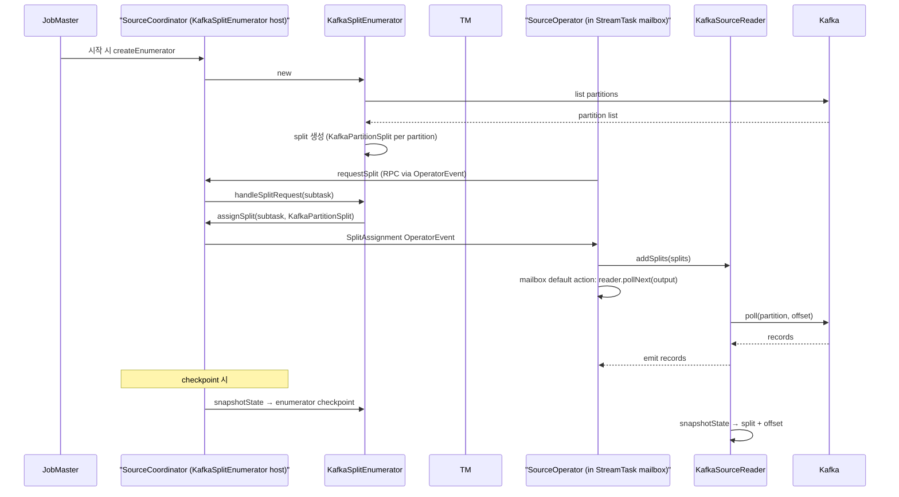

# Source V2 SPI (FLIP-27) — Unified Connector Interface

> **요약**: Flink 2.x의 표준 Source 인터페이스 — `Source<T, SplitT, EnumChkT>`가 SplitEnumerator(JM 측, split 분배)와 SourceReader(TM 측, split 처리)의 factory 역할. 본인 환경의 Kafka 커넥터(외부 레포)가 이 위에 구현됨.
> **모듈**: `flink-core/api/connector/source/`, `flink-runtime/runtime/source/coordinator/`
> **운영 권장 여부**: ★ Production (Source V1은 deprecated)

---

## 1. TL;DR

`Source` 인터페이스는 3가지를 만든다 — `SplitEnumerator`(JM에서 동작, 어떤 split을 어느 reader에 배분할지 결정), `SourceReader`(TM에서 동작, 받은 split을 read해 record emit), 그리고 두 측이 통신할 때 쓰는 split/checkpoint serializer. SplitEnumerator는 `SourceCoordinator`(`flink-runtime`의 OperatorCoordinator)가 host. Reader는 `SourceOperatorStreamTask`(`flink-runtime`)의 mailbox 안에서 동작 — async I/O와 잘 맞음.

---

## 2. 핵심 인터페이스

| 역할 | 인터페이스 | 위치 |
|------|---------|------|
| Source factory (top-level) | `Source<T, SplitT, EnumChkT>` (`@Public`) | `flink-core/.../api/connector/source/Source.java` |
| Split (read 단위) | `SourceSplit` (Interface) | `flink-core/.../api/connector/source/SourceSplit.java` |
| JM 측 enumerator | `SplitEnumerator<SplitT, CheckpointT>` | `flink-core/.../api/connector/source/SplitEnumerator.java` |
| TM 측 reader | `SourceReader<T, SplitT>` | `flink-core/.../api/connector/source/SourceReader.java` |
| JM 측 host (runtime) | `SourceCoordinator` | `flink-runtime/.../runtime/source/coordinator/SourceCoordinator.java` |
| TM 측 host (StreamTask) | `SourceOperatorStreamTask` | `flink-runtime/.../streaming/runtime/tasks/SourceOperatorStreamTask.java` |

---

## 3. `Source` 인터페이스 (코드 인용)

`flink-core/.../source/Source.java:28-`:

```java
/**
 * The interface for Source. It acts like a factory class that helps construct the {@link
 * SplitEnumerator} and {@link SourceReader} and corresponding serializers.
 *
 * @param <T> The type of records produced by the source.
 * @param <SplitT> The type of splits handled by the source.
 * @param <EnumChkT> The type of the enumerator checkpoints.
 */
@Public
public interface Source<T, SplitT extends SourceSplit, EnumChkT>
        extends SourceReaderFactory<T, SplitT> {

    /** Get the boundedness of this source. */
    Boundedness getBoundedness();

    /** Creates a new SplitEnumerator for this source, starting a new input. */
    SplitEnumerator<SplitT, EnumChkT> createEnumerator(SplitEnumeratorContext<SplitT> enumContext) throws Exception;

    /** Restores an enumerator from a checkpoint. */
    SplitEnumerator<SplitT, EnumChkT> restoreEnumerator(
            SplitEnumeratorContext<SplitT> enumContext, EnumChkT checkpoint) throws Exception;

    SimpleVersionedSerializer<SplitT> getSplitSerializer();
    SimpleVersionedSerializer<EnumChkT> getEnumeratorCheckpointSerializer();
    
    // (SourceReaderFactory에서 상속)
    // SourceReader<T, SplitT> createReader(SourceReaderContext readerContext) throws Exception;
    
    default Set<? extends WatermarkDeclaration> declareWatermarks() { return Collections.emptySet(); }
}
```

핵심:
- **Boundedness**: `BOUNDED`(batch 가능) vs `CONTINUOUS_UNBOUNDED`(streaming) — Kafka는 보통 unbounded
- **Enumerator + Reader 분리**: split discovery(JM)와 split processing(TM)을 분리 → 동적 split 추가 가능
- **Serializer 두 종류**: split 자체 + enumerator state — 모두 SimpleVersionedSerializer

---

## 4. 동작 흐름 (Kafka 예시)



---

## 5. 핵심 컨셉

### 5.1 Split

source가 read 가능한 가장 작은 단위. Kafka에선 (topic, partition, startOffset, endOffset) tuple. File source면 (filePath, offset). enumerator가 만들고 reader에게 분배.

### 5.2 SplitEnumerator (JM 측)

- 잡당 1 인스턴스 (parallelism 무관)
- `start()`, `addSplitsBack(splits, subtask)` (reader 죽으면 split 회수), `addReader(subtask)` (새 reader 등록), `handleSplitRequest`, `snapshotState`
- 동적 split discovery 가능 (예: Kafka partition rebalance)

### 5.3 SourceReader (TM 측)

- 각 source subtask당 1 인스턴스
- `start()`, `pollNext(output)` (record emit), `addSplits(splits)`, `notifyNoMoreSplits()`, `snapshotState`
- `pollNext`는 비동기 friendly — `InputStatus`(`MORE_AVAILABLE`/`NOTHING_AVAILABLE`/`END_OF_INPUT`) 반환

### 5.4 OperatorEvent (Enumerator ↔ Reader 통신)

별도 RPC 채널. SplitAssignment, SourceEvent, 사용자 정의 이벤트. JM-TM 간 SourceCoordinator를 거쳐 전달.

---

## 6. 본인 환경 매핑

본인 환경의 `apache/flink-connector-kafka` (외부 레포):

| Flink V2 SPI | Kafka 구현체 |
|-------------|------------|
| `Source` | `KafkaSource<T>` |
| `SourceSplit` | `KafkaPartitionSplit` |
| `SplitEnumerator` | `KafkaSourceEnumerator` |
| `SourceReader` | `KafkaSourceReader` |

자세한 매핑은 [`./04-iceberg-kafka-mapping.md`](./04-iceberg-kafka-mapping.md).

---

## 7. 다음

- SourceCoordinator 자세한 동작: [`./02-source-coordinator.md`](./02-source-coordinator.md)
- Sink V2 + 2PC: [`./03-sink-v2-overview.md`](./03-sink-v2-overview.md)
- Iceberg / Kafka 매핑: [`./04-iceberg-kafka-mapping.md`](./04-iceberg-kafka-mapping.md)
