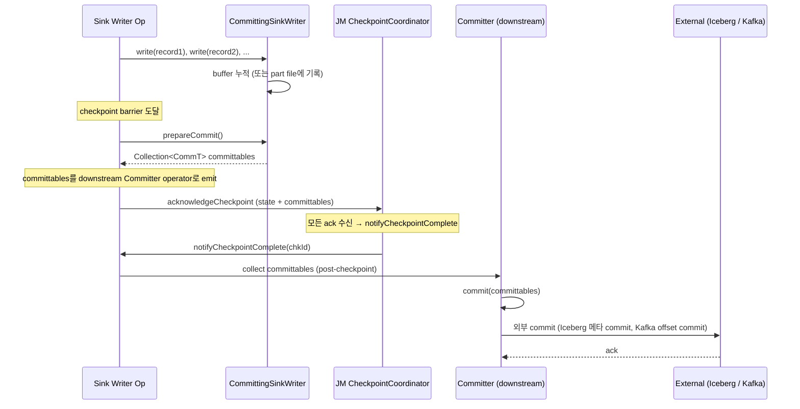

# Sink V2 SPI (FLIP-143/191) — Two-Phase Commit

> **요약**: Sink V2는 stateless `Sink` 기본형 + 옵션 mixin (`SupportsWriterState`, `SupportsCommitter`, `SupportsPostCommitTopology`)으로 구성. Iceberg-Flink가 SupportsCommitter를 구현해 checkpoint 시 pre-commit, checkpoint complete 시 commit하는 2PC 패턴 사용.
> **모듈**: `flink-core/api/connector/sink2/`
> **선행**: [`./01-source-v2-overview.md`](./01-source-v2-overview.md), [`../05-state-checkpoint/01-checkpoint-coordinator.md`](../05-state-checkpoint/01-checkpoint-coordinator.md)

---

## 1. TL;DR

`Sink<InputT>` 자체는 stateless writer factory 1개만 — `SupportsWriterState`로 stateful writer (failover 시 state 복구), `SupportsCommitter`로 2PC commit (checkpoint complete 시 commit) 등을 옵션 mixin으로 추가. Sink V2의 commit 흐름: writer가 element 받아 buffer에 누적 → checkpoint barrier 시 `prepareCommit()` 호출해 committable 추출 → committable이 직렬화되어 checkpoint 메타에 포함 → checkpoint complete 시 `Committer.commit(committables)` 호출 → 외부 commit 수행 (idempotent 보장 필요).

---

## 2. 핵심 인터페이스

| 역할 | 인터페이스 | 위치 |
|------|---------|------|
| Sink top-level (stateless 기본) | `Sink<InputT>` | `flink-core/.../api/connector/sink2/Sink.java` |
| Stateless writer | `SinkWriter<InputT>` | 같은 패키지 |
| Stateful writer (state 복구 가능) | `StatefulSinkWriter<InputT, WriterStateT>` | 같은 패키지 |
| Committable 만드는 writer | `CommittingSinkWriter<InputT, CommT>` | 같은 패키지 |
| Committer | `Committer<CommT>` | 같은 패키지 |
| Mixins | `SupportsWriterState`, `SupportsCommitter`, `SupportsPreCommitTopology`, `SupportsPostCommitTopology` | 같은 패키지 |

---

## 3. `Sink<T>` 인터페이스

`flink-core/.../sink2/Sink.java:21-`:

```java
/**
 * Base interface for developing a sink. A basic Sink is a stateless sink that can flush data on
 * checkpoint to achieve at-least-once consistency. Sinks with additional requirements should
 * implement SupportsWriterState or SupportsCommitter.
 */
@Public
public interface Sink<InputT> extends Serializable {
    SinkWriter<InputT> createWriter(WriterInitContext context) throws IOException;
}
```

기본은 매우 단순. 복잡함은 mixin으로 더해진다.

---

## 4. 2PC 흐름 (`SupportsCommitter` 시)



핵심:
- **prepareCommit**: barrier 시 호출, 결과 committable이 checkpoint state에 들어감
- **commit**: notifyCheckpointComplete 후 호출 — checkpoint failure 시 commit 안 됨 (rollback과 동등)
- **idempotent**: failover 후 같은 committable이 재 commit 시도될 수 있음 → committer가 idempotent해야

---

## 5. `Committer<CommT>` 인터페이스

`flink-core/.../sink2/Committer.java:21-`:

```java
/**
 * The {@code Committer} is responsible for committing the data staged by the {@link
 * CommittingSinkWriter} in the second step of a two-phase commit protocol.
 *
 * <p>A commit must be idempotent: If some failure occurs in Flink during commit phase, Flink will
 * restart from previous checkpoint and re-attempt to commit all committables. Thus, some or all
 * committables may have already been committed. These CommitRequests must not change the external
 * system and implementers are asked to signal CommitRequest#signalAlreadyCommitted().
 */
@Public
public interface Committer<CommT> extends AutoCloseable {
    void commit(Collection<CommitRequest<CommT>> committables) throws IOException, InterruptedException;
    
    interface CommitRequest<CommT> {
        CommT getCommittable();
        int getNumberOfRetries();
        void signalFailedWithKnownReason(Throwable t);
        void signalFailedWithUnknownReason(Throwable t);
        void signalAlreadyCommitted();
    }
}
```

핵심:
- **idempotency 강조** (javadoc) — failover 후 재시도 가능하므로 외부 시스템 상태에 부작용 없는 retry 보장
- **`signalAlreadyCommitted`** — 이미 committed인 committable에 대해 호출 (중복 commit 회피)
- **retry 정보** — `getNumberOfRetries()`로 backoff 등 가능

---

## 6. `GlobalCommitter` (FLIP-191)

일부 sink는 모든 subtask의 committable을 한 곳에 모아 atomic 단일 commit이 필요 (예: Iceberg snapshot — 메타 commit은 단일):

- `SupportsPostCommitTopology` mixin으로 별도 vertex 추가 가능
- 또는 `GlobalCommittingSinkWriter` 패턴 (Iceberg-Flink가 사용)
- 보통 parallelism=1로 강제 → 다른 vertex와 chain 안 됨

---

## 7. 본인 환경 핵심: Iceberg & Kafka

### 7.1 Iceberg-Flink (외부 레포 `apache/iceberg`)

```
IcebergSink implements Sink, SupportsWriterState, SupportsCommitter, SupportsPreWriteTopology

Writer (per-subtask):
  write(rec) → Parquet writer로 data file에 append (MinIO에 업로드, RecoverableWriter 활용)
  prepareCommit() → completed data file paths를 IcebergCommittable로 emit

Committer (single):
  commit(committables) → Iceberg 메타데이터 (manifest + snapshot) 생성 + Polaris REST API 호출
  → atomic하게 새 snapshot 노출 (이전 시점은 그대로 유지)
```

핵심: Polaris가 Iceberg REST Catalog spec을 구현해 commit이 atomic. Polaris OAuth2 토큰으로 인증.

### 7.2 Kafka Sink (외부 레포 `apache/flink-connector-kafka`)

```
KafkaSink implements Sink, SupportsWriterState, SupportsCommitter

Writer (per-subtask):
  write(rec) → producer.send(rec) (Kafka transactional producer)
  prepareCommit() → flush + offsets snapshot → KafkaCommittable

Committer:
  commit(committables) → Kafka transaction commit
```

`DeliveryGuarantee.EXACTLY_ONCE` 모드면 Kafka transactional producer 사용. checkpoint와 transaction을 매핑해 exactly-once 보장.

---

## 8. 다음

- Iceberg / Kafka 매핑 종합: [`./04-iceberg-kafka-mapping.md`](./04-iceberg-kafka-mapping.md)
