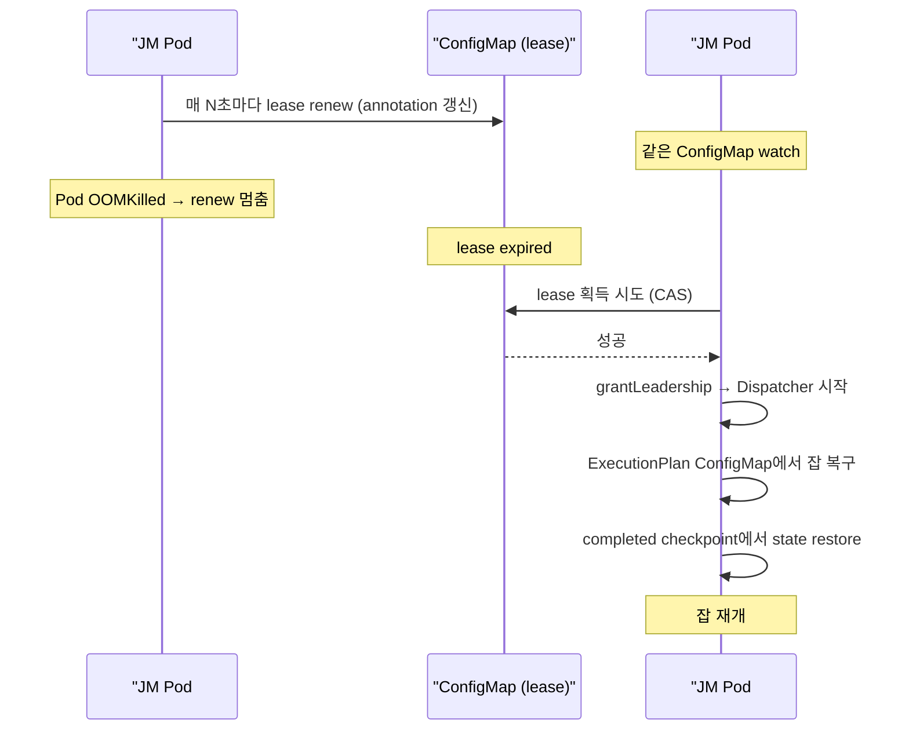

# K8s HA & Leader Election (ConfigMap 기반)

> **요약**: Flink 2.x의 K8s HA는 ZooKeeper 없이 K8s ConfigMap만으로 leader election + state handle store. JM Pod이 죽으면 새 Pod이 같은 ConfigMap watch로 leader 획득 후 잡 복구.
> **모듈**: `flink-kubernetes/highavailability/`

---

## 1. TL;DR

`KubernetesLeaderElectionDriver`가 K8s의 leader election 라이브러리(`org.apache.flink.kubernetes.kubeclient.resources.KubernetesLeaderElector`)로 ConfigMap의 annotation을 lock으로 사용 — leader가 주기적으로 lease renew, 못하면 다른 후보가 takeover. `KubernetesStateHandleStore`는 ConfigMap의 data 필드에 직렬화된 state handle(checkpoint metadata, JobGraph 등)을 저장. ZooKeeper 의존성 제거 → K8s 환경에 완전 native.

---

## 2. 핵심 클래스

| 역할 | 클래스 | 위치 |
|------|------|------|
| Leader election driver | `KubernetesLeaderElectionDriver` | `flink-kubernetes/.../highavailability/KubernetesLeaderElectionDriver.java` |
| Underlying leader elector | `KubernetesLeaderElector` | `flink-kubernetes/.../kubeclient/resources/KubernetesLeaderElector.java` |
| State handle store | `KubernetesStateHandleStore<T>` | `flink-kubernetes/.../highavailability/KubernetesStateHandleStore.java` |
| HA services | `KubernetesLeaderElectionHaServices` | 같은 패키지 |
| Checkpoint recovery | `KubernetesCheckpointRecoveryFactory` | 같은 패키지 |
| Checkpoint ID counter | `KubernetesCheckpointIDCounter` | 같은 패키지 |

---

## 3. ConfigMap 구조

본인 환경의 클러스터 ID = `myjob`이면:

```
namespace: flink-jobs
ConfigMaps:
├── myjob-cluster-config-map       # leader info, leader latch
│   metadata.annotations:
│     control-plane.alpha.kubernetes.io/leader: "..."   # 현재 leader id + lease 만료
│   data:
│     dispatcherLeaderAddress: "akka.tcp://..."
│     resourceManagerLeaderAddress: "akka.tcp://..."
│
├── myjob-resourcemanager-leader   # RM leader election
├── myjob-dispatcher-leader        # Dispatcher leader election
├── myjob-restserver-leader        # REST endpoint leader
├── myjob-<jobid>-jobmanager-leader  # 잡당 JM leader
│
├── myjob-<jobid>-jobgraph         # ExecutionPlan 영속화 (JobGraph store)
│
└── myjob-<jobid>-completed-checkpoint
    data:
      counter: "100"               # 마지막 체크포인트 ID
      <chkId>: "<state-handle-blob-key>"   # 체크포인트 메타 ref
```

---

## 4. Leader Election 흐름



---

## 5. KubernetesLeaderElectionDriver

`flink-kubernetes/.../KubernetesLeaderElectionDriver.java:51-`:

```java
/** {@link LeaderElectionDriver} for Kubernetes. */
public class KubernetesLeaderElectionDriver implements LeaderElectionDriver {

    private final FlinkKubeClient kubeClient;
    private final String configMapName;
    private final String lockIdentity;
    private final LeaderElectionDriver.Listener leaderElectionListener;
    private final KubernetesLeaderElector leaderElector;
    private final KubernetesSharedWatcher.Watch kubernetesWatch;
    private final AtomicBoolean running = new AtomicBoolean(true);
    
    public KubernetesLeaderElectionDriver(...) {
        this.kubeClient = ...;
        this.leaderElectionListener = ...;
        // ConfigMap watch 시작 — leader 변경 감지
    }
}
```

핵심: `leaderElector`가 lease renewal을 담당, `kubernetesWatch`가 ConfigMap state를 모니터.

---

## 6. State Handle Store

`KubernetesStateHandleStore<T>`는 ConfigMap의 data 필드에 직렬화된 state handle 저장. JM이 ExecutionPlan을 persist 시 그 BLOB을 BlobServer에 업로드, key를 ConfigMap에 기록.

```
ConfigMap data:
  jobgraph-<jobId>: "<blob-key>"    # ExecutionPlan은 BLOB에, 키만 ConfigMap에
  ckpt-counter: "100"
  ckpt-100: "<state-handle-blob-key>"
  ckpt-99: "<state-handle-blob-key>"
  ...
```

ConfigMap의 1MB size limit 회피 — 실제 큰 데이터는 BLOB(MinIO 등 file system) 또는 별도 BLOB server에.

---

## 7. 운영 시 주의

### 7.1 ConfigMap RBAC

JM Pod의 ServiceAccount에 다음 권한 필요:

```yaml
rules:
  - apiGroups: [""]
    resources: ["configmaps"]
    verbs: ["create", "get", "list", "watch", "update", "patch", "delete"]
```

Operator가 보통 자동 생성.

### 7.2 ConfigMap cleanup

잡 cancel 시 ConfigMap 자동 삭제 (cleanup):
```yaml
high-availability.cluster-id: myjob   # 같은 잡으로 재시작 시 같은 ID 유지
high-availability.kubernetes.leader-election.lease-duration: 15s
high-availability.kubernetes.leader-election.renew-deadline: 10s
high-availability.kubernetes.leader-election.retry-period: 5s
```

너무 짧은 lease는 false-positive failover 위험, 너무 길면 실제 failover 늦음. 본인 환경 권장: lease 15s.

---

## 8. 다음

- Operator-Flink 경계: [`./05-operator-flink-boundary.md`](./05-operator-flink-boundary.md)
- Pod template & config: [`./06-pod-template-and-config.md`](./06-pod-template-and-config.md)
