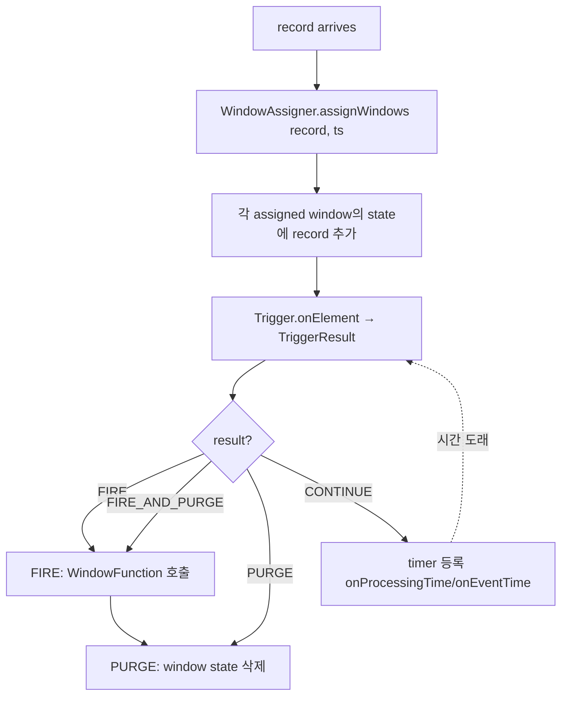

# Window Operator — WindowAssigner / Trigger / Evictor

> **요약**: keyedStream.window(...)이 만드는 `WindowOperator` — record를 window state에 모으고 trigger 결정에 따라 window function 호출. event time / processing time / count window 모두 같은 추상 위에 있음.
> **모듈**: `flink-runtime/streaming/api/windowing/`, `flink-runtime/streaming/runtime/operators/windowing/`
> **선행**: [`./01-event-time-watermark.md`](./01-event-time-watermark.md)

---

## 1. TL;DR

`WindowAssigner`가 record를 어떤 window들에 assign할지 결정 (Tumbling/Sliding/Session/Global). 각 window의 state는 `keyedState`에 저장 (`ListState<T>` 또는 `ReducingState<T>`/`AggregatingState<T>`). `Trigger`가 window state 추가/시간 변화에 반응해 `FIRE` / `FIRE_AND_PURGE` / `CONTINUE` / `PURGE` 결정. fire 시 `WindowFunction`/`ProcessWindowFunction` 호출 → 결과 emit.

---

## 2. 핵심 인터페이스

| 역할 | 인터페이스 | 위치 |
|------|---------|------|
| Window assigner | `WindowAssigner<T, W extends Window>` | `flink-runtime/streaming/api/windowing/assigners/` |
| 윈도우 자체 | `Window` (Abstract: `TimeWindow`, `GlobalWindow`) | `flink-runtime/streaming/api/windowing/windows/` |
| Trigger | `Trigger<T, W>` | `flink-runtime/streaming/api/windowing/triggers/` |
| Evictor | `Evictor<T, W>` (선택) | `flink-runtime/streaming/api/windowing/evictors/` |
| Window operator | `WindowOperator<K, IN, ACC, OUT, W>` | `flink-runtime/streaming/runtime/operators/windowing/` |

---

## 3. 동작 흐름



---

## 4. 본인 환경 시나리오

```java
DataStream<Event> events = env.fromSource(kafkaSource, watermarkStrategy, "src");

events
  .keyBy(e -> e.getUserId())
  .window(TumblingEventTimeWindows.of(Time.minutes(5)))
  .aggregate(new EventCountAgg())
  .sinkTo(icebergSink);
```

- Window: 5분 단위 tumbling event time
- State: `AggregatingState<EventCount>` per (key, window)
- Trigger: 기본은 EventTimeTrigger — watermark가 window end 넘으면 FIRE
- Output: 매 window 종료 시 1개 record per key

---

## 5. State 누적 vs Allowed Lateness

```java
.window(TumblingEventTimeWindows.of(Time.minutes(5)))
.allowedLateness(Time.minutes(2))
.sideOutputLateData(lateOutputTag)
```

- `allowedLateness`: window fire 후에도 추가 N분 동안 late record 받음 (multiple fires 가능)
- 그 이후 도착한 record는 side output으로
- 단, allowed lateness만큼 window state가 더 오래 유지됨 → 메모리/RocksDB 부담

---

## 6. RocksDB와 Window state

session window나 큰 lateness 설정 시 window state가 매우 큼 → RocksDB가 거의 필수. RocksDB column family per state descriptor — namespace는 window 자체.

---

## 7. 다음

- 13-new-datastream-v2 — V2 process function 모델로 window 표현 변경 시 비교
