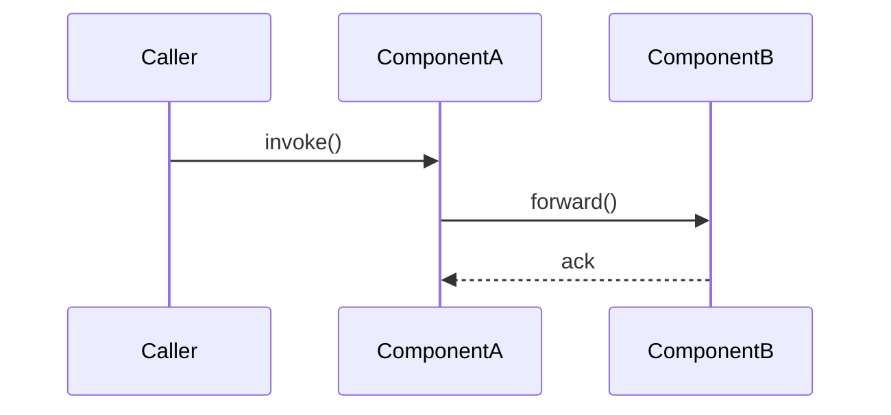

# <문서 제목>

> **요약**: 한 줄 설명
> **모듈**: `flink-X`
> **기준 버전**: Flink `release-2.0` (필요 시 다른 버전 명시)
> **운영 권장 여부**: ★Production / ⚠Experimental / 🧪PoC

## 1. TL;DR (3문장 이내)

이 컴포넌트가 무엇이고, 왜 존재하며, 본인 환경에서 언제 만나게 되는가.

## 2. 사전 지식

이 문서를 이해하려면 알아야 하는 개념. 모르는 항목은 링크된 prerequisite 문서를 먼저 읽는다.

- [Java 항목 1](../01-java-prerequisites/0X-xxx.md)
- [Flink 선행 항목](../0X-yyy/zzz.md)

## 3. 핵심 클래스 / 진입점

| 역할 | qualified name | 위치 |
|------|---------------|------|
| 진입점 | `o.a.f.X.Y` | `flink-X/.../Y.java:42` |
| 보조 | `o.a.f.X.Z` | `flink-X/.../Z.java:101` |

## 4. 데이터/제어 흐름



## 5. 코드 워크스루

핵심 메서드를 인용하며 단계별로 설명. 모든 인용은 `<file_path>:<line>` 형식.

```java
// flink-X/.../Y.java:42-50
public Result process(Input in) {
    // ...
}
```

설명: ...

## 6. 관련 FLIP / JIRA

- [FLIP-XXX: ...](https://cwiki.apache.org/confluence/display/FLINK/FLIP-XXX)
- [FLINK-NNNN: ...](https://issues.apache.org/jira/browse/FLINK-NNNN)

## 7. 디버깅 & 실험

본인 환경에서 어떻게 동작을 확인할 것인가.

- 사용할 MiniCluster / 테스트 코드 위치
- 브레이크포인트를 걸 메서드
- 관련 로그 / 메트릭

## 8. 자주 묻는 질문 / 함정

- Q: ...
- A: ...

## 9. 다음에 읽을 문서

- [관련 문서 1](../0X-yyy/zzz.md)
